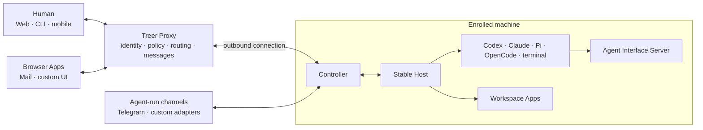

  

# Treer

**Run every coding agent, on every machine, from one place.**

Treer is an open, self-hostable control plane for coding agents. Keep Codex,
Claude, Pi, OpenCode, and plain terminals running on the machines that own your
code, then connect their Apps and conversations in the same workspace.

[Open Treer](https://app.treer.ai/) ·
[Product site](https://www.treer.ai/v2) ·
[Documentation](docs/README.md) ·
[Security model](docs/security.md)

## Configuration over convention

Treer keeps the platform minimal and the workflow configurable. It standardizes
only the contracts needed for Agents, humans, machines, and Apps to work
together: identity, process ownership, routing, and messages. It does not
prescribe one Agent, prompt format, launch command, communication channel, App
stack, or deployment model.

Launch profiles are commands you can edit. Apps are ordinary services you can
replace. Mail, Telegram, and future channels sit outside the core. Start with a
plain terminal, adopt only the pieces you need, and keep the rest of your
environment as it is.

## What Treer brings together

| | Capability | What it means |
| --- | --- | --- |
| **Agents** | Persistent processes and PTYs | Launch any command-based agent, observe it, prompt it, and return after the browser disconnects. |
| **Apps** | Workspace software with its own UI and data | Run HTTP Apps beside Agents. Treer supplies identity, routing, and a stable workspace address. |
| **Communication** | Durable Core Messages | Humans and Agents exchange addressed messages with explicit acknowledgement and ordered context. Mail and Telegram remain replaceable channels. |
| **Network** | Outbound machine connections and private names | Reach Agents, interfaces, and services across enrolled machines without publishing SSH or local service ports. |

Treer does not ship another Agent runtime. It coordinates the tools and
environments you already use through the browser and CLI. Native iOS and Android
clients are developed in [`mobile`](mobile/).

## How it works

The Host keeps Agent processes and terminal history alive on each machine. The
Proxy connects machines into workspaces and provides shared identity, routing,
policy, and messages. Machines connect outward, so Treer does not require you to
publish SSH or local service ports.

## Get started

1. [Open Treer](https://app.treer.ai/) and create or select a workspace.
2. Choose **Add machine** and run the installer and enrollment command shown by
   the App.
3. Launch a built-in Agent, define your own command, or open a plain terminal.

> [!IMPORTANT]
> Agents run with the operating-system authority of the account that starts the
> Treer Host. Treer is intended for machines you control and collaborators you
> trust; it is not a mutually untrusted execution sandbox. Use a dedicated
> account, container, or VM for untrusted code.

Treer currently fits individual developers with several machines, trusted
research groups sharing long-running sessions, and internal teams that want an
inspectable control plane. Read [Product direction](docs/product.md) for its
current scope and non-goals.

## Learn more

- [Operator guide](docs/operator-guide.md): self-hosting, local development,
  machine enrollment, administration, networking, and CLI examples.
- [Product direction](docs/product.md): audience, promise, principles, and
  current boundaries.
- [Architecture](docs/architecture.md): components, protocols, state, and
  information flow.
- [Security model](docs/security.md): trust assumptions, credentials, isolation,
  and known gaps.
- [Workspace Apps](apps/README.md): build services and interfaces for humans and
  Agents.
- Communication Apps: [Mail](apps/mail/README.md) and
  [Telegram](apps/telegram/README.md) are replaceable examples built on Treer's
  public contracts.
- [Documentation index](docs/README.md): every maintained guide and reference.

## License

Copyright 2026 Zijian Zhang.

Treer is licensed under the [Apache License 2.0](LICENSE).
