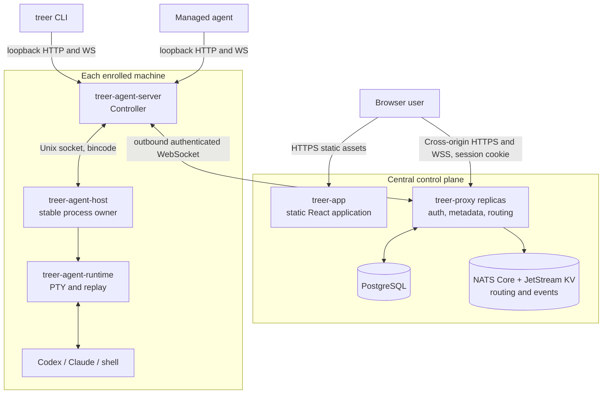
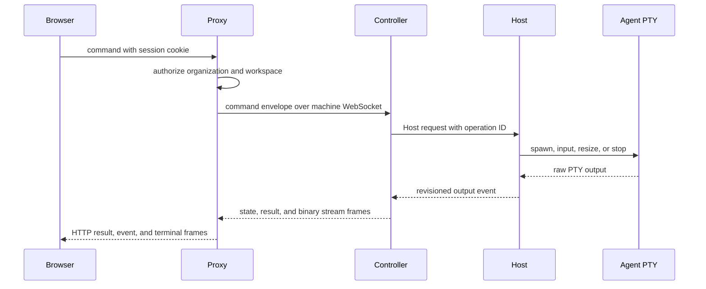

# Architecture

- Status: maintained
- Last source review: 2026-08-18 at `72921f1`

Treer separates the internet-facing control plane from machine-local process
ownership. Shared Rust protocol crates connect the layers; the React application
and CLI remain clients of those contracts.

## System map

## Component ownership

| Component | Owns | Must not own |
| --- | --- | --- |
| [`treer-proxy`](../crates/treer-proxy/src/main.rs) | Public API, user auth, workload token signing, PostgreSQL metadata, workspace projection, command and stream routing, domain-event publication | Local process lifetime |
| [`treer-agent-server`](../crates/treer-agent-server/src/main.rs) | Machine Controller, local API, Agent definitions, state detection, Proxy link, network bridge | Durable PTY ownership |
| [`treer-agent-host`](../crates/treer-agent-host/src/main.rs) | Stable child processes, Controller supervision, idempotent mutation cache | Users, workspaces, Agent brands, product policy |
| [`treer-agent-runtime`](../crates/treer-agent-runtime/src/lib.rs) | PTY lifecycle, raw input/output, bounded replay, root-relative working directories | Distributed routing or identity |
| [`treer-cli`](../crates/treer-cli/src/main.rs) | Human and managed-Agent commands and terminal attach | Private wire-model variants |
| [`treer-protocol`](../crates/treer-protocol/src/lib.rs) | Shared public and Controller protocol models and frames | Runtime implementation |
| [`treer-host-protocol`](../crates/treer-host-protocol/src/lib.rs) | Controller-to-Host request, response, and event contract | Proxy or browser concepts |
| [`web`](../web/src/App.tsx) | Standalone static browser application, runtime Proxy discovery, control-plane interaction, and terminal UI | Backend policy or hidden business state |

## Architectural invariants

- The Host owns local process lifetime so a Controller update does not terminate
  active PTYs.
- The Host remains product-agnostic; Agent-specific interpretation belongs in
  the Controller.
- Shared wire models live in protocol crates. A client and server must not grow
  parallel copies of the same contract.
- Every distributed lookup is scoped by workspace before machine or Agent ID.
- Agent mail is a pull-only PostgreSQL path. Sending mail never becomes terminal
  input or a runtime event, and reading an inbox marks only that recipient's
  returned deliveries read.
- A workspace's human directory is derived from its parent organization
  membership. Human mail addresses use stable user IDs; preferred names are
  display snapshots and member emails are not exposed to managed Agents.
- Enrolled machines establish outbound connections to the Proxy.
- Durable identity metadata lives in PostgreSQL. With NATS configured, live
  Controller ownership and retained machine inventory snapshots are shared across Proxy replicas;
  session and stream coordination remains in the initiating Proxy and is
  reached through routed IDs.
- Workspace mutations emit a shared, versioned domain-event envelope. The
  broker-neutral event bus stays in process by default and can publish the same
  envelope to an optional NATS JetStream.
- JetStream carries durable domain events, durable control projections,
  expiring ownership leases, and change-driven retained inventory snapshots.
  Losing a Controller connection releases only its ownership lease; its last
  machine and Agent inventory remains visible as offline until an explicit
  delete. Heartbeats do not republish full snapshots. PTY output, terminal input, and virtual-network
  TCP bytes are not retained in JetStream; live
  bytes use Core NATS only when their endpoints use different Proxy replicas.
- The browser application is deployed independently from `treer-proxy`. It
  reads the Proxy origin from `/config.json` at startup; the Proxy allows
  credentialed requests and browser WebSockets only from its configured App
  origin.
- `skills/treer/SKILL.md` is embedded into the CLI at build time and is the
  managed-Agent operations contract.

## Protocols and state

| Link | Transport and encoding | Authentication |
| --- | --- | --- |
| Browser to App | HTTPS static files and runtime JSON configuration | None |
| Browser to Proxy | Cross-origin HTTP/JSON and WebSocket frames | Host-only user or admin session cookie; exact App origin allowlist |
| Controller to Proxy | Persistent WebSocket, JSON and binary frames | Workspace-bound machine Bearer credential |
| CLI or managed Agent to Controller | Loopback HTTP/JSON and WebSocket | Local context; mail, inbox, and workload-token requests require the Agent credential |
| Controller to Host | Length-prefixed bincode on a local Unix socket | Local socket boundary |
| Host to child process | PTY raw bytes | Host process ownership |
| Proxy replica to Proxy replica | Core NATS MessagePack request/reply and broadcast; JetStream KV for leases, snapshots, and durable projections | Private NATS boundary |

PostgreSQL persists users, organizations, memberships, sessions, invitations,
workspaces, enrollment records, machine credentials, the workload signing key,
display names, Agent messages, per-Agent and per-human read state, message
context edges, machine services, Agent UI declarations, and virtual hosts.
Administrator invitations create a user-owned personal organization during registration; organization
invitations only create membership in their target organization. Both flows
consume the invitation and write identity state in one transaction.

Agent mail and human-directory requests travel from the caller's loopback API
to the Proxy under the Controller's machine credential and caller Agent ID. The
Controller first validates the private workload credential, and the Proxy
verifies that the Agent belongs to that machine and workspace. Agent recipient
names resolve to stable Agent IDs; human recipients must use stable user IDs
from the workspace organization directory. One message and its typed recipient
deliveries are committed together. Agent `inbox` and the web workspace Inbox
each lock an oldest-first unread batch and mark only that recipient's rows read.
This path is shared PostgreSQL state and neither requires NATS nor interrupts a
live Agent or human.

Each Controller connection begins with one atomic registration snapshot containing
the machine and its complete Host-backed Agent inventory. There is no visible
registered-but-unsynchronized intermediate state. Each Controller connection,
pending command, browser session, terminal leg, and network route is
owned by one Proxy process. A small expiring NATS KV lease maps a Controller to
that process; a separate file-backed KV inventory entry changes only when its
machine snapshot changes and is purged only when the machine is explicitly
deleted. Proxy startup restores retained inventory before accepting traffic and
derives online state from the independent lease. File-backed projection entries retain the latest workspace,
rename/delete, and restoration state across replica disconnects. Routed
terminal and network IDs encode the initiating Proxy so return
traffic reaches its in-memory state. Connection IDs and JetStream revisions
fence stale owners and out-of-order snapshot delivery. Heartbeats revalidate
machine revocation against PostgreSQL before renewing ownership.

Workspace state changes also produce `DomainEventEnvelope` values containing a
unique event ID, schema version, actor, action, resource, occurrence time,
workspace revision, optional trace/correlation lineage, and JSON payload. When
`TREER_NATS_URL` is configured, the Proxy provisions a file-backed JetStream
stream and publishes these envelopes under a workspace-scoped subject. Publish
retries use the event ID as `Nats-Msg-Id`; the database remains authoritative
because the publisher queue is not yet a transactional outbox.

Without `TREER_NATS_URL`, the same code runs as one standalone Proxy and keeps
all live routing in process. Horizontal replicas require a shared PostgreSQL
database and a shared NATS server with JetStream enabled. Sticky load-balancer
sessions are not required. NATS loss interrupts cross-replica routing; the
Controller reconnect loop and Host-owned terminal revisions recover live state
after the backplane returns.

The browser receives workspace state from one WebSocket stream. The stream
sends an initial full snapshot and another full snapshot after each relevant
workspace event; the browser keeps its last valid snapshot while reconnecting.
This avoids cross-replica HTTP refresh races. A globally sequenced incremental
event reducer can replace the full-snapshot stream when workspace size requires
it.

An Agent UI declaration maps one Agent to an HTTP machine service on that
Agent's machine plus an absolute service path. The declaration is durable in
PostgreSQL and is carried in the workspace snapshot; NATS control projections
make updates visible across Proxy replicas. When present, the web application
embeds `/api/workspaces/{workspace}/agents/{agent}/ui/proxy/` instead of mounting
the PTY terminal. The UI tunnel and virtual-host tunnel share the same HTTP/1.1
bridge. WebSocket Upgrade requests become bidirectional byte streams over the
existing Controller WebSocket and network binary frames; the custom page never
connects directly to a machine. Relative URLs are required so assets, fetches,
and WebSocket endpoints remain beneath the Agent UI tunnel prefix. Deleting the
service, changing it to TCP, or moving it away from the Agent's machine clears
the declaration and restores the terminal view.

## Primary information flow

Managed Agent coordination starts at the source machine's loopback API, crosses
the Proxy under that machine's credential, and reaches the target Controller
and Host. The source Agent does not need the destination address or a Proxy
credential.

Each managed Agent also receives a random workload credential in its process
environment and Host-owned metadata. For `treer identity token`, the Controller
matches that credential to the Agent, forwards the request under its machine
credential, and the Proxy resolves the requested machine service, evaluates the
`identity.token.issue` policy action, and signs a 60-second Ed25519 JWT bound to
the stable service ID. Services validate through the Proxy JWKS document or the
online verify endpoint. Tokens are requested explicitly and are never injected
into arbitrary virtual-network traffic.

## Network paths

On Linux, managed Agent TCP and DNS traffic enters a per-Agent network namespace
and TUN interface, then reaches a Controller-owned SOCKS5 boundary. Ordinary
destinations are authorized by the Proxy and then use source-machine egress;
only their route request and direct response cross the Controller WebSocket.
Workspace virtual hosts are relayed through the Proxy to another Controller,
including their TCP payload. Each alias resolves through a durable machine
service record before routing to the target Controller. Services belong to a
machine and outlive the Agent that registers or maintains them. The Controller
can probe the target from the machine host network; Treer does not yet start or
supervise the external service process. This is network containment and routing,
not a VM or private filesystem. A private mount namespace supplies the Agent's
resolver configuration and masks the host `nscd` socket, ensuring DNS lookups
reach the TUN virtual resolver instead of host NSS plugins or caches. These mounts do not
modify the host resolver files or cache service.

For route-level details and additional diagrams, use the dated
[project review](research/2026-08-18-project-review.md). Review this document
whenever a crate boundary, transport, persistence rule, or ownership invariant
changes.
