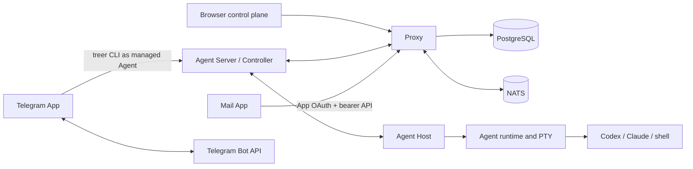

# Architecture

Treer separates durable coordination from machine-local process ownership.

## Ownership

| Component | Owns |
| --- | --- |
| `treer-proxy` | Public API, authentication, Policy, App identity, PostgreSQL metadata, Core Message, routing, ingress, and distributed coordination |
| `treer-agent-server` | Machine Controller, local authenticated API, Proxy connection, network bridge, and Agent definitions |
| `treer-agent-host` | Stable local child-process ownership and idempotent mutations |
| `treer-agent-runtime` | PTY lifecycle, bounded output replay, and working-directory containment |
| `treer-cli` | Human/operator and managed-Agent commands, including Core Message |
| `treer-protocol` | Shared public and Controller wire models |
| `apps` | Ordinary service code, presentation, external APIs, configuration, secrets, and App-owned state |

The Host is intentionally product-agnostic. Shared wire models live in protocol
crates. Every distributed lookup is scoped by workspace before machine or Agent
ID.

## Core Message

Core stores immutable Message bodies, ordered context edges, recipient
snapshots, per-recipient delivery state, idempotency records, and a body-free
transactional outbox. `receive` repeats an unacknowledged delivery; `ack` is an
explicit idempotent mutation. A context edge never grants visibility to its
parent.

Managed Agents call the local `treer message` commands. The Controller verifies
the Agent workload credential and forwards the request under the machine
credential. The Proxy verifies both bindings, evaluates the workspace Policy,
and writes Core state.

Browser Apps call `/api/apps/{service_id}/messages...` with a standard
service-audience App token. The Proxy rechecks the registered service and human
membership, maps the claims to the same Policy subject and Message principal,
then uses the same Message implementation as the Agent routes.

`TREER_ENABLE_CORE_MESSAGES` is a rollout switch, not an authorization or
isolation boundary.

## App Identity

An enabled workspace service uses its stable `service_id` as OAuth client ID.
Redirect origins come from the service ingress registry. Human authorization is
Authorization Code with S256 PKCE. Codes are hashed, short-lived, and single
use. The resulting signed bearer token is audience-bound to the service.

Managed Agents can request a 60-second workload token for a registered service.
Apps may validate tokens through `/.treer/apps/identity/verify`; verification
also checks current service existence and, for humans, current membership.

Apps are ordinary processes. Treer does not install, sandbox, supervise, or
grant a special capability to them. Mail stores a local cookie-to-App-token
mapping. Telegram runs inside a dedicated managed Agent and uses that Agent's
normal CLI identity. Telegram users remain external metadata, not Treer human
principals.

## Policy

One versioned JSONB Policy document exists per workspace. The Proxy compiles
rules into action-indexed immutable structures and caches them briefly. Updates
use optimistic revisions and PostgreSQL notification. Multi-recipient sends and
multi-delivery acknowledgements evaluate one pinned revision.

Policy covers Agent discovery/control, launch profiles, machine/service/network
mutation, workload identity, and Message send/read/receive/ack/import. A
workspace without a Policy document currently defaults to allow; this is an
explicit product limitation.

## Routing And State

Machines connect outward to the Proxy over an authenticated WebSocket. The
Controller-to-Host protocol is a local length-prefixed bincode socket. The
socket filename is a 16-hex FNV-1a hash of the machine id (`h-<hash>.sock`)
so the full path stays inside `sockaddr_un` limits on macOS, where the default
runtime directory under `$TMPDIR` is already long. Browser terminal and service
streams route through the Proxy; ordinary virtual-network payload travels
between Controllers after Proxy authorization.

Linux managed Agents run in a private network namespace. Outbound TCP is
captured onto the Controller SOCKS path. Agent-scoped services use a Unix
bridge (`sandbox-exec --service-socket`) so the Controller can reach a
namespace-local loopback listener without publishing a host TCP port. An Agent
UI HTTP server that must be reachable from the host loopback also needs
`publish_ports` (`sandbox-exec --publish`): the Controller binds
`127.0.0.1:<port>` on the machine and splices each connection over a pathname
Unix socket into the namespace, where the Agent's server is listening.

Browser terminal attach is revisioned. The Host keeps a bounded PTY output ring
keyed by stream epoch. Reconnects send the client's last cursor; the Host
returns only later chunks and a gap flag when the ring has slid past that
cursor. Live Controller lag resyncs from the same Host read instead of dropping
bytes. This is opaque byte replay, not Agent-protocol item storage.

Covered organization, workspace, and membership mutations write their audit
event in the same PostgreSQL transaction. Successful Agent create, rename, stop,
and delete operations and machine rename and delete operations append runtime
audit events after the Controller result; an audit write failure is logged
without turning a completed runtime mutation into a retryable API failure.

PostgreSQL is the durable source for accounts, organizations, workspaces,
machine credentials, services, ingresses, App OAuth codes, policy, audit,
traffic counters, and Core Message. NATS supplies events and cross-Proxy live
routing but is not Message truth. App SQLite databases contain only App-owned
sessions or external delivery mappings.

See [Security](security.md) for trust claims and [Quality](quality.md) for the
verification matrix.
