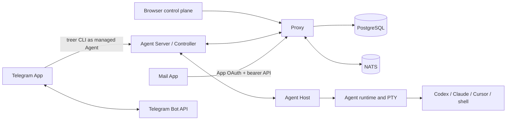

# Architecture

Treer separates durable coordination from machine-local process ownership.

## Ownership

| Component | Owns |
| --- | --- |
| `treer-proxy` | Public API, authentication, Policy, App identity, PostgreSQL metadata, Core Message, routing, ingress, and distributed coordination |
| `treer-agent-server` | Machine Controller, local authenticated API, Proxy connection, network bridge, and Agent definitions |
| `treer-agent-host` | Stable local child-process ownership and idempotent mutations |
| `treer-agent-runtime` | PTY lifecycle, bounded output replay, and working-directory containment |
| `treer-cli` | Human/operator and managed-Agent commands, including Core Message |
| `treer-protocol` | Shared public and Controller wire models |
| `apps` | Ordinary service code, presentation, external APIs, configuration, secrets, and App-owned state |
| `deploy/updater` | Self-hosted Compose mutations over `docker.sock`; not part of Proxy |

The Host is intentionally product-agnostic. Shared wire models live in protocol
crates. Every distributed lookup is scoped by workspace before machine or Agent
ID.

The React app in `web/` is the browser control plane. Workspace views cover
terminals, launch profiles, network, machine overview, and audit. The sidebar
user menu opens a floating Settings overlay: Account edits preferred name and
email through `PATCH /api/auth/profile`; General stores Light/Dark appearance in
`localStorage` (`treer-theme`) and currently offers English only; Usage &
billing is a placeholder until a billing backend exists. Control-plane image
updates are not in Settings. They live on `/admin` for the platform
administrator.

## Core Message

Core stores immutable Message bodies, ordered context edges, recipient
snapshots, per-recipient delivery state, idempotency records, and a body-free
transactional outbox. `receive` repeats an unacknowledged delivery; `ack` is an
explicit idempotent mutation. A context edge never grants visibility to its
parent.

Managed Agents call the local `treer message` commands. The Controller verifies
the Agent workload credential and forwards the request under the machine
credential. The Proxy verifies both bindings, evaluates the workspace Policy,
and writes Core state.

Browser Apps call `/api/apps/{service_id}/messages...` with a standard
service-audience App token. The Proxy rechecks the registered service and human
membership, maps the claims to the same Policy subject and Message principal,
then uses the same Message implementation as the Agent routes.

`TREER_ENABLE_CORE_MESSAGES` is a rollout switch, not an authorization or
isolation boundary.

## App Identity

An enabled workspace service uses its stable `service_id` as OAuth client ID.
Redirect origins come from the service ingress registry. Human authorization is
Authorization Code with S256 PKCE. Codes are hashed, short-lived, and single
use. The resulting signed bearer token is audience-bound to the service.

Managed Agents can request a 60-second workload token for a registered service.
Apps may validate tokens through `/.treer/apps/identity/verify`; verification
also checks current service existence and, for humans, current membership.

Apps are ordinary processes. Treer does not install, sandbox, supervise, or
grant a special capability to them. Mail stores a local cookie-to-App-token
mapping. Telegram runs inside a dedicated managed Agent and uses that Agent's
normal CLI identity. Telegram users remain external metadata, not Treer human
principals.

## Policy

One versioned JSONB Policy document exists per workspace. The Proxy compiles
rules into action-indexed immutable structures and caches them briefly. Updates
use optimistic revisions and PostgreSQL notification. Multi-recipient sends and
multi-delivery acknowledgements evaluate one pinned revision.

Policy covers Agent discovery/control, launch profiles, machine/service/network
mutation, workload identity, and Message send/read/receive/ack/import. A
workspace without a Policy document currently defaults to allow; this is an
explicit product limitation.

## Routing And State

Machines connect outward to the Proxy over an authenticated WebSocket. The
Controller-to-Host protocol is a local length-prefixed bincode socket. The
socket filename is a 16-hex FNV-1a hash of the machine id (`h-<hash>.sock`)
so the full path stays inside `sockaddr_un` limits on macOS, where the default
runtime directory under `$TMPDIR` is already long. Browser terminal and service
streams route through the Proxy; ordinary virtual-network payload travels
between Controllers after Proxy authorization.

Proxy replicas fence machine connections through a distributed ownership
lease. An explicit duplicate-Controller error makes the older Controller stop
reconnecting, while a stale or expired lease makes it reconnect and claim a
fresh connection. A stale lease alone is not evidence that the machine
credential is running on another host.

Linux managed Agents run in a private network namespace. Outbound TCP is
captured onto the Controller SOCKS path. On macOS and other `proxy-env`
machines the same loopback listener also accepts HTTP CONNECT, and the
Controller injects `HTTP_PROXY`/`HTTPS_PROXY` so HTTP-only clients can use
that path. Agent-scoped services use a Unix
bridge (`sandbox-exec --service-socket`) so the Controller can reach a
namespace-local loopback listener without publishing a host TCP port. The
browser Agent UI iframe uses that same bridge to reach the port and `ui_path`
declared by the Agent's verified Interface descriptor. No separate service or
UI registration is required. On a narrow viewport, selecting that Agent opens
the iframe full-screen, matching the mobile terminal overlay.
`publish_ports` (`sandbox-exec --publish`)
is only for host-loopback clients that dial `127.0.0.1` themselves; it binds
that port on the machine and splices accepted connections into the namespace.

Browser terminal attach is revisioned. The Host keeps a bounded PTY output ring
keyed by stream epoch. Reconnects send the client's last cursor; the Host
returns only later chunks and a gap flag when the ring has slid past that
cursor. Live Controller lag resyncs from the same Host read instead of dropping
bytes. This is opaque byte replay, not Agent-protocol item storage.

## Agent Interface Server

An Agent may register one versioned Agent Interface Server (AIS) with its local
Controller. AIS is a semantic adapter beside the Agent's native application
server; it does not replace Host process ownership. Registration is authenticated
with the Agent workload credential, scoped to that same Agent, verified against
`GET /v1/manifest`, and cached in the Controller's local runtime directory. A
hot Controller restart restores a descriptor only when its Agent ID, PID, and
process start time still match, then revalidates the live manifest before the
first Proxy snapshot. The cache contains no credentials and is not a trust
boundary. The descriptor and capabilities travel with `AgentInfo` snapshots
and events, while the live endpoint remains on Agent-private loopback. An
optional `ui_path` exposes an embedded browser interface on that same endpoint;
HTTP and WebSocket traffic below the path is opaque to the semantic AIS contract.

The Controller routes `prompt.submit` and `transcript.read` through AIS when the
matching capability is present. A missing prompt capability falls back to the
PTY compatibility path. Once an AIS request is dispatched, errors are returned
without a second PTY submission. Every prompt carries the Proxy command ID as
an idempotency key. An interface with `state.observe` owns working, idle, and
blocked state; Host exit state remains authoritative. Terminal attach, raw
input, resize, stop, and delete remain Host/PTY operations.

Pi UI and Codex UI are the bundled AIS implementations. Pi exposes the v1
routes from its extension. Codex UI owns one `codex app-server` thread per Treer
Agent and deliberately has no thread list or session switcher. Each serves its
browser UI and semantic routes from the same private listener; its verified
descriptor is the single registration for both capabilities and presentation.

Creating an Agent with a `recipe` git URL lets the operator pick an already
installed interactive CLI on that machine. Treer reuses an idle Agent of that
kind when one exists; otherwise it starts that CLI and prompts it with the bundled
[install skill](../skills/treer-install/SKILL.md). The installer clones that
repository, creates a different command Agent, and upserts a workspace launch
profile from `treer-agent.json`. Each created Agent is one thread. Extra
conversations use Launch to create another Agent. A recipe start script may
attach to an already healthy same-type listener instead of starting another
app-server and frontend. It still runs a per-Agent AIS adapter with a unique
instance ID and immutable thread binding, so prompt, transcript, state, events,
and abort cannot drift into another Agent's conversation. Launch does not run
Install recipe again. Readiness is the Agent's verified AIS descriptor,
including `ui_path` for browser recipes, and the saved profile; a raw health
probe does not establish semantic capabilities. This is not an App package
installer.

Covered organization, workspace, and membership mutations write their audit
event in the same PostgreSQL transaction. Successful Agent create, rename, stop,
and delete operations and machine rename and delete operations append runtime
audit events after the Controller result; an audit write failure is logged
without turning a completed runtime mutation into a retryable API failure.

PostgreSQL is the durable source for accounts, organizations, workspaces,
machine credentials, services, ingresses, App OAuth codes, policy, audit,
traffic counters, and Core Message. NATS supplies events and cross-Proxy live
routing but is not Message truth. App SQLite databases contain only App-owned
sessions or external delivery mappings.

## Self-hosted control plane updates

Compose pulls immutable GHCR tags for Proxy, App, and the updater sidecar.
`/admin` exposes Check and Apply to the platform administrator. Proxy forwards
those calls to the sidecar over HTTP with a shared token and never mounts
`docker.sock`. Hosted Railway leaves `TREER_UPDATER_URL` unset.

After the control plane moves, enrolled machines still run
`treer-agent-server update` on each host. Remote machine rollout from the
control plane is a follow-up.

See [Self-hosted Compose](../deploy/README.md), [Security](security.md) for
trust claims, and [Quality](quality.md) for the verification matrix.
