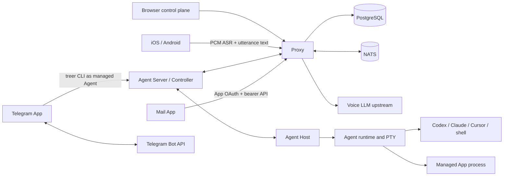

# Architecture

Treer separates durable coordination from machine-local process ownership.

## Ownership

| Component | Owns |
| --- | --- |
| `treer-proxy` | Public API, authentication, Policy, App identity, PostgreSQL metadata, Core Message, routing, ingress, distributed coordination, Voice ASR proxy, and Voice command LLM |
| `treer-agent-server` | Machine Controller, local authenticated API, Proxy connection, network bridge, and Agent definitions |
| `treer-agent-host` | Stable local child-process ownership and idempotent mutations |
| `treer-agent-runtime` | PTY lifecycle, bounded output replay, and working-directory containment |
| `treer-cli` | Human/operator and managed-Agent commands, including Core Message |
| `treer-protocol` | Shared public and Controller wire models |
| `apps` | Ordinary service code, presentation, external APIs, configuration, secrets, and App-owned state |
| `launchers` | Optional profile-driven Agent runtimes and explicitly selected Agent Interfaces; not Host, Controller, or Core behavior |
| `deploy/updater` | Self-hosted Compose mutations over `docker.sock`; not part of Proxy |

The Host is intentionally product-agnostic. Shared wire models live in protocol
crates. Every distributed lookup is scoped by workspace before machine or Agent
ID.

Within `treer-proxy`, source modules follow the same boundaries: `api/` groups
HTTP and WebSocket handlers by use case, `auth/` groups durable account and
resource operations, and `state/` groups live connection, command, terminal,
network, and cluster behavior. The parent modules retain composition and shared
types; this is an in-process organization boundary, not a deployment boundary.

The React app in `web/` is the browser control plane. Workspace views cover
terminals, launch profiles, managed Apps, network, machine overview, bounded
file upload, and audit.
`/admin` is the platform-administrator inventory: user, machine, and Agent
counts expand into lists, password-reset links, and live Agents per machine. The sidebar
user menu opens a floating Settings overlay: Account edits preferred name and
email through `PATCH /api/auth/profile`; General stores Light/Dark appearance in
`localStorage` (`treer-theme`) and currently offers English only. Embedded Agent
Interface iframes follow that setting through `theme` query, iframe
`color-scheme`, and a `treer:embed-theme` postMessage. Usage &
billing is a placeholder until a billing backend exists. Control-plane image
updates are not in Settings. They live on `/admin` for the platform
administrator.

## Core Message

Core stores immutable Message bodies, ordered context edges, recipient
snapshots, per-recipient delivery state, idempotency records, and a body-free
transactional outbox. `receive` repeats an unacknowledged delivery; `ack` is an
explicit idempotent mutation. A context edge never grants visibility to its
parent.

Managed Agents call the local `treer message` commands. The Controller verifies
the Agent workload credential and forwards the request under the machine
credential. The Proxy verifies both bindings, evaluates the workspace Policy,
and writes Core state.

Browser Apps call `/api/apps/{service_id}/messages...` with a standard
service-audience App token. The Proxy rechecks the registered service and human
membership, maps the claims to the same Policy subject and Message principal,
then uses the same Message implementation as the Agent routes.

`TREER_ENABLE_CORE_MESSAGES` is a rollout switch, not an authorization or
isolation boundary.

### Bridge Agents

The `bridge` Agent kind is a command-owned integration point for providers that
are not running under Host control. Its command is started and supervised like
an ordinary `command` Agent, but `prompt` requests are placed in a bounded
Controller-local queue instead of being written to the process PTY. The bridge
process consumes its own queue through the authenticated local endpoint
`GET /api/agents/{agent_id}/prompt-queue` and can then invoke the normal
`treer` CLI commands in its own process. Queue reads consume up to 100 entries
at a time, each prompt is limited to 64 KiB, and the queue holds at most 256
entries; the queue is intentionally ephemeral and should be paired with Core
Message acknowledgement when delivery must survive a Controller restart.

Bridge Agent output is not exposed through `read` or `transcript`; those calls
return `agent_output_unavailable`. This keeps provider-owned transcripts out of
the Host terminal contract while preserving ordinary `prompt` authorization and
audit behavior. The queue endpoint accepts only the bridge Agent's own workload
credential and rejects attempts to read another Agent's queue.

## App Identity

An enabled workspace service uses its stable `service_id` as OAuth client ID.
Redirect origins come from the service ingress registry. Human authorization is
Authorization Code with S256 PKCE. Codes are hashed, short-lived, and single
use. The resulting signed bearer token is audience-bound to the service.

Managed Agents can request a 60-second workload token for a registered service.
Apps may validate tokens through `/.treer/apps/identity/verify`; verification
also checks current service existence and, for humans, current membership.

## Managed App Lifecycle

A Managed App is a durable Proxy record for one command, one machine, and one
HTTP UI port. Creation transactionally allocates a stable machine service and
virtual host. When wildcard ingress is configured, it also allocates a stable
origin and exposes it as `public_url`. The origin requires Workspace
authentication by default. An Agent may opt its Managed App into anonymous
access at creation time with `treer app create --public`; startup reconciliation
preserves that access mode and backfills private origins for existing Apps.
Start, stop, restart, delete, list, and show are available through the browser,
public API, Controller-local API, and `treer app` CLI. User-triggered lifecycle
changes append workspace audit events.

The human UI treats Managed Apps as Agent-owned deployments: it lists and
operates existing Apps but does not offer App creation. Each App has a settings
view that changes only its owned ingress between `workspace` and `public`
access. General service, virtual-host, and ingress editing is not exposed in
the workspace UI.

Managed App lifecycle is the only Agent-authorized path that allocates a
service, virtual host, or its owned ingress. The public option applies only to
that App-owned ingress. Direct Agent routes for arbitrary service, virtual-host,
and ingress mutation return `managed_app_required`, including for older CLIs.
Logged-in workspace users retain those controls through the browser/public API
for operator-managed infrastructure.

The first runtime adapter launches `kind=app` through the existing Host process
contract. The backing runtime receives its own workload credential, private
network namespace, and declared `publish_ports` bridge, but is hidden from the
ordinary Agent snapshot and list. App status is projected from that runtime;
the durable App, service, and hostname never depend on its runtime ID.

When an App runtime exits, the Proxy schedules a bounded-backoff replacement.
When a Controller reconnects and publishes its first snapshot, the Proxy
reconciles every desired-running App assigned to that machine. Compare-and-set
runtime claims prevent concurrent reconcilers from intentionally launching the
same generation. A future Host pipes supervisor can replace the PTY-backed
adapter without changing the App API or durable ownership model.

Managed Apps do not install packages, inject secrets, migrate App-owned data,
or create a security boundary. Mail stores a local cookie-to-App-token mapping.
Telegram can still run inside a dedicated ordinary Agent and use that Agent's
normal CLI identity. Telegram users remain external metadata, not Treer human
principals.

## Policy

One versioned JSONB Policy document exists per workspace. The Proxy compiles
rules into action-indexed immutable structures and caches them briefly. Updates
use optimistic revisions and PostgreSQL notification. Multi-recipient sends and
multi-delivery acknowledgements evaluate one pinned revision.

Policy covers Agent discovery/control, launch profiles, machine exec and file
write, machine/service/network mutation, workload identity, and Message
send/read/receive/ack/import. A
workspace without a Policy document currently defaults to allow; this is an
explicit product limitation.

## Routing And State

Machines connect outward to the Proxy over an authenticated WebSocket. The
Controller-to-Host protocol is a local length-prefixed bincode socket. The
socket filename is a 16-hex FNV-1a hash of the machine id (`h-<hash>.sock`)
so the full path stays inside `sockaddr_un` limits on macOS, where the default
runtime directory under `$TMPDIR` is already long. Browser terminal and service
streams route through the Proxy; ordinary virtual-network payload travels
between Controllers after Proxy authorization.

Machine exec and file upload reuse the authenticated Proxy-to-Controller
command path. Exec is a non-interactive argv vector with a 30-second ceiling
and bounded stdout/stderr. Upload accepts at most 16 MiB from the browser,
crosses distributed Proxy routing in 192 KiB chunks, stages a temporary file in
the requested directory, and renames it into place only after every chunk
arrives. Directories are canonicalized beneath the enrolled Host root and file
names cannot contain path separators. These operations run in the Controller,
so a Controller hot update enables them without replacing the stable Host.

Controller registration carries a legacy protocol value, an additive list of
supported protocol versions, and explicit command capabilities. The Proxy
selects the highest common version and rejects capability-gated commands before
they reach an older Controller. A Controller ignores unknown top-level Proxy
messages and returns a correlated `unsupported_command` result for an unknown
command action; either case keeps the machine connection alive during rolling
upgrades. New command variants must declare a capability unless they are part
of the protocol-v4 baseline.

Automatic mode starts the Host as a detached `nohup` process on Linux and
macOS. Treer records the PID and process start identity and redirects output to
its state directory so lifecycle commands can reject reused PIDs and manage the
correct Host. An ordinary managed Agent may register one local startup spec
through `treer agent startup set`. The Controller stores its argv, working
directory, sandbox port publications, and workload credential in a private
machine-scoped state file. A new Host epoch restores each enabled spec at most
once, and only after the Proxy confirms that the Agent credential is still
active and bound to that machine. Controller-only restarts do not relaunch an
Agent, and a naturally exited Agent does not enter a restart loop. Explicit
Agent stop disables its startup spec. Deletion revokes recovery immediately;
the machine-local record may remain inert so a newer Proxy remains compatible
with older Controllers during rolling upgrades.

Startup specs do not provide start-at-boot or Host crash restart. A per-user
systemd service or LaunchAgent remains an explicit operator choice, and attached
foreground mode remains available for diagnostics. An
Apple container machine is a Linux guest: install it with `treer --skill
macos-container` and do not reuse a Mac `server_id` inside the guest. The
persisted service-manager choice and fallback reason keep later lifecycle
commands and machine diagnostics consistent. The Controller publishes that
state as an optional machine snapshot field so older Controllers remain valid
during rolling upgrades. TUI reads the same persisted state locally.
Startup is complete only when the Controller identity endpoint reports
`proxy_connected`. Local `/api/agents` success is not a Proxy lease. Because
service configuration is saved before native registration, `service repair` can
reconstruct a partial installation without another enrollment key. Manager
changes remove the old native registration or stop the old `nohup` process
first, and reject transitions that would leave a running Host owned by the
wrong supervisor. `connect` reuses the
existing `server_id` for an already-installed hostname and workspace; a second
Controller for that `server_id` fails if the listen socket is already live.
Re-enrollment sends the installed `server_id` with the persistent installation
identity, and the Proxy validates and rotates the credential in the enrollment
transaction. Recovery therefore does not depend on the previous machine
credential and does not consume the one-use key before identity conflicts have
been checked.
Service commands without `--workspace` list local installs or, when exactly one
exists, use it. They no longer imply the workspace name `default`.

Proxy replicas fence machine connections through a distributed ownership
lease. The newest authenticated connection owns the `server_id` and the previous
socket is closed with `duplicate_machine_connection`. Duplicate and
`stale_connection` are retryable: the loser stays in the reconnect loop with
capped exponential backoff until it is owner again, the credential is revoked,
or the server is deleted. The Proxy sends WebSocket pings at most every 20
seconds and closes a silent socket within 60 seconds so a sleeping Mac is not
advertised Online. On Unix `SIGCONT` (lid open / thaw), the Controller aborts a
socket whose last activity is older than that dead interval and reconnects.

Linux managed Agents run in a private network namespace. Outbound TCP is
captured onto the Controller SOCKS path. On macOS and other `proxy-env`
machines the same loopback listener also accepts HTTP CONNECT, and the
Controller injects `HTTPS_PROXY` so clients without SOCKS support can use that
path for HTTPS while plain HTTP continues through `ALL_PROXY` as SOCKS5h.
`proxy-env` classifies locally from the virtual-host snapshot: destinations in
that snapshot, or the reserved local-API address `192.0.2.1`, still take the
Treer Open/relay path; every other destination is dialed on this machine
immediately and does not wait on the Proxy socket. Disconnect resets relayed
streams and Proxy-authorized Direct streams; compatibility-mode internet bypass
streams remain independent. New transparent requests fail while disconnected,
and transport epochs prevent queued Open frames from being replayed on reconnect.

The owned [native macOS backend](../native/macos-network/README.md) has an explicit
`native-experimental` Controller mode. A signed helper readiness check precedes
startup; per-process registration ACK precedes workload exec. Egress uses the
same Proxy Open path, while macOS service ingress uses shared localhost ports.
It has not passed installed-extension acceptance and is not a supported
transparent backend.

The source Proxy rechecks tracked network authorizations every five seconds.
Denied relay streams receive Reset on both legs; tracked Direct streams receive
Reset at the source. Controllers advertise per-stream lifetime tracking in the
optional Open field and send Reset on full completion. Older Direct sources omit
that field and retain Open-only checks. Relay lifetimes are also observable from
the Proxy's stream table. Policy cache TTL and evaluation time add to revocation
latency; this is periodic revocation, not instantaneous revocation.

Direct usage is negotiated through the optional `report_usage` target flag.
The Controller counts successful application writes and sends cumulative Usage
frames on that authorized stream. The owning source Proxy deduplicates against
the previous totals and persists deltas as non-billable `direct_network` usage.
The original relay ledger remains machine-scoped; Agent endpoint detail is
written separately to `agent_traffic_usage_hourly` and served by `/traffic/agents`.
Both views use the same observed payload, so they must not be summed together.
The optional Open flag `durable_usage` negotiates a Proxy-issued `usage_ticket`.
Ticketed Usage frames carry cumulative totals, persist in the Controller outbox,
and replay after reconnect. `UsageAck` (kind 10) is sent only after receipt
deduplication and both hourly ledgers commit together. Receipts bind the original
machine/workspace and cannot open traffic. They survive Proxy restarts; reporting
without tickets remains the legacy live-stream path. Delayed reports currently
use the commit-time hour, and uncheckpointed crash tails are not recoverable.
Final reports mark receipts closed. Closed receipts and unfinished open receipts
are retained for at most 90 days; a route that fails before delivery discards
its unused receipt immediately.
Operator-managed Agent-scoped services use a Unix bridge (`sandbox-exec
--service-socket`) so the Controller can reach a namespace-local loopback
listener without publishing a host TCP port. Agents cannot create those
records themselves. The browser Agent UI iframe uses that same bridge to reach
the port and `ui_path` declared by the Agent's verified Interface descriptor.
No separate service or UI registration is required. On a narrow viewport,
selecting that Agent opens the iframe full-screen, matching the mobile terminal
overlay.
`publish_ports` (`sandbox-exec --publish`)
is only for host-loopback clients that dial `127.0.0.1` themselves; it binds
that port on the machine and splices accepted connections into the namespace.

Browser terminal attach is revisioned. The Host keeps a bounded PTY output ring
keyed by stream epoch. Reconnects send the client's last cursor; the Host
returns only later chunks and a gap flag when the ring has slid past that
cursor. Live Controller lag resyncs from the same Host read instead of dropping
bytes. The Proxy owning the browser session learns the stream epoch from the
delivered Ready frame, including when the Controller is connected to another
Proxy, so live output carries the same reconnect cursor across replicas.
When a process exits, the Host releases its child and PTY resources
immediately and retains only the latest 256 completed process records for
Controller restart recovery. This is opaque byte replay, not Agent-protocol
item storage.

## Agent Interface Server

An Agent may register one versioned Agent Interface Server (AIS) with its local
Controller. AIS is a semantic adapter beside the Agent's native application
server; it does not replace Host process ownership. Registration is authenticated
with the Agent workload credential, scoped to that same Agent, verified against
`GET /v1/manifest`, and cached in the Controller's local runtime directory.
Agents register once at start; repeating register rewrites `registered_at` and
remounts any embedded UI. A hot Controller restart restores a descriptor only
when its Agent ID, PID, and process start time still match, then revalidates the
live manifest before the first Proxy snapshot. The cache contains no credentials and is not a trust
boundary. The descriptor and capabilities travel with `AgentInfo` snapshots
and events, while the live endpoint remains on Agent-private loopback. An
optional `ui_path` exposes an embedded browser interface on that same endpoint;
HTTP and WebSocket traffic below the path is opaque to the semantic AIS contract.

The Controller routes `prompt.submit` and `transcript.read` through AIS when the
matching capability is present. A missing prompt capability falls back to the
PTY compatibility path. Once an AIS request is dispatched, errors are returned
without a second PTY submission. Every prompt carries the Proxy command ID as
an idempotency key. An interface with `state.observe` owns working, idle, and
blocked state; Host exit state remains authoritative. Terminal attach, raw
input, resize, stop, and delete remain Host/PTY operations.

Pi UI and Codex UI are the bundled browser AIS implementations. Pi exposes the
v1 routes from its extension. Codex UI owns one `codex app-server` thread per
Treer Agent and deliberately has no thread list or session switcher. Each
serves its browser UI and semantic routes from the same private listener; its
verified descriptor is the single registration for both capabilities and
presentation.

Optional launchers live under `launchers/` and use the same public profile and
Agent Interface contracts as an external recipe. The ACP launcher starts as an
ordinary profile command; its provider catalog, session journal, and optional
presentation remain inside that launcher. Headless profiles omit `ui_path`.
Remote Codex presentation is a separately named, explicit profile and does not
add an ACP Agent kind, provider routes, Host-wide UI state, or provider choices
to Controller, Proxy, Protocol, or Web.

Launch-profile sidecars in `apps/codex-ais`, `apps/opencode-ais`,
`apps/dsh-ais`, `apps/claude-ais`, `apps/grok-ais`, and `apps/cursor-ais`
register the same protocol without a bundled page. They bind one Treer Agent to
one downstream thread/session beside `codex app-server`, `opencode serve`, a
dedicated DeepSeek Harness host (`dsh --profile web`) or SDK runtime, Claude
Code stream-json, Grok Build ACP (`grok agent stdio`), and Cursor ACP
(`cursor-agent acp`). Neither Grok Build nor Cursor ships a Codex-style
app-server; ACP over stdio is their first-party editor integration. The Cursor
sidecar uses `cursor-agent`, not `agent`, because Grok Build also installs an
`agent` symlink. Built-in `--kind codex` and `--kind claude` remain TUI/PTY
paths. Shared helpers live in `apps/ais-kit`.

`GET /v1/transcript` pages by conversation turn. A turn starts at a user prompt
and includes the following entries until the next user prompt. Leading non-user
session entries attach to the first turn; a log with no user prompt is a single
page. `page` (or `cursor`) is the 0-based turn index. `limit` is the number of
turns and defaults to 1. The response includes `page`, `page_count`,
`next_page`, and string `cursor` / `next_cursor` aliases.

Creating an Agent with a `recipe` git URL lets the operator pick an already
installed interactive CLI on that machine. Treer reuses an idle Agent of that
kind when one exists; otherwise it starts that CLI and prompts it with the bundled
[install skill](../skills/treer-install/SKILL.md). The installer clones that
repository, creates a different command Agent, and upserts a workspace launch
profile from `treer-agent.json`. Each created Agent is one thread. Extra
conversations use Launch to create another Agent. A recipe start script may
attach to an already healthy same-type listener instead of starting another
app-server and frontend. It still runs a per-Agent AIS adapter with a unique
instance ID and immutable thread binding, so prompt, transcript, state, events,
and abort cannot drift into another Agent's conversation. Launch does not run
Install recipe again. Readiness is the Agent's verified AIS descriptor,
including `ui_path` for browser recipes, and the saved profile; a raw health
probe does not establish semantic capabilities. This is not an App package
installer.

Covered organization, workspace, and membership mutations write their audit
event in the same PostgreSQL transaction. Successful Agent create, rename, stop,
and delete operations, App lifecycle operations, machine exec and file upload,
and machine rename and delete operations append runtime
audit events after the Controller result; an audit write failure is logged
without turning a completed runtime mutation into a retryable API failure.

Hold-to-talk audio stays on the Proxy only long enough to forward 16 kHz PCM16
to the configured ASR vendor. After a transcript is available, `POST
/api/workspaces/{workspace_id}/voice/command` sends that text to an OpenAI
Responses or Chat Completions upstream. The model receives
[the voice skill](../skills/treer-voice/SKILL.md) and a compact roster, then
calls a `treer` tool. The Proxy executes allowed CLI-equivalent commands
(`status`, `whoami`, `machine list`, `agent list|show|prompt|read`) in-process
as the signed-in user and returns a speakable reply. The native app reads that
reply with system TTS on the media stream. Conversation mode runs an
on-device speech gate (adaptive energy, zero-crossing rate, and a 360ms
minimum speech window) and only opens the ASR stream after speech is
confirmed, so noise and coughs do not spend ASR tokens. Vendor ASR and LLM keys stay in
Proxy environment variables. This is not the later confirm-card Voice Live
protocol, and the phone does not run the Treer CLI.

Workspace access is either `organization` or `restricted`. The former admits
every current organization member; the latter admits only direct user grants,
group grants, workspace creators, and organization managers. Direct and group
grants carry `owner` or `member`, with owner taking precedence. Organization
`owner`/`admin` roles imply workspace ownership, and workspace creation adds an
explicit owner grant for the creator.
Removing an organization member also clears that user's direct workspace and
group grants.

Workspace deletion is workspace-owner-only and requires every
Machine in the workspace to be deleted first. Deletion is lazy: PostgreSQL
marks the workspace with a deletion tombstone and revokes remaining Agent
credentials, while retaining its messages, traffic history, policies, and
other records. Active workspace queries and authentication exclude tombstoned
rows. The Proxy then evicts the affected credential, service-ingress, and
virtual-host caches, removes the workspace from in-memory active state, and
broadcasts a `WorkspaceDeleted` cluster projection so other Proxies stop
serving it.

PostgreSQL is the durable source for accounts, organizations, workspaces,
machine credentials, services, ingresses, App OAuth codes, policy, audit,
the logical traffic-usage ledger, and Core Message. Usage is metered once after
payload delivery and classified by route and meter version; NATS framing,
control messages, fan-out, and retries are operational transport costs rather
than customer usage. The legacy machine-traffic table remains read-compatible
during retention while new counters write to `traffic_usage_hourly`. NATS
supplies events and cross-Proxy live routing but is not Message or billing
truth. App SQLite databases contain only App-owned sessions or external
delivery mappings.

## Self-hosted control plane updates

Compose pulls immutable GHCR tags for Proxy, App, and the updater sidecar.
`/admin` exposes Check and Apply to the platform administrator. Proxy forwards
those calls to the sidecar over HTTP with a shared token and never mounts
`docker.sock`. Hosted Railway leaves `TREER_UPDATER_URL` unset.

After the control plane moves, enrolled machines still run
`treer-agent-server update` on each host. Remote machine rollout from the
control plane is a follow-up.

See [Self-hosted Compose](../deploy/README.md), [Security](security.md) for
trust claims, and [Quality](quality.md) for the verification matrix.

### Experimental datagram transport

The owned macOS UDP adapter uses authenticated SOCKS command `0xf0` on the local
Controller listener, followed by big-endian u16-length datagrams. This is a Treer
extension, not SOCKS UDP ASSOCIATE. `OpenDatagram` (binary kind 9) goes through the
same source-Agent ownership check and `network.connect` Policy as TCP. Each Data
frame carries one whole datagram, including empty payloads. UDP services are
registered with `protocol: "udp"`; a TCP/UDP service mismatch is rejected. Existing
Policy rules are transport-independent host/port rules. Upgrade participating
Proxies and Controllers together before using UDP services; older peers cannot
handle kind 9 and are never given a TCP fallback.

Direct UDP stays on the source Controller and reports successful datagram payload
writes. Relayed UDP traverses the existing regional routing and ledger. Each
association has a 60-second idle timeout and closes on reset. Datagram windows
charge payload plus 64 bytes per packet, bounding even empty-packet queues; the local adapter
bounds destinations and pending replies. UDP carried over TCP preserves message
boundaries but inherits head-of-line blocking. Linux private Agent UDP service
bridges are not yet implemented and explicitly reject this destination; host UDP
services are supported. OS datagram size limits still apply. The owned macOS provider implements a shared persistent virtual-address map and
loopback UDP/TCP DNS responder. Accepted Controller snapshots synchronize through
the helper, and the privileged provider maintains only its exact-domain files in
`/etc/resolver`. Synthetic addresses are reversed to names before TCP/UDP routing.
Retired addresses are never reassigned, protecting shared DNS caches. Signed
resolver/capture integration is still an acceptance gate.
