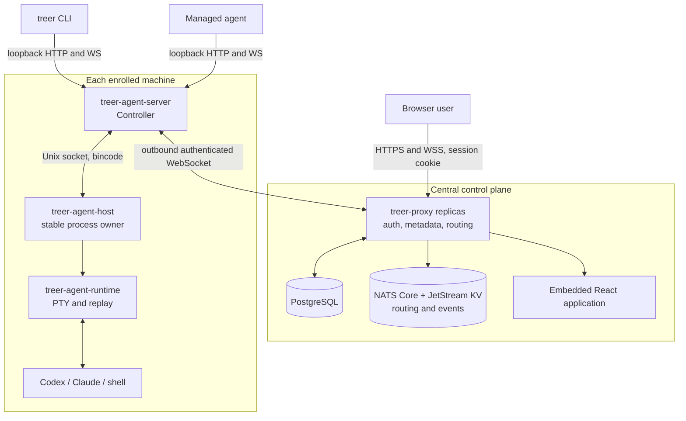
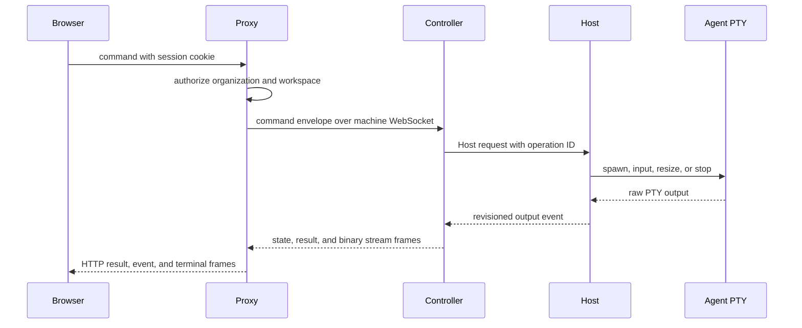

# Architecture

- Status: maintained
- Last source review: 2026-08-18 at `72921f1`

Treer separates the internet-facing control plane from machine-local process
ownership. Shared Rust protocol crates connect the layers; the React application
and CLI remain clients of those contracts.

## System map

## Component ownership

| Component | Owns | Must not own |
| --- | --- | --- |
| [`treer-proxy`](../crates/treer-proxy/src/main.rs) | Public API, user auth, workload token signing, PostgreSQL metadata, workspace projection, command and stream routing, domain-event publication | Local process lifetime |
| [`treer-agent-server`](../crates/treer-agent-server/src/main.rs) | Machine Controller, local API, Agent definitions, state detection, Proxy link, network bridge | Durable PTY ownership |
| [`treer-agent-host`](../crates/treer-agent-host/src/main.rs) | Stable child processes, Controller supervision, idempotent mutation cache | Users, workspaces, Agent brands, product policy |
| [`treer-agent-runtime`](../crates/treer-agent-runtime/src/lib.rs) | PTY lifecycle, raw input/output, bounded replay, root-relative working directories | Distributed routing or identity |
| [`treer-cli`](../crates/treer-cli/src/main.rs) | Human and managed-Agent commands, attach, remote shell, file copy | Private wire-model variants |
| [`treer-protocol`](../crates/treer-protocol/src/lib.rs) | Shared public and Controller protocol models and frames | Runtime implementation |
| [`treer-host-protocol`](../crates/treer-host-protocol/src/lib.rs) | Controller-to-Host request, response, and event contract | Proxy or browser concepts |
| [`treer-transfer`](../crates/treer-transfer/src/lib.rs) | Transfer manifests, validation, path containment, atomic upload commit | Session authorization |
| [`web`](../web/src/App.tsx) | Browser control-plane interaction and terminal UI | Backend policy or hidden business state |

## Architectural invariants

- The Host owns local process lifetime so a Controller update does not terminate
  active PTYs.
- The Host remains product-agnostic; Agent-specific interpretation belongs in
  the Controller.
- Shared wire models live in protocol crates. A client and server must not grow
  parallel copies of the same contract.
- Every distributed lookup is scoped by workspace before machine or Agent ID.
- Enrolled machines establish outbound connections to the Proxy.
- Remote working directories and file paths are resolved beneath the machine's
  configured workspace root. This path rule is not filesystem sandboxing.
- Durable identity metadata lives in PostgreSQL. With NATS configured, live
  Controller ownership and machine snapshots are shared across Proxy replicas;
  session and stream coordination remains in the initiating Proxy and is
  reached through routed IDs.
- Workspace mutations emit a shared, versioned domain-event envelope. The
  broker-neutral event bus stays in process by default and can publish the same
  envelope to an optional NATS JetStream.
- JetStream carries durable domain events, durable control projections,
  expiring ownership leases, and change-driven live snapshots. Heartbeats do
  not republish full snapshots. PTY output, terminal input, file transfer
  payloads, and virtual-network TCP bytes are not retained in JetStream; live
  bytes use Core NATS only when their endpoints use different Proxy replicas.
- The web build is embedded into `treer-proxy`; frontend API changes and Proxy
  routes must be changed and verified together.
- `skills/treer/SKILL.md` is embedded into the CLI at build time and is the
  managed-Agent operations contract.

## Protocols and state

| Link | Transport and encoding | Authentication |
| --- | --- | --- |
| Browser to Proxy | HTTP/JSON and WebSocket frames | User or admin session cookie |
| Controller to Proxy | Persistent WebSocket, JSON and binary frames | Workspace-bound machine Bearer credential |
| CLI or managed Agent to Controller | Loopback HTTP/JSON and WebSocket | Local context; workload-token requests require the Agent credential |
| Controller to Host | Length-prefixed bincode on a local Unix socket | Local socket boundary |
| Host to child process | PTY raw bytes | Host process ownership |
| Proxy replica to Proxy replica | Core NATS MessagePack request/reply and broadcast; JetStream KV for leases, snapshots, and durable projections | Private NATS boundary |

PostgreSQL persists users, organizations, memberships, sessions, invitations,
workspaces, enrollment records, machine credentials, the workload signing key,
display names, machine services, and virtual hosts. Administrator invitations
create a user-owned personal organization during registration; organization
invitations only create membership in their target organization. Both flows
consume the invitation and write identity state in one transaction.

Each Controller connection,
pending command, browser session, terminal leg, transfer, and network route is
owned by one Proxy process. A small expiring NATS KV lease maps a Controller to
that process; a separate KV entry changes only when its machine snapshot
changes. File-backed projection entries retain the latest workspace,
rename/delete, and restoration state across replica disconnects. Routed
terminal, transfer, and network IDs encode the initiating Proxy so return
traffic reaches its in-memory state. Connection IDs and JetStream revisions
fence stale owners and out-of-order snapshot delivery. Heartbeats revalidate
machine revocation against PostgreSQL before renewing ownership.

Workspace state changes also produce `DomainEventEnvelope` values containing a
unique event ID, schema version, actor, action, resource, occurrence time,
workspace revision, optional trace/correlation lineage, and JSON payload. When
`TREER_NATS_URL` is configured, the Proxy provisions a file-backed JetStream
stream and publishes these envelopes under a workspace-scoped subject. Publish
retries use the event ID as `Nats-Msg-Id`; the database remains authoritative
because the publisher queue is not yet a transactional outbox.

Without `TREER_NATS_URL`, the same code runs as one standalone Proxy and keeps
all live routing in process. Horizontal replicas require a shared PostgreSQL
database and a shared NATS server with JetStream enabled. Sticky load-balancer
sessions are not required. NATS loss interrupts cross-replica routing; the
Controller reconnect loop and Host-owned terminal revisions recover live state
after the backplane returns.

## Primary information flow

Managed Agent coordination starts at the source machine's loopback API, crosses
the Proxy under that machine's credential, and reaches the target Controller
and Host. The source Agent does not need the destination address or a Proxy
credential.

Each managed Agent also receives a random workload credential in its process
environment and Host-owned metadata. For `treer identity token`, the Controller
matches that credential to the Agent, forwards the request under its machine
credential, and the Proxy resolves the requested machine service, evaluates the
`identity.token.issue` policy action, and signs a 60-second Ed25519 JWT bound to
the stable service ID. Services validate through the Proxy JWKS document or the
online verify endpoint. Tokens are requested explicitly and are never injected
into arbitrary virtual-network traffic.

## Network and transfer paths

On Linux, managed Agent TCP and DNS traffic enters a per-Agent network namespace
and TUN interface, then reaches a Controller-owned SOCKS5 boundary. Ordinary
destinations are authorized by the Proxy and then use source-machine egress;
only their route request and direct response cross the Controller WebSocket.
Workspace virtual hosts are relayed through the Proxy to another Controller,
including their TCP payload. Each alias resolves through a durable machine
service record before routing to the target Controller. Services belong to a
machine and outlive the Agent that registers or maintains them. The Controller
can probe the target from the machine host network; Treer does not yet start or
supervise the external service process. This is network containment and routing,
not a VM or private filesystem. A private mount namespace supplies the Agent's
resolver configuration and masks the host `nscd` socket, ensuring DNS lookups
reach the TUN virtual resolver instead of host NSS plugins or caches. These mounts do not
modify the host resolver files or cache service.

`treer scp` creates an authenticated Proxy transfer session between Controllers.
Remote operands are workspace-relative; the transfer engine rejects symlinks
and special files, enforces declared limits, and commits uploads by atomic
rename. Treer does not continuously synchronize project trees or resolve file
conflicts.

For route-level details and additional diagrams, use the dated
[project review](research/2026-08-18-project-review.md). Review this document
whenever a crate boundary, transport, persistence rule, or ownership invariant
changes.
