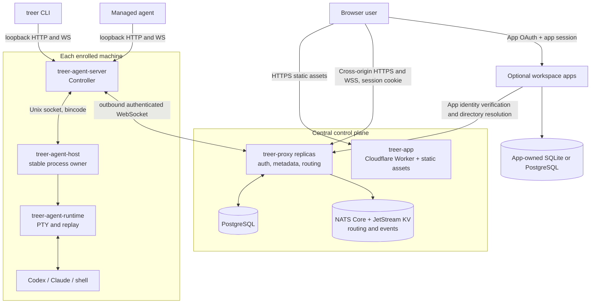
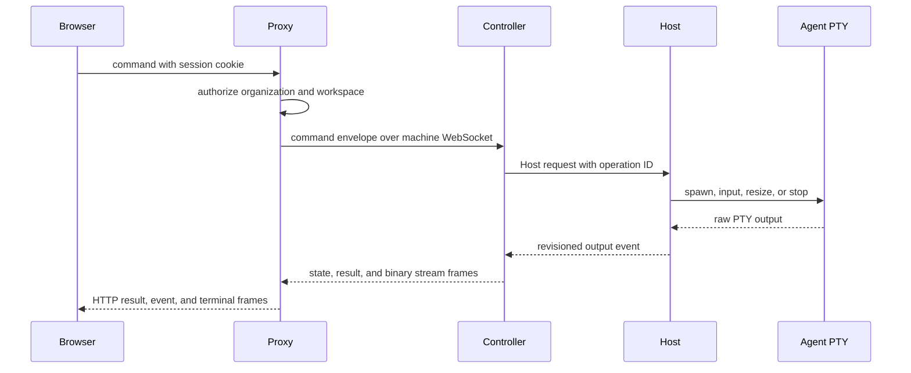

# Architecture

- Status: maintained
- Last source review: 2026-08-18 at `72921f1`

Treer separates the internet-facing control plane from machine-local process
ownership. Shared Rust protocol crates connect the layers; the React application
and CLI remain clients of those contracts.

## System map

## Component ownership

| Component | Owns | Must not own |
| --- | --- | --- |
| [`treer-proxy`](../crates/treer-proxy/src/main.rs) | Public API, user auth, workload token signing, PostgreSQL metadata, workspace projection, command and stream routing, domain-event publication | Local process lifetime |
| [`treer-agent-server`](../crates/treer-agent-server/src/main.rs) | Machine Controller, local API, Agent definitions, state detection, Proxy link, network bridge | Durable PTY ownership |
| [`treer-agent-host`](../crates/treer-agent-host/src/main.rs) | Stable child processes, Controller supervision, idempotent mutation cache | Users, workspaces, Agent brands, product policy |
| [`treer-agent-runtime`](../crates/treer-agent-runtime/src/lib.rs) | PTY lifecycle, raw input/output, bounded replay, root-relative working directories | Distributed routing or identity |
| [`treer-cli`](../crates/treer-cli/src/main.rs) | Human and managed-Agent commands and terminal attach | Private wire-model variants |
| [`treer-protocol`](../crates/treer-protocol/src/lib.rs) | Shared public and Controller protocol models and frames | Runtime implementation |
| [`treer-host-protocol`](../crates/treer-host-protocol/src/lib.rs) | Controller-to-Host request, response, and event contract | Proxy or browser concepts |
| [`web`](../web/src/App.tsx) | Standalone static browser application, runtime Proxy discovery, control-plane interaction, and terminal UI | Backend policy or hidden business state |
| [`apps`](../apps/README.md) | Optional service-owned APIs, databases, and frontends using Treer identity and routing | Proxy metadata tables or machine process ownership |

## Architectural invariants

- The Host owns local process lifetime so a Controller update does not terminate
  active PTYs.
- The three machine-facing binaries embed their package version and source
  commit. Host sync reports the Host build to the Controller; Controller health
  and Proxy machine snapshots carry separate Host and Controller identities so
  a hot update cannot hide a stale Host.
- Machine-local dashboards read Agent and PTY state from the Controller and
  Host. Proxy projections provide workspace-wide discovery and metadata but do
  not replace local runtime state when the Proxy is unavailable.
- The Host remains product-agnostic; Agent-specific interpretation belongs in
  the Controller.
- Shared wire models live in protocol crates. A client and server must not grow
  parallel copies of the same contract.
- Every distributed lookup is scoped by workspace before machine or Agent ID.
- Optional apps own their own storage and product behavior. The Proxy exposes
  generic, workspace-scoped human OAuth, Agent workload identity verification,
  a combined Agent/human directory, and stable recipient resolution. Apps do
  not connect to the Proxy database.
- A workspace's human directory is derived from its parent organization
  membership. Generic App directory responses expose stable IDs, preferred
  names, and roles, but not member email addresses.
- Enrolled machines establish outbound connections to the Proxy.
- Persistent machine identity is scoped by installation hostname. Controller
  and Host configurations and service-manager entries are keyed by server ID;
  the Host socket is node-local runtime state. Linux systemd units are pinned to
  their installation hostname so a network-mounted home directory cannot start
  one machine identity on multiple nodes.
- Durable identity metadata lives in PostgreSQL. With NATS configured, live
  Controller ownership and machine snapshots are shared across Proxy replicas;
  session and stream coordination remains in the initiating Proxy and is
  reached through routed IDs.
- Workspace mutations emit a shared, versioned domain-event envelope. The
  broker-neutral event bus stays in process by default and can publish the same
  envelope to an optional NATS JetStream.
- JetStream carries durable domain events, durable control projections,
  expiring ownership leases, and change-driven live snapshots. Heartbeats do
  not republish full snapshots. PTY output, terminal input, and virtual-network
  TCP bytes are not retained in JetStream; live
  bytes use Core NATS only when their endpoints use different Proxy replicas.
- The browser application is deployed independently to Cloudflare Workers
  Static Assets. Its small Worker serves `/config.json` and `/health`; all other
  requests use the static asset binding. The App reads the Proxy origin from
  `/config.json` at startup, and the Proxy allows credentialed requests and
  browser WebSockets only from its configured App origin.
- `skills/treer/SKILL.md` is embedded into the CLI at build time and is the
  managed-Agent operations contract.

## Release distribution

The repository release tool treats artifact identity, distribution, and rollout
as separate boundaries. A trusted publisher collects the three machine-facing
binaries for each platform, records their byte lengths and SHA-256 digests in a
versioned manifest together with the platform build provenance, and signs the
exact manifest bytes with an Ed25519 release key. Version manifests and channel
pointers have separate detached signatures.

GitHub Actions builds the four supported platform sets on native Linux and
macOS runners. Each workflow artifact carries the source commit, package
version, platform, and checksums. The workflow cannot publish a release; an
operator must collect one successful commit and invoke the separately
authenticated R2 publisher. This keeps compilation credentials and the offline
release-signing key in different trust domains.

Cloudflare R2 stores immutable objects under `releases/<version>/`; mutable
`channels/canary.json` and `channels/stable.json` identify a manifest by path and
digest. The public R2 custom domain and cache are distribution infrastructure,
not the trust root. Stable promotion changes only a signed channel pointer and
requires the version tag to identify the commit recorded in the canary
manifest.

This publisher is ahead of the installed-machine update protocol. The current
Controller updater still downloads flat Proxy artifact endpoints and validates
executability before activation. A future remote rollout must verify the
embedded release public key, signed channel, signed manifest, artifact digest,
platform, and Host/Controller protocol compatibility before asking the Host to
restart the Controller.

Local and GitHub builds resolve the source commit from the checked-out Git
repository. Railway release scripts set `TREER_BUILD_COMMIT` to the exact
candidate revision and the Docker builder accepts it as a build argument, so a
CLI source upload without `.git` still produces attributable binaries. A source
archive built without either input reports `unknown` rather than guessing.

When enabled, Cloudflare Workers Builds is only a frontend build check. Its
production-branch command uploads an inactive Canary Worker version, but it
does not move Canary or Production traffic. The explicit release scripts remain
the only supported traffic-promotion path.

## Protocols and state

| Link | Transport and encoding | Authentication |
| --- | --- | --- |
| Browser to App | HTTPS static files and runtime JSON configuration | None |
| Browser to Proxy | Cross-origin HTTP/JSON and WebSocket frames | Host-only user or admin session cookie; exact App origin allowlist |
| Browser to optional App | HTTPS/HTTP JSON and static assets | App-owned session established through Proxy Authorization Code + S256 PKCE |
| Optional App to Proxy | HTTP/JSON identity verification, directory, and recipient resolution | Service-audience human or Agent Bearer token |
| Controller to Proxy | Persistent WebSocket, JSON and binary frames | Workspace-bound machine Bearer credential |
| CLI or managed Agent to Controller | Loopback HTTP/JSON and WebSocket | Managed-Agent requests require the matching Agent workload credential; local CLI requests require a private operator credential stored in the owner-only Controller config |
| Controller to Host | Length-prefixed bincode on a local Unix socket | Local socket boundary |
| Host to child process | PTY raw bytes | Host process ownership |
| Proxy replica to Proxy replica | Core NATS MessagePack request/reply and broadcast; JetStream KV for leases, snapshots, and durable projections | Private NATS boundary |

PostgreSQL persists users, OAuth identities and short-lived OAuth states,
organizations, memberships, sessions, password reset tokens, invitations,
workspaces, enrollment records, machine credentials, the workload signing key,
display names, workspace-scoped Agent launch profiles, machine services,
virtual hosts, service ingresses, App OAuth authorization codes, ingress
authorization sessions, append-only organization audit events, and hourly
directional machine traffic counters. Administrator invitations
create a user-owned personal organization during registration; organization
invitations only create membership in their target organization. Both flows
consume the invitation and write identity state in one transaction.

An Agent launch profile stores a display name, optional description, working
directory, executable, and ordered argument array. It does not bind to a
machine: the caller chooses an online machine and optional Agent name for each
launch. The Proxy translates the profile into the existing command-kind
`CreateAgentRequest`, so machine selection, `agent.create` authorization,
workload credential creation, Controller routing, and Host process ownership
remain the same as a direct create. The executable and arguments are passed as
an argv vector; shell parsing occurs only when the profile explicitly launches
a shell such as `sh` with `-lc`. New workspaces start with ordinary, editable
and deletable profiles for Codex, Claude, Pi, and OpenCode. Existing workspaces
are not backfilled.

Covered organization and membership mutations write their audit event in the
same PostgreSQL transaction. Successful Agent create, rename, stop, and delete
operations and machine rename and delete operations append runtime audit events
after the Controller result; an audit write failure is logged without turning a
completed runtime mutation into a retryable API failure.

OAuth authorization-code callbacks terminate at the Proxy. PostgreSQL-backed,
single-use state makes callbacks valid across Proxy replicas. The Proxy uses the
provider token only to fetch the current stable subject and verified email, then
discards it. A new provider identity links to an existing user only when that
verified email matches; subsequent logins resolve the stored provider and
subject pair even if the provider email changes.

Optional apps authenticate Agents with the existing 60-second workload token.
Humans authorize an enabled workspace service with Authorization Code and S256
PKCE; the service ID is the client ID and redirect origins are derived from the
service ingress registry. App authorization codes are hashed, short-lived,
single-use PostgreSQL records. Human app tokens are rechecked against current
membership, and all app tokens are rechecked against the target service. Apps
can resolve stable Agent and human recipients through the Proxy but own their
domain data and delivery semantics in a separate database.

The managed-Agent CLI carries its Agent ID and workload credential on discovery,
Agent control, and terminal WebSocket requests. The Controller validates and
forwards both values under its machine credential. The Proxy independently
checks the workload credential's SHA-256 hash and machine/workspace binding
before constructing the Agent principal. A request carrying only a machine
credential may discover or control resources on that same machine; cross-machine
Agent and machine control requires the authenticated Agent principal. Local CLI
requests without an Agent identity require the Controller's private operator
credential and remain machine-scoped at the Proxy.

Workspace policy documents have a versioned shared wire model and one JSONB row
per workspace in PostgreSQL. The typed store validates bounded documents, uses
optimistic revision updates, and emits a transactional PostgreSQL notification.
The Proxy compiles documents into action-indexed immutable rules and applies them
to Agent discovery, inspection, creation, prompt, input, output, terminal,
lifecycle, launch-profile CRUD/use, machine mutation, service,
virtual-host, network, and workload identity checks. A per-workspace five-second cache keeps JSONB reads off the hot
path while bounding cross-replica update and revocation staleness.

Each Controller connection,
pending command, browser session, terminal leg, and network route is
owned by one Proxy process. A small expiring NATS KV lease maps a Controller to
that process; a separate KV entry changes only when its machine snapshot
changes. File-backed projection entries retain the latest workspace,
rename/delete, and restoration state across replica disconnects. Routed
terminal and network IDs encode the initiating Proxy so return
traffic reaches its in-memory state. Connection IDs, per-process Controller
instance IDs, and JetStream revisions fence stale owners and out-of-order
snapshot delivery. A replacement connection closes the previous local
connection; a remotely displaced Controller stops its automatic reconnect loop
after the Proxy reports duplicate ownership. This prevents two processes with
one machine credential from indefinitely stealing the lease from each other.
Heartbeats revalidate machine revocation against PostgreSQL before renewing
ownership.

Workspace state changes also produce `DomainEventEnvelope` values containing a
unique event ID, schema version, actor, action, resource, occurrence time,
workspace revision, optional trace/correlation lineage, and JSON payload. When
`TREER_NATS_URL` is configured, the Proxy provisions a file-backed JetStream
stream and publishes these envelopes under a workspace-scoped subject. Publish
retries use the event ID as `Nats-Msg-Id`; the database remains authoritative
because the publisher queue is not yet a transactional outbox.

Without `TREER_NATS_URL`, the same code runs as one standalone Proxy and keeps
all live routing in process. Horizontal replicas require a shared PostgreSQL
database and a shared NATS server with JetStream enabled. Sticky load-balancer
sessions are not required. NATS loss interrupts cross-replica routing; the
Controller reconnect loop and Host-owned terminal revisions recover live state
after the backplane returns.

## Primary information flow

Managed Agent coordination starts at the source machine's loopback API, crosses
the Proxy under that machine's credential, and reaches the target Controller
and Host. The source Agent does not need the destination address or a Proxy
credential.

Each managed Agent also receives a random workload credential in its process
environment and Host-owned metadata. For `treer identity token`, the Controller
matches that credential to the Agent, forwards the request under its machine
credential, and the Proxy resolves the requested machine service, evaluates the
`identity.token.issue` policy action, and signs a 60-second Ed25519 JWT bound to
the stable service ID. Services validate through the Proxy JWKS document or the
online verify endpoint. Tokens are requested explicitly and are never injected
into arbitrary virtual-network traffic.

## Network paths

On Linux, managed Agent TCP and DNS traffic enters a per-Agent network namespace
and TUN interface, then reaches a Controller-owned SOCKS5 boundary. Ordinary
destinations are authorized by the Proxy and then use source-machine egress;
only their route request and direct response cross the Controller WebSocket.
Workspace virtual hosts are relayed through the Proxy to another Controller,
including their TCP payload. Each alias resolves through a durable machine
service record before routing to the target Controller. Services belong to a
machine and outlive the Agent that registers or maintains them. The Controller
can probe the target from the machine host network; Treer does not yet start or
supervise the external service process. This is network containment and routing,
not a VM or private filesystem. A private mount namespace supplies the Agent's
resolver configuration and masks the host `nscd` socket, ensuring DNS lookups
reach the TUN virtual resolver instead of host NSS plugins or caches. These mounts do not
modify the host resolver files or cache service.

Public service ingress is a separate resource from workspace virtual hosts. A
`ServiceIngress` points directly to one HTTP machine service and owns a generated
single-label hostname under `TREER_INGRESS_PUBLIC_URL`. Any Proxy replica can
resolve the request `Host` from its in-memory cache, falling back to PostgreSQL
on a cache miss, then reuse the existing browser network stream to reach the
target Controller. A five-second metadata refresh converges out-of-band and
cross-replica changes. HTTP bodies remain streaming and WebSocket upgrades pin
one route for the connection lifetime.

`public` ingress performs no Treer edge authentication. `workspace` ingress
accepts an audience-bound Agent token in `Treer-Authorization` or redirects a
human through the Proxy session and a single-use authorization code to a
host-only ingress cookie. The application continues to own its normal
`Authorization`, cookies, and `Set-Cookie` semantics. The Proxy removes only
Treer-private credentials, hop-by-hop headers, and spoofable identity headers.

Machine-to-machine relay traffic is accounted at the coordinating Proxy's
`NetworkBinaryFrame::Data` routing boundary. Stream creation resolves two
directional counters keyed by workspace, source machine, and destination
machine. The per-frame hot path performs only relaxed atomic additions; it does
not lock a map or write PostgreSQL. Each Proxy drains its counters every ten
seconds and batch-upserts hourly rows into `machine_traffic_hourly`, so replicas
converge through additive PostgreSQL updates without routing telemetry through
JetStream. Cross-Proxy frames are counted only after they reach the Proxy that
owns the stream legs, avoiding double accounting at the NATS hop. Hourly rows
are retained for 90 days and pruned once per hour.

These records count relayed application payload bytes and data frames, not
WebSocket, TLS, NATS, or TCP framing. PTY traffic, public-ingress traffic, and
direct egress are excluded because they do not describe a machine-to-machine
direction. A Proxy crash can lose at most its unflushed interval; traffic
accounting is operational telemetry rather than an exact billing ledger.

For route-level details and additional diagrams, use the dated
[project review](research/2026-08-18-project-review.md). Review this document
whenever a crate boundary, transport, persistence rule, or ownership invariant
changes.
