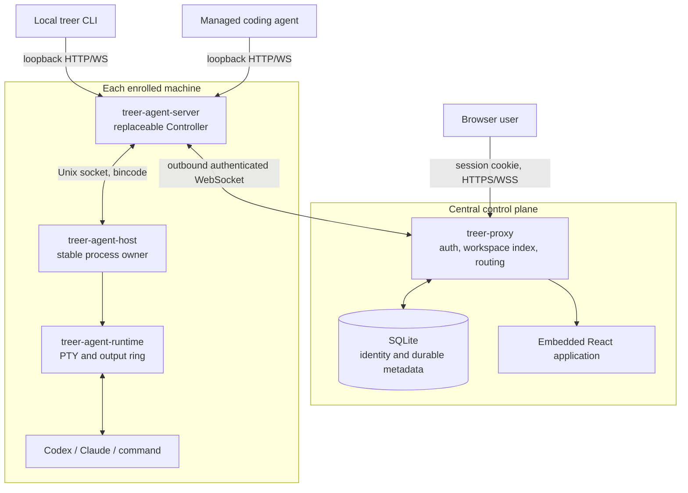
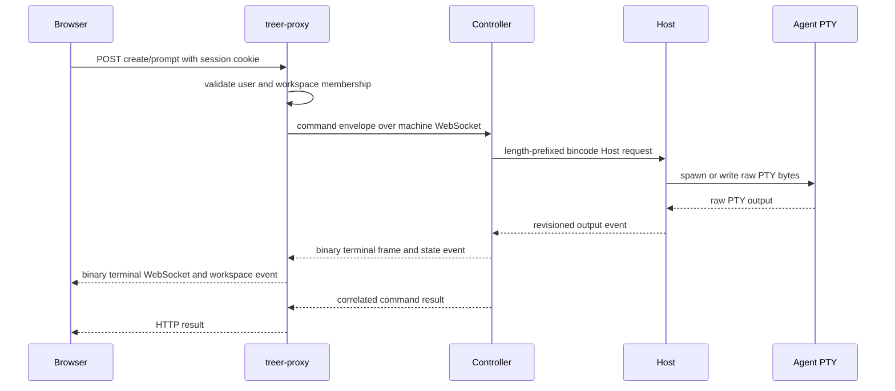
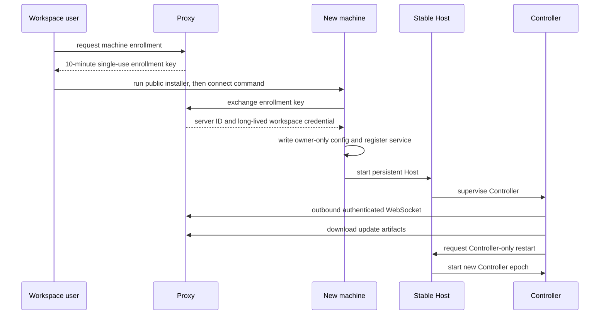
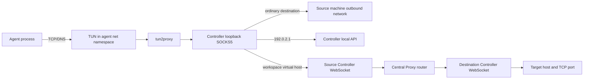

# Treer project review: architecture, information flows, and product direction

- Status: research snapshot
- Reviewed: 2026-08-18
- Treer revision: `72921f15006cff04f3947c26499f4f6e2fe88633`
- Reference revisions: Herdr `2d24950`, AgentENV `d3d3a77`

This report is a source and strategy snapshot at the named Treer revision. For
the maintained post-review view, use the [documentation index](../README.md),
[product direction](../product.md), [architecture](../architecture.md),
[security model](../security.md), and [quality status](../quality.md).

## 1. Executive summary

Treer is currently a distributed runtime and control plane for interactive
coding agents. It connects user-enrolled machines into organization-scoped
workspaces, keeps agent PTYs alive behind a stable Host process, and routes
browser, CLI, agent-control, terminal, file-transfer, and TCP traffic through a
central Proxy.

The near-term product strategy is convenience-first. Treer does not need to
prove strong multi-tenant isolation before it is useful. It does need a security
story that is easy to understand, grounded in observable behavior, and capable
of improving without replacing the product:

> Your agents stay on machines you enroll. Treer uses an open-source control
> plane, workspace-scoped machine credentials, and outbound-only connections to
> coordinate them without publishing SSH or local service ports.

This is a persuasive and technically supportable claim. It combines three
ideas: local runtime custody, scoped authenticated relay, and open
verifiability. It should not be expanded into claims of zero trust, strong
filesystem isolation, per-user subscription isolation, or enterprise-grade
sandboxing; the current implementation does not provide those properties.

The core architecture is a good match for a fast-moving project: a stable,
minimal process runtime sits below a replaceable Controller, while Web and CLI
remain clients of shared protocols. The largest missing product surfaces are
usage attribution, billing, per-user credential ownership, resource scheduling,
durable audit/history, and a production isolation backend.

## 2. Product purpose under the updated strategy

Treer's practical first product is a self-hostable collaboration layer for a
trusted or mostly trusted research group:

1. Install one small machine service without opening an inbound port.
2. Enroll the machine into a logical workspace with a single-use key.
3. Launch Codex, Claude, or shell agents on any online workspace machine.
4. Share live terminals and agent state through a browser or CLI.
5. Let agents discover, prompt, wait for, and read one another.
6. Reach private workspace services and move selected files through the same
   authenticated tunnel.

This is materially more structured than a remote terminal UI. The Proxy knows
organizations, users, workspaces, machines, and globally stable agent IDs; the
Host owns actual processes; the Controller translates between those models.

The longer-term opportunity is to keep the control-plane contract while adding
multiple execution backends:

- a local Host for personal and lab use;
- a Herdr adapter for a richer persistent local terminal runtime;
- an AgentENV or equivalent microVM backend for managed public workloads.

That progression preserves the convenient prototype instead of requiring the
first release to carry the operational cost of a production sandbox platform.

## 3. Technology stack

| Area | Technology | Purpose |
| --- | --- | --- |
| Backend language | Rust 2021 workspace | Proxy, Controller, Host, runtime, CLI, protocols, and transfer engine |
| Async runtime | Tokio | Network services, WebSockets, process observation, and concurrent routing |
| HTTP and WebSocket | Axum, tower, tower-http, tungstenite | Public Proxy API, local Controller API, events, terminals, transfers, and tunnels |
| Data model | Serde, JSON, bincode | JSON across public/control APIs; length-prefixed bincode on the Host socket |
| Persistence | SQLite through SQLx | Users, organizations, memberships, sessions, invitations, workspaces, machine credentials, names, and virtual hosts |
| Authentication | Argon2, random UUID-derived secrets, cookies, Bearer credentials | Password verification, browser sessions, enrollment, and machine identity |
| Agent runtime | portable-pty | Interactive shells, raw terminal I/O, resize, process lifecycle, and replay |
| Linux networking | unshare, tun2proxy, rtnetlink, SOCKS5 | Rootless network namespace and transparent TCP capture |
| CLI | clap, reqwest, crossterm | Human and agent-facing control, attach, native remote shell, and file copy |
| Frontend | React 19, TypeScript, Vite | Browser control plane |
| UI | Tailwind CSS, Radix UI, Lucide, xterm.js | Dashboard controls and raw interactive terminals |
| Frontend packaging | pnpm, vite-plugin-singlefile | Reproducible install and one-file static UI embedded by the Proxy |
| Deployment | Multi-stage Docker, Railway, systemd user service, macOS LaunchAgent | Central Proxy deployment and persistent machine services |
| Release | GitHub Actions, GitHub Releases | Native macOS ARM64 artifacts and missing-platform fallback downloads |

The workspace is split into eight Rust crates. Shared protocol crates prevent
the Proxy, Controller, Host, and CLI from inventing separate wire models. The
frontend depends only on the HTTP/WebSocket surface rather than Rust internals.

## 4. Component map



### `treer-proxy`

The Proxy is the internet-facing rendezvous point. It authenticates browser
users, enrolls machines, holds workspace projections, routes commands, fans out
events, and multiplexes terminal, transfer, and network streams. Durable identity
metadata lives in SQLite; live connections and most runtime projections live in
memory. Relevant entry points are
[`crates/treer-proxy/src/api.rs`](../../crates/treer-proxy/src/api.rs),
[`auth.rs`](../../crates/treer-proxy/src/auth.rs), and
[`state.rs`](../../crates/treer-proxy/src/state.rs).

### `treer-agent-server`

The Controller is the changeable, machine-local control layer. It understands
agent kinds, converts remote operations into Host commands, detects terminal
state, exposes a loopback API, maintains the Proxy connection, and owns the
transparent network bridge. It can be updated without terminating Host-owned
PTYs. See
[`crates/treer-agent-server/src/controller.rs`](../../crates/treer-agent-server/src/controller.rs)
and [`proxy.rs`](../../crates/treer-agent-server/src/proxy.rs).

### `treer-agent-host` and `treer-agent-runtime`

The Host is deliberately unaware of users, prompts, agent brands, and network
routing. It owns processes and caches mutating operation results so a retried
command cannot spawn or stop twice. The runtime resolves working directories
under one configured workspace root, creates PTYs, serializes input, and retains
a bounded 512 KiB raw-output ring per process. See
[`crates/treer-agent-host/src/main.rs`](../../crates/treer-agent-host/src/main.rs)
and [`treer-agent-runtime`](../../crates/treer-agent-runtime/src/lib.rs).

### Clients and shared contracts

The React application uses session-authenticated public routes. The `treer` CLI
normally uses the machine-local API; a managed agent receives its workspace,
machine, agent, and local API identity through environment variables. Protocol
and frame definitions live in
[`treer-protocol`](../../crates/treer-protocol/src/lib.rs) and
[`treer-host-protocol`](../../crates/treer-host-protocol/src/lib.rs).

## 5. Identity and durable state

| Identity | Created by | Presented to | Current scope |
| --- | --- | --- | --- |
| User session cookie | Proxy login | Public Proxy API | One user and organization memberships |
| Admin session cookie | Separate admin login | Admin API | Platform administration only |
| Enrollment key | Authorized workspace user | Public enrollment endpoint | One workspace, ten minutes, single use |
| Machine Bearer credential | Enrollment exchange | Controller WebSocket and `/agent/*` API | One server ID in one workspace |
| Agent ID | Proxy at create time | Proxy, Controller, Host, and managed process | One agent record in one workspace |
| Operation ID | Proxy command router | Controller and Host | Idempotency for one mutation |

Passwords and machine/enrollment secrets are hashed at rest. Browser and admin
sessions are stored as bearer-like tokens in SQLite. Live workspace state,
pending commands, terminals, transfers, and network stream legs are process
memory in the active Proxy, so the current design assumes one routing instance.

The browser user's identity does not currently travel to the Controller or Host
with each operation. Once workspace access is accepted, runtime attribution is
primarily workspace, machine, and agent based. This is sufficient for the first
collaboration product but not for per-user billing or fine-grained audit.

## 6. Control and terminal information flow



The terminal path deliberately avoids Base64. Host output carries a stream epoch
and monotonic revision. Reattachment requests replay from a cursor; the client
can detect when bounded history caused a gap. Controller replacement briefly
interrupts routing but does not replace the Host-owned process.

Agent-to-agent control follows a related path:

```text
managed agent
  -> treer CLI
  -> source Controller loopback API
  -> Proxy /agent/workspaces/... with source machine credential
  -> target Controller WebSocket
  -> target Host
  -> target agent PTY
```

The source Agent never needs the remote machine address or the Proxy credential.

## 7. Enrollment and update flow



The public installer contains no workspace secret. Enrollment and installation
are separate, which allows one reusable install command and short-lived scoped
connection commands.

## 8. Workspace network and service flow

Linux managed agents run in user, network, and mount namespaces. A TUN interface
captures TCP and DNS and transfers sockets to a Controller-owned SOCKS endpoint.
This is network containment and routing, not a private filesystem or VM.



Virtual hosts are explicit workspace discovery records. They are not DNS zones
and do not by themselves authorize access. Source Agent identity is carried in
SOCKS authentication so the policy API can evaluate it, but the production
Proxy currently installs an allow-all policy engine. Every connection sends its
destination metadata to the Proxy for that decision. When no virtual host
matches, the Proxy returns a direct route and the source Controller carries the
TCP payload over its own outbound socket; only virtual-host payload is relayed
through the Proxy.

Browser HTTP/WebSocket tunneling to a virtual host follows the same Controller
path. Before forwarding, the Proxy removes browser cookies, `Authorization`,
proxy authorization, and response `Set-Cookie` to avoid leaking control-plane
credentials into the target service.

## 9. File-transfer flow

```text
treer scp
  -> local Controller WebSocket
  -> authenticated Proxy transfer session
  -> target Controller
  -> target workspace-relative path
```

Transfers preserve regular-file modes, verify declared file sizes and aggregate
counts, reject symlinks and special files, constrain remote paths to the
workspace root, and commit uploaded files by atomic rename. This is explicit
artifact movement, not continuous workspace synchronization or conflict
resolution.

## 10. The current security story

### Claims that are useful and supported

- Machines make outbound connections; users do not publish SSH or local Agent
  Server ports.
- A short-lived, single-use enrollment key produces a credential bound to one
  server and one workspace.
- The open-source Proxy can be self-hosted, inspected, and replaced.
- The stable Host keeps process ownership local to the enrolled machine.
- Browser users authenticate and only discover workspaces belonging to their
  organizations.
- Remote working directories and transfer paths are constrained to the declared
  workspace root.
- Linux Agent TCP traffic passes through a namespace and one policy boundary,
  creating a credible upgrade path for domain and service restrictions.

Together, these properties support a concise product phrase:

> Local custody, scoped coordination, open control plane.

### Claims to avoid for now

- "Zero trust" or "safe for mutually untrusted tenants."
- "Agents cannot access files outside the workspace."
- "Every user's AI subscription is isolated."
- "End-to-end encrypted from the control plane."
- "Enterprise sandbox" or "microVM isolation."
- "All operations are attributable and auditable per user."

The current Controller launches Codex and Claude with their permission bypass
flags. The Linux wrapper isolates networking but not the host filesystem. Policy
evaluation exists as an interface but production defaults to allow-all. The
local Controller API trusts loopback access, and organization members who can
access a workspace share its operational API surface.

These are acceptable prototype tradeoffs under a convenience-first strategy as
long as the supported trust tier is explicit. A useful product model is:

| Trust tier | Runtime | Intended users | Status |
| --- | --- | --- | --- |
| Personal | Current local Host | One developer across devices | Supported by the architecture |
| Lab | Current local Hosts and organization workspace | Trusted or mostly trusted group | Current primary fit |
| Managed | Ephemeral container or microVM backend | Untrusted customers and paid workflows | Future backend |

This tiering gives users a reason to trust the current product without claiming
that the first implementation already solves the final isolation problem.

## 11. Subscription, usage, and billing reality

Codex and Claude currently inherit the authenticated CLI state of the operating
system user running the Host. Treer has no credential vault, credential-owner
record, user-to-runtime binding, token usage event, price table, quota, ledger,
or invoice model. The browser user ID is not carried end-to-end to the process.

Official OpenAI authentication documentation distinguishes ChatGPT sign-in for
subscription access from API-key sign-in for usage-based access, recommends API
keys for programmatic Codex CLI workflows, and warns against exposing Codex
execution in untrusted or public environments. Enterprise access tokens are
described for trusted scripts and private runners. See
[OpenAI authentication](https://learn.chatgpt.com/docs/auth#openai-authentication).

The lowest-cost first step is not billing code. It is an append-only attribution
event with `organization_id`, `user_id`, `workspace_id`, `machine_id`,
`agent_id`, `provider`, `model`, timestamps, and provider-reported usage when
available. That event creates a path to dashboards, quotas, and billing later
without delaying the collaboration product.

## 12. Reference-project comparison

### Herdr

Herdr is a mature local terminal runtime: server-owned terminals, multiple
clients, rich Agent detection, session restore, plugins, TUI interaction, and a
large CLI/socket API. Its core principles explicitly separate state, runtime,
detection, and presentation.

Treer overlaps with Herdr at the PTY and Agent-observation layer. Treer's unique
surface is distributed workspace routing, organization/machine identity,
outbound tunnels, and cross-machine agent control. Treer should keep its Host
small and invest primarily in that distributed surface instead of competing on
every terminal-manager feature.

Review checkout: `.references/herdr` (git-ignored). Upstream source at the
reviewed revision:
[`herdrdev/herdr@2d24950`](https://github.com/herdrdev/herdr/tree/2d24950).

### AgentENV

AgentENV supplies the infrastructure Treer intentionally postpones:
Firecracker microVMs, snapshots, fork/resume, OverlayBD storage, warm pools,
node resource observation, a Gateway/Scheduler split, Kubernetes discovery, and
E2B-compatible APIs. Its scheduler selects eligible nodes from resource
snapshots and maintains sandbox-to-node bindings.

AgentENV is not an internet-facing identity control plane. Its current auth
implementation only checks whether supported headers are non-empty and contains
a TODO for credential validation. A plausible future composition is Treer for
identity, product workflow, policy, and accounting, with AgentENV as a managed
runtime backend.

Review checkout: `.references/AgentENV` (git-ignored). Upstream source at the
reviewed revision:
[`kvcache-ai/AgentENV@d3d3a77`](https://github.com/kvcache-ai/AgentENV/tree/d3d3a77).

## 13. Harness Engineering baseline audit

The comparison target is OpenAI's February 11, 2026 article
[Harness engineering: leveraging Codex in an agent-first world](https://openai.com/index/harness-engineering/).
Its central practices are a short repository map, structured docs as the system
of record, progressive disclosure, versioned execution plans, mechanically
enforced architecture, agent-legible runtime feedback, and recurring cleanup.

Treer had several compatible foundations but did not have that documentation
system at the reviewed base revision. The table is intentionally a baseline;
the maintained [quality document](../quality.md) records the post-review state.

| Practice | Current evidence | Assessment |
| --- | --- | --- |
| Repository-local knowledge | Root `README.md`, detailed `PLAN.md`, bundled Treer skill | Partial |
| Short agent map | No root `AGENTS.md` | Missing |
| Structured `docs/` system of record | Added by this review; previously absent | Beginning |
| Progressive disclosure | README now links to this docs index and report | Beginning |
| Architecture map | `PLAN.md` and this report; no stable standalone invariant document | Partial |
| Versioned execution plans | One prototype plan, no active/completed plan lifecycle or decision log | Weak |
| Mechanical architecture rules | Rust crate boundaries and shared protocol crates; no dependency-boundary lint | Partial |
| Executable quality feedback | `just check`, 118 Rust tests, strict Clippy, frontend typecheck/build | Good locally |
| Continuous integration | Release-only macOS workflow; no required cross-platform test/check workflow | Weak |
| Agent-legible UI validation | Browser terminal exists; no checked-in browser-flow or screenshot harness | Missing |
| Logs, metrics, traces | Basic tracing logs; no local observability stack or performance assertions | Weak |
| Documentation checks | No link, freshness, ownership, or structure validation | Missing |
| Quality and debt tracking | Prototype non-goals exist; no graded quality or debt ledger | Missing |
| Recurring garbage collection | No doc-gardening or architecture cleanup automation | Missing |

Baseline assessment: Treer followed the article's architectural instinct more
than its repository-maintenance method. The code was modular, typed, testable,
and easy for an agent to inspect, but important product knowledge still depended
on a monolithic historical plan and conversation context.

## 14. Recommended lightweight maintenance sequence

The goal is to preserve iteration speed, not build a documentation bureaucracy.
Add each mechanism only when it removes repeated rediscovery:

1. Add a short root `AGENTS.md` that points to `docs/README.md`, `README.md`,
   `PLAN.md`, the relevant crate boundaries, and `just check`.
2. Extract stable architecture and security/trust-tier documents only when the
   next implementation changes those contracts.
3. Add one normal CI workflow running frontend typecheck/build, Rust format,
   tests, and Clippy on pull requests.
4. Record substantial work in a dated execution plan with decisions and final
   outcome; keep small changes in commits and issues.
5. Add an inexpensive Markdown link check after the docs set grows beyond a few
   files.
6. Add browser automation and local logs/metrics only when UI regressions or
   runtime diagnosis become a repeated bottleneck.
7. Periodically ask an agent to compare documented behavior with routes,
   protocol types, and launch flags, then submit small corrections.

This order captures the leverage of Harness Engineering while respecting
Treer's current strategy: ship the convenient distributed runtime first, make
its trust story legible, and strengthen the implementation as real users expose
the important failure modes.

The documentation change accompanying this report implements the short root
map, focused product/architecture/security/quality documents, a relative-link
check, and docs-only CI. It deliberately leaves full cross-platform CI, browser
automation, observability, and an execution-plan lifecycle for changes that can
justify their ongoing cost.

## 15. Verification snapshot

At the reviewed revision:

- `cargo test --workspace`: 118 tests passed;
- `cargo fmt --all -- --check`: passed;
- `cargo clippy --workspace --all-targets -- -D warnings`: passed;
- `pnpm typecheck`: passed;
- `pnpm build`: passed.

The repository's local `just check` recipe covers these checks, although `just`
was not installed in the review environment and the commands were run directly.
