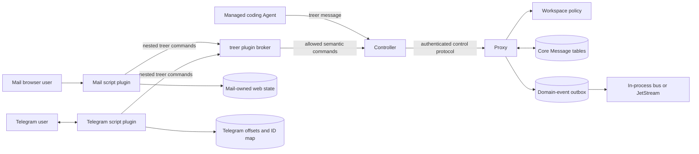

# Core messaging and CLI-only channel plugins execution plan

- Status: completed
- Approved direction: 2026-08-21
- Completion date: 2026-08-21
- Base revision: `1ba449b39be22c1f6da7f9bd56fbd8f6f5d3caac`
- Implementation and E2E revision: `c27fda5`
- Completion-gate revision: `07e02cd`
- Implementation branch: `feat/plugin-system-telegram`

## Goal

Make durable Message data, its directed-acyclic context graph, authorization,
persistence, API, and command surface Treer Core capabilities. Move every
channel-specific presentation and transport out of Core. Introduce a script
plugin contract whose only supported way to operate Treer is the `treer` CLI,
then deliver Mail and Telegram as the first two plugins.

The completed system must preserve the current Mail workflows, add reliable
Telegram reply bridging, keep a self-hosted single-Proxy deployment usable
without NATS, and provide end-to-end evidence that migration, authorization,
delivery, restart, and reply behavior work.

## Completion definition

This plan is complete only when all of the following are true:

1. Core owns the canonical Message and MessageDelivery models, DAG validation,
   PostgreSQL tables, policy checks, idempotency, acknowledgement semantics,
   domain events, Proxy routes, Controller forwarding, and CLI commands.
2. `treer message` is the sole supported Message interface used by managed
   Agents and plugins. Its non-interactive commands have stable JSON output and
   structured errors.
3. `treer plugin` validates, installs, inspects, and runs manifest-declared
   executable scripts through a command-limited local broker. A plugin receives
   no raw machine, Agent workload, or operator credential.
4. Plugin source does not link Treer Rust crates, import repository internals,
   connect to the Proxy or Controller API, read the Proxy database, or consume
   NATS directly. Channel-specific network access, plugin-owned configuration,
   and plugin-owned delivery mapping state remain allowed.
5. The existing Mail backend is removed from the Cargo workspace. Mail runs as
   a script plugin, uses `treer message` for all Message behavior, preserves the
   current human web UI and HTTP behavior, and supports a documented migration
   from both legacy SQLite and PostgreSQL Mail databases.
6. Telegram runs as a script plugin, uses Telegram's official Bot API plus
   `treer` commands, maps native replies and topics to Message context edges,
   and recovers from duplicate updates and process restarts.
7. Focused unit and integration tests, a real Treer end-to-end harness with fake
   external services, migration tests, frontend checks, and `just check` pass.
8. Maintained documentation, operator examples, the embedded Agent skill,
   plugin documentation, security claims, quality evidence, and this plan all
   describe the shipped behavior at the final revision.

## Agreed boundaries

### Core owns collaboration semantics

Treer Core owns concepts that every channel must share:

- authenticated human, Agent, machine, service, and plugin-instance identities;
- workspace-scoped Message IDs and recipient deliveries;
- immutable text bodies and sender/recipient snapshots;
- ordered `context_ids` that form a Message DAG;
- visibility, policy, acknowledgement, idempotency, and retention metadata;
- durable storage and recovery;
- domain events and trace/correlation lineage;
- the versioned HTTP/control protocols and `treer message` CLI contract.

This makes Message analogous to Agent and Machine: channels present or
transport it but do not redefine its semantics or persistence.

### Plugins own channel behavior

A plugin owns behavior that is specific to one external surface:

- Telegram Bot API polling, chat/user allowlists, topics, native replies, and
  Telegram Message ID mappings;
- Mail HTML/API presentation, browser cookies, and Mail-specific navigation;
- Slack, Discord, GitHub, voice, and other future adapters;
- channel tokens and channel-specific retry state;
- conversion between external payloads and the Core Message contract.

Core must not contain Telegram, Slack, or Mail-specific fields, routes, SDKs, or
credentials. Core may carry a bounded, sender-asserted external-source annotation
whose schema is channel-neutral and whose contents are never treated as an
authenticated Treer principal.

### CLI-only means a capability boundary

"CLI-only" is not only a documentation convention. The official plugin runner
must withhold raw Treer credentials and expose a manifest-limited broker used by
nested `treer` commands. The effective permission is the intersection of:

1. the commands declared by the plugin manifest;
2. the identity of the plugin instance or delegated human session;
3. the workspace policy decision for the requested action and resource;
4. immutable Core guards such as workspace and credential binding.

A script that manually implements the local broker protocol must gain no more
authority than it would through the corresponding CLI command. The broker is a
capability boundary, not a claim that arbitrary same-user code is sandboxed.
Protection from a malicious plugin that can inspect another same-UID process or
read its files remains a later separate-user, container, or microVM feature.

## Current baseline and gaps

At the base revision:

- Message, Delivery, recipients, contexts, unread state, and message bodies live
  only in the standalone Rust Mail app.
- A Message may reference up to 32 unique context messages. Send validation
  requires every context to exist in the same workspace and already be visible
  to the sender. Because a new Message can reference only existing Messages, the
  context graph is acyclic by construction and permits multiple parents.
- The Mail app owns SQLite/PostgreSQL storage, App OAuth state and sessions, its
  HTTP API, and its React frontend.
- Mail inbox reads mark deliveries read in the same request. There is no
  explicit acknowledgement, receive lease, idempotency key, graph traversal,
  public Message event consumer, or Message CLI.
- The Proxy provides generic App OAuth, workload identity, directory, and
  recipient resolution, but the current app recipient routes do not enforce
  Message-specific policy.
- `AppPrincipalKind` covers Agent and human while the durable policy vocabulary
  anticipates human, Agent, machine, and service. The hot-path policy subject is
  still Agent or machine.
- The CLI reads raw workload/operator credentials and contacts the local
  Controller directly. Passing that environment unchanged to arbitrary scripts
  would not provide a CLI-only boundary.
- The event envelope and optional JetStream publisher exist, but the publisher
  is not a transactional outbox and there is no supported plugin subscription.

The migration must not conceal these gaps behind a channel adapter. It must
establish the shared contracts before moving Mail or adding Telegram.

## Target architecture



The Core Message path must work with one Proxy and PostgreSQL without NATS.
NATS distributes events when configured but is never the source of Message or
delivery truth.

## Core Message contract

### Shared models

Add versioned shared protocol models with bounded fields. Exact names may follow
existing conventions, but the contract must represent:

| Model | Required data |
| --- | --- |
| `Message` | ID, workspace, authenticated sender, sender snapshot, recipients, ordered context IDs, text body, created time, optional expiry, correlation/trace IDs, bounded external-source annotation |
| `MessageDelivery` | ID, Message ID, recipient, created time, acknowledgement time, optional expiry |
| `SendMessageRequest` | recipients, ordered context IDs, body, optional expiry, optional idempotency key, optional external-source annotation |
| `ReceiveMessagesRequest` | limit and bounded long-poll timeout |
| `AcknowledgeMessagesRequest` | one or more delivery IDs plus an operation/idempotency ID |
| `MessagePage` | visible messages or deliveries, deterministic cursor, and remaining/unacknowledged metadata |

Stable principal IDs authorize access. Stored names and roles are historical
display snapshots and must not become authorization keys. External Telegram or
Mail labels are sender assertions; they do not change the authenticated sender.

Version 1 remains text-only. Attachments, edits, reactions, retention policy,
full-text search, and cross-workspace federation are later contracts. Telegram
edits may initially create a new Message referencing the old Message rather than
mutating an immutable record.

### DAG invariants

Core must enforce these invariants transactionally:

1. Message IDs and context IDs are scoped to one workspace.
2. Context IDs are unique and ordered, with a bounded maximum of 32.
3. Every context Message exists before the child is inserted.
4. The sender can already read every referenced context Message.
5. A context edge does not grant a recipient access to the referenced body.
6. Sender and recipient visibility is durable; later policy changes do not
   rewrite historical authorship or silently delete deliveries.
7. Multi-recipient creation is atomic, including all recipient resolution,
   policy decisions, Message data, deliveries, context edges, idempotency state,
   and the outbox row.
8. Import validates that legacy edges are acyclic and topologically resolvable
   before committing a batch.

The first implementation needs `get` plus direct parent information. Descendant
and arbitrary graph traversal may be added only with visibility filtering and
bounded depth/page size; it is not required for the first Telegram flow.

### Persistence

Create dedicated Proxy Message storage rather than extending authentication
modules. PostgreSQL tables should separately model:

- immutable Messages;
- ordered Message recipients or deliveries;
- ordered context edges;
- sender-scoped idempotency keys and their completed result;
- transactional Message domain-event outbox entries;
- any durable plugin-human session metadata required by the generic broker.

Use database constraints for workspace ownership, unique recipients, unique
context edges, positive positions, and idempotency uniqueness. Application
validation remains necessary for visibility and policy. Schema initialization
and migrations must be repeatable on an existing deployment.

Message bodies become visible to the Proxy and PostgreSQL operators. They must
not appear in audit events, domain-event payloads, traces, structured error
messages, or ordinary logs. Backups, export, deletion, and retention remain
explicitly documented limitations until implemented.

### Delivery and acknowledgement

Replace destructive read-on-fetch semantics in Core with repeatable receipt and
explicit acknowledgement:

- `receive` returns unacknowledged deliveries and may long-poll for a bounded
  duration;
- a delivery remains eligible until `ack` commits;
- clients deduplicate by stable delivery ID and Message ID;
- acknowledgement is idempotent;
- history listing is separate from receipt and does not mutate state;
- one Message sent to several recipients produces separately acknowledged
  deliveries;
- expired data is never silently discarded before its retention contract is
  documented and tested.

This provides at-least-once delivery. Exactly-once effects in Telegram are not
possible because `sendMessage` has no client idempotency key. The Telegram plugin
must minimize and surface ambiguous post-send crashes rather than claim exactly
once.

### Idempotency

`message send` accepts a bounded sender-scoped idempotency key. Retrying the
same key and identical request returns the original Message. Reusing the key
with different content fails with a stable conflict error. Telegram uses a key
derived from bot identity and `update_id`; migration uses a deterministic legacy
Message key. A completed idempotent response survives Proxy restart.

### Policy and identity

Add explicit actions and resources rather than folding Message into Agent
prompting:

```text
message.send       -> recipient mailbox resource
message.read       -> visible Message resource
message.receive    -> caller-owned mailbox resource
message.ack        -> caller-owned delivery resource
message.import     -> workspace migration resource, operator/admin only
```

Name-based recipient resolution uses the filtered directory. Stable recipient
IDs may be used without discovery only when `message.send` itself is allowed,
and denied/nonexistent recipients produce the same external error. Pin one
policy revision for all recipients and contexts in a send. `agent.prompt`
remains a distinct, stronger action used only for optional wake-up.

The initial Telegram plugin runs as a dedicated managed Agent principal. Its
Telegram allowlist is channel admission, not Treer authentication. A bounded
external-source annotation may record Telegram user/chat/message IDs and display
names, but Core and audit must continue to attribute the operation to the bridge
Agent.

### Events and recovery

Emit at least `message.created` and `message.acknowledged` envelopes. Payloads
contain IDs and safe routing metadata, not body text. Insert the Message change
and outbox row in one PostgreSQL transaction. An idempotent dispatcher publishes
to the in-process event bus and optional JetStream, marks successful outbox
entries, and recovers undispatched rows after restart.

Plugins use authoritative `message receive --wait`, not NATS. A later public
event CLI may reuse the outbox but is not required to make Mail or Telegram
correct.

## CLI contract

Add a top-level `message` group with complete help and embedded-skill coverage:

```bash
treer message send --to <principal>... --context <message-id>... \
  --idempotency-key <key> --body-file -
treer message reply <message-id> --to sender --body-file -
treer message get <message-id>
treer message list --before <cursor> --limit <n>
treer message receive --wait <milliseconds> --limit <n>
treer message ack <delivery-id>...
treer message import --format legacy-mail-v1 --body-file <path>
```

Command details:

- default non-interactive output is one JSON value; any streaming mode is JSONL;
- bodies can come from an argument for short interactive use or stdin/file for
  exact multiline content and safe process argument handling;
- errors expose a stable code, message, and nonzero exit status in a documented
  machine-readable form;
- reply resolves visible context and defaults to its sender but still performs
  ordinary recipient and policy checks;
- import is unavailable to ordinary plugin manifests and requires explicit
  migration authority;
- receive timeout and page sizes are bounded server-side;
- current compatibility aliases remain unchanged.

The local Controller forwards typed Message requests and authenticated principal
context to the Proxy. Wire models live in `treer-protocol`; Controller and Proxy
must not define parallel JSON structures.

## Script plugin contract

### Package layout

Each plugin directory contains a manifest and an executable script entry point:

```text
plugins/<id>/
  plugin.json
  README.md
  <entrypoint script>
  config.schema.json
  tests/
  web/                 # optional source/static assets
```

`plugin.json` version 1 includes:

- schema version, stable plugin ID, display name, and plugin version;
- minimum compatible Treer CLI version;
- entrypoint argv and supported operating systems;
- declared Treer command capabilities;
- required configuration and named secrets;
- optional local HTTP service and health contract;
- plugin-owned state version;
- checksums or package provenance when installed from an archive.

The entry point must be a script. A plugin may ship static assets and tests but
must not contain a Cargo package, join the Rust workspace, or link internal
Treer code. Python is the preferred first-party channel language because its
standard library covers JSON, HTTP, subprocesses, and SQLite without vendored
dependencies. The contract remains language-neutral.

### CLI management surface

Implement at least:

```bash
treer plugin validate <directory-or-package>
treer plugin install <directory-or-package>
treer plugin list
treer plugin inspect <id>
treer plugin run <id> --config <path>
```

Installation is data-only: validate and copy an immutable package into the
Treer data directory. Version 1 has no install hook and executes no package code
during validation or installation. `run` stays in the foreground so systemd,
Docker, launchd, or a managed Treer Agent can supervise it. Automatic remote
marketplaces, dependency installation, upgrade orchestration, and arbitrary
post-install scripts are non-goals.

### Broker and credentials

`treer plugin run` creates a private local broker session, then launches the
script with a sanitized environment:

- remove Agent workload, machine, operator, Controller URL, and unrelated Treer
  credential variables;
- provide plugin ID/version, a plugin state directory, declared configuration,
  named channel secrets, and the broker endpoint/session;
- force nested `treer` invocations into broker mode;
- reject direct-mode overrides while the plugin broker context is present;
- parse nested CLI argv with the installed CLI, map it to a semantic operation,
  and reject commands outside the manifest before network access;
- apply normal Proxy identity and workspace policy after broker authorization;
- bound request size, concurrency, runtime, and captured stderr/stdout;
- record safe command/action metadata without recording Message bodies or
  channel tokens.

The child can use its channel secret, such as a Telegram bot token. It cannot
receive the parent Agent workload credential or local operator credential.
Tests must inspect the child environment and prove that undeclared commands and
direct Controller access fail.

### Human browser sessions for plugins

Mail must preserve human login without directly implementing private Proxy API
calls. Add generic brokered App OAuth commands that:

1. create a PKCE authorization request for the running plugin instance and
   return a browser URL plus bounded state;
2. exchange the callback code through Core;
3. create a durable, revocable, plugin-bound human session capability;
4. let later nested CLI commands present that capability and execute as the
   human within the same plugin/workspace;
5. prevent the capability from being used by another plugin or as a general
   machine/Agent credential.

The browser may navigate to the Core authorization URL returned by the CLI; the
plugin script must not construct or call private Proxy routes. The plugin owns
its HttpOnly cookie and maps it to the opaque plugin session capability. Core
stores only the data needed to validate/revoke that capability. Expiry,
membership removal, service removal, and plugin uninstall revoke access.

This generic contract replaces Mail-specific OAuth coupling and is reusable by
future web-facing script plugins.

## Mail plugin migration

### Target package

Move the Mail product surface under `plugins/mail`:

- a Python script is the HTTP/backend entrypoint;
- the existing React/TypeScript frontend moves with the plugin and retains its
  current routes and interaction model unless a change is necessary for the new
  explicit acknowledgement contract;
- the script serves static assets, manages Mail browser cookies, performs the
  generic brokered App OAuth flow, and invokes `treer human` and `treer message`;
- Message bodies, recipients, contexts, and read/ack state are never stored in
  the plugin database after cutover;
- only Mail web-session and presentation state may remain plugin-owned;
- the Rust `treer-mail` backend and Cargo workspace member are removed after
  migration and compatibility tests pass.

Preserve the existing HTTP paths and response shapes used by the frontend where
reasonable:

```text
/api/health
/api/config
/api/auth/start
/api/auth/callback
/api/auth/session
/api/auth/logout
/api/directory
/api/messages
/api/inbox
```

The compatibility layer translates these routes to CLI commands. Existing
behavioral distinctions remain: recent history, unread receipt, multi-recipient
send, context IDs, combined human/Agent directory, and workspace-scoped OAuth.
The wrapper may acknowledge returned deliveries to emulate the old pull API,
while Telegram uses explicit ack directly.

### Legacy data migration

Provide an explicit, restartable migration script for legacy SQLite and
PostgreSQL Mail databases. It may read the legacy app-owned database but writes
Treer only through the operator-authorized CLI import command.

The migration must preserve:

- Message IDs, workspace IDs, bodies, and original timestamps;
- authenticated sender kind/ID and historical sender display snapshot;
- ordered recipients and their historical display snapshots;
- ordered context edges;
- per-recipient read/unread state;
- usable, unexpired browser sessions when they can be converted without
  broadening their service audience; otherwise require one documented re-login;
- deterministic import idempotency so an interrupted migration can restart.

Migration procedure:

1. Validate the target workspace, service identity, Core schema, and source DB.
2. Back up the source DB and record counts plus a content-independent checksum
   of IDs/edges/delivery state.
3. Stop legacy Mail writes.
4. Export and validate a bounded `legacy-mail-v1` stream in topological order.
5. Import through `treer message import`, committing restartable batches.
6. Compare source/target counts, IDs, context edges, and unread state.
7. Start the Mail plugin on the same registered service/ingress and run smoke
   tests before reopening writes.
8. Retain the source backup read-only until the rollback window closes; never
   delete it automatically.

Provide a reverse export or documented roll-forward recovery for Messages
created after cutover. A rollback must not silently split new Core Messages from
the restored legacy service. Production cutover is blocked until this procedure
has passed against representative SQLite and PostgreSQL fixtures.

## Telegram plugin

### Runtime and configuration

Implement `plugins/telegram/telegram.py` using the Python standard library. It
may access only the Telegram Bot API, its plugin-owned SQLite state, declared
configuration/secrets, and nested `treer` commands.

Version 1 uses `getUpdates` long polling because it requires no inbound public
port and preserves Treer's outbound-only machine story. Webhook mode is a later
optional transport using the same mapping state.

Configuration maps stable Telegram identities to Treer targets:

- bot token supplied as a named secret, never in the manifest or logs;
- allowed numeric Telegram user IDs;
- `(chat_id, message_thread_id)` binding to a stable target Agent ID;
- optional default target and whether `agent.prompt` wake-up is enabled;
- bounded polling, retry, and formatting settings.

Usernames and display names are presentation only and never authorization keys.
Group privacy mode, bot permissions, and supported update types must be
documented for operators.

### Plugin-owned state

Use SQLite transactions for:

- last confirmed Telegram `update_id`;
- inbound update processing state;
- mapping `(chat_id, thread_id, telegram_message_id)` to Treer Message ID;
- reverse mapping from Treer Message/delivery ID to Telegram Message ID;
- pending outbound attempt state and last error;
- configuration schema/data migration version.

The bot confirms an update offset only after the idempotent Core Message send
and local mapping commit are recoverable. Stable Core idempotency keys prevent a
crash from duplicating inbound Messages.

Telegram outbound delivery is at least once. Store intent before `sendMessage`,
store the returned Telegram Message ID before acknowledging the Core delivery,
and retry known failures with bounds. A crash after Telegram accepts a message
but before its response is committed is ambiguous and may duplicate; tests and
documentation must state this limitation.

### Reply and DAG mapping

Inbound mapping:

1. Resolve and authorize the numeric Telegram user/chat/topic binding.
2. If `reply_to_message` has a local mapping, add its Treer Message ID as the
   primary context ID.
3. Send a Core Message from the dedicated Telegram bridge Agent to the configured
   target with a deterministic idempotency key.
4. Store the Telegram-to-Treer mapping.
5. Optionally wake the target with `treer agent prompt`, passing only the new
   Message ID and instructions to read/reply through `treer message`.

Outbound mapping:

1. Receive an unacknowledged Message delivery addressed to the bridge Agent.
2. Find context IDs mapped to the same Telegram chat/topic.
3. Use the first such context as Telegram's native reply target.
4. Preserve every context edge in Core; represent additional parents with
   bounded text or inline controls without inventing extra native reply edges.
5. Send to the original topic using `message_thread_id`, commit the reverse
   mapping, then acknowledge the Core delivery.

Example:

```text
Telegram #100 -> Core M1
Core M2(context=[M1]) -> Telegram #101(reply_to=#100)
Telegram #102(reply_to=#101) -> Core M3(context=[M2])
```

Replies may branch when several Messages reference the same parent. Multi-parent
Core Messages remain DAG nodes even though Telegram displays only one native
reply edge. A context mapped to another chat/topic cannot become a native reply
and must not leak its body.

### Initial feature boundary

Required in version 1:

- private chats and configured groups/topics;
- text Messages;
- native reply mapping in both directions;
- allowlists and stable target bindings;
- `/start`, target/status discovery appropriate to declared permissions, and
  clear denied/offline/queued results;
- optional Agent wake-up;
- rate-limit handling, bounded exponential backoff, restart recovery, and safe
  logging.

Deferred:

- attachments and Telegram file downloads;
- message mutation synchronization and deletion propagation;
- reactions, polls, voice, payments, Mini Apps, and arbitrary callback actions;
- per-Telegram-user Treer human impersonation;
- webhook/high-availability active-active consumers.

## Delivery phases

### Phase 0: Freeze contracts and fixtures

1. Capture legacy Mail SQLite and PostgreSQL fixtures with branching and
   multi-parent contexts, human/Agent recipients, read/unread deliveries, and
   active/expired web sessions.
2. Add current Mail API contract tests before changing storage.
3. Record current CLI help/output fixtures relevant to compatibility.
4. Add the plugin manifest JSON schema and architecture decision tests.
5. Confirm message-size, recipient, context, polling, and manifest limits.

Exit gate: tests fail if current Mail behavior or fixtures are not captured.

### Phase 1: Core Message persistence and protocols

1. Add shared Message, delivery, request, response, cursor, and error models.
2. Add PostgreSQL schema/migrations, store module, idempotency, DAG validation,
   explicit acknowledgement, and transactional outbox.
3. Add Message policy actions/resources and batch authorization.
4. Add Proxy routes and Controller forwarding with authenticated principals.
5. Add domain-event dispatch/recovery without requiring NATS.
6. Test atomicity, visibility, DAG invariants, policy, restart, and multi-Proxy
   behavior where applicable.

Exit gate: Core tests can send, receive, acknowledge, retry, and recover Messages
without Mail or Telegram installed.

### Phase 2: Message CLI and managed-Agent contract

1. Add `treer message` commands, JSON output/errors, stdin bodies, long polling,
   reply convenience, and restricted import/export.
2. Extend the local Controller routes and operation idempotency as needed.
3. Update the embedded Treer skill so Agents read and reply by stable Message ID.
4. Add CLI parser, wire round-trip, identity, denial, and process-level tests.

Exit gate: an Agent can complete a two-way contextual exchange using only CLI
commands, and no Mail-specific service is running.

### Phase 3: Plugin runner and broker

1. Add manifest types, JSON schema, validator, installation layout, list/inspect,
   and foreground run commands.
2. Add environment sanitization and broker-mode nested CLI dispatch.
3. Enforce declared commands before network access and ordinary Policy after it.
4. Add generic plugin App OAuth and plugin-bound human session capabilities.
5. Add a minimal test plugin proving allowed/denied commands, restart, config,
   channel secret, and credential withholding.
6. Add repository checks that first-party plugins are scripts and have no Treer
   crate or private endpoint dependency.

Exit gate: the fixture plugin operates Treer through nested CLI commands but
cannot obtain or use the parent Treer credentials directly.

### Phase 4: Mail plugin and migration

1. Move Mail frontend assets and docs under `plugins/mail`.
2. Implement the script HTTP backend over brokered OAuth, directory, and Message
   CLI commands while preserving current browser API shapes.
3. Implement legacy SQLite/PostgreSQL export/import and validation.
4. Run compatibility tests against the frozen API and browser fixtures.
5. Remove the Rust Mail server from Cargo and deployment build contexts only
   after migration/cutover tests pass.
6. Keep a concise legacy-path migration pointer so old deployment links do not
   fail without explanation.

Exit gate: old and new Mail behavior match for login, directory, send, inbox,
history, reply/context, unread state, and responsive frontend workflows; legacy
data migration is idempotent and count/edge complete.

### Phase 5: Telegram plugin

1. Implement configuration, secret handling, SQLite state, and Bot API client.
2. Implement long polling, update deduplication, stable bindings, and inbound
   Message creation.
3. Implement Core receipt, Telegram send, native replies/topics, mapping commit,
   and Core acknowledgement.
4. Add optional Agent wake-up without copying Message bodies into prompts.
5. Add fake Telegram API tests for rate limits, malformed updates, duplicate
   updates, reply branches, multiple contexts, restarts, and ambiguous sends.

Exit gate: a Telegram user and managed Agent complete a multi-turn reply chain
whose native Telegram replies and Core DAG edges agree after plugin restarts.

### Phase 6: End-to-end, rollout, and documentation

1. Run the real Proxy, Controller, Host, CLI broker, Mail plugin, Telegram plugin,
   PostgreSQL, and fake Telegram API in a deterministic harness.
2. Exercise human Mail OAuth, Agent/human directory, migrated history, Message
   policy denials, Telegram reply chains, optional wake-up, and restarts.
3. Run single-Proxy without NATS and multi-Proxy with NATS coverage appropriate
   to changed routing/event behavior.
4. Update every maintained and operator-facing document in the documentation
   completion matrix below.
5. Run focused checks, migration/canary tests, and the complete `just check` gate.
6. Mark this plan completed only after results and final revision are recorded.

## Source ownership map

| Path | Delivered responsibility |
| --- | --- |
| `crates/treer-protocol` | Shared Message, delivery, plugin manifest/session, request/response, and event wire models |
| `crates/treer-proxy` | Core Message PostgreSQL store, policy, idempotency, outbox, app/plugin sessions, and public/control routes |
| `crates/treer-agent-server` | Authenticated local Message forwarding and broker-compatible control transport |
| `crates/treer-cli` | `message` commands, `plugin` lifecycle, broker, JSON output/errors, and migration commands |
| `skills/treer/SKILL.md` | Managed-Agent Message workflow and operational limits |
| `plugins/mail` | Script backend, Mail frontend, plugin manifest, compatibility and migration tests |
| `plugins/telegram` | Script connector, Telegram state/mapping, manifest, and fake Bot API tests |
| `apps/mail` | Removed after migration, or retained only as a short migration pointer for one compatibility window |
| `scripts` / `justfile` | Plugin validation, migration fixtures, hermetic tests, and full end-to-end gate |
| `docs` / `README.md` / `AGENTS.md` | Maintained contracts, source map, trust claims, setup, operations, and completion evidence |

Avoid placing plugin mechanics in Host/runtime crates. The Host owns processes;
the CLI owns the plugin command surface and broker; the Proxy owns durable
product state and policy.

## Verification and acceptance matrix

### Core Message correctness

- send to Agent and human stable IDs and unique names;
- duplicate-name non-disclosure and hidden-recipient behavior;
- atomic multi-recipient send and per-recipient delivery state;
- sender/history visibility and context-body non-leakage;
- branch and multi-parent DAG creation;
- rejection of missing, cross-workspace, duplicate, invisible, or forward
  contexts;
- explicit acknowledgement and repeatable unacknowledged receive;
- send/ack idempotency across process and Proxy restart;
- bounded body, recipient, context, page, and wait sizes;
- policy monitor/enforce decisions and one pinned revision per batch;
- message/outbox atomicity, dispatcher restart, JetStream deduplication, and
  single-Proxy operation without NATS;
- no Message body in logs, errors, audit payloads, or domain events.

### Plugin boundary

- malformed, unknown-version, duplicate-ID, unsafe-path, and oversized manifests
  fail before execution;
- install performs no plugin code execution;
- plugin environment excludes raw Treer credentials and unrelated secrets;
- undeclared CLI commands fail locally before a Controller/Proxy request;
- declared commands still fail when workspace policy denies the target;
- direct-mode CLI override fails inside broker context;
- broker request size/concurrency/time limits hold under hostile input;
- plugin package tests use a fake `treer` executable and do not need repository
  internals;
- repository checks reject first-party plugin Cargo packages and private Treer
  endpoint usage;
- uninstall/session revocation prevents further brokered human operations.

### Mail compatibility

- existing OAuth start/callback/session/logout flow and cookie properties;
- current human and Agent directory contents without email disclosure;
- human-to-Agent, Agent-to-human, and multi-recipient sends;
- recent history and unread inbox behavior;
- reply/context rendering, branches, and inaccessible-context behavior;
- SQLite and PostgreSQL legacy migration with preserved IDs, edges, timestamps,
  and read state;
- interrupted migration resume and duplicate import safety;
- frontend typecheck/build and real-browser desktop/mobile critical flows;
- service registration, workspace ingress, health/config, and process restart;
- one documented re-login only if session conversion cannot be performed safely.

### Telegram behavior

- unauthorized Telegram user/chat/topic rejected before any Treer command;
- update offset confirmation and duplicate update idempotency;
- text escaping, length limits, split responses, and Telegram rate limits;
- inbound native reply to Core context mapping;
- Core context to outbound native reply and topic mapping;
- branches and multiple Core contexts without cross-chat leakage;
- offline/denied target produces a durable Message and accurate queued/error
  status according to configuration;
- optional wake-up requires separate `agent.prompt` capability and Policy;
- restart before/after Core send, local mapping commit, Telegram send, and Core
  ack;
- bot token and Message bodies absent from logs and command arguments where stdin
  is available.

### End-to-end scenarios

At minimum, automate these complete workflows:

1. Fresh install: create workspace, enroll machine, install both plugins, log in
   to Mail, exchange contextual Messages with an Agent, and verify acknowledgements.
2. Legacy upgrade: populate old Mail SQLite/PostgreSQL fixtures, migrate, run the
   new Mail plugin, compare all visible history/read state, and send new replies.
3. Telegram conversation: fake user sends #100, Agent replies through Core, bot
   sends native reply #101, user replies #102, and Core records the expected
   `M1 <- M2 <- M3` context chain.
4. Reliability: repeat updates and restart every process boundary without
   duplicating Core Messages or losing unacknowledged deliveries.
5. Authorization: deny `message.send`, `message.receive`, and `agent.prompt` in
   turn and verify non-disclosing errors plus unchanged durable state.
6. Isolation: run two workspaces and prove Mail/Telegram identities, mappings,
   contexts, sessions, and broker commands cannot cross them.

Fast hermetic plugin and fake-channel tests become part of `just check`. A
separate documented end-to-end command may provision PostgreSQL and real Treer
processes, but it is a release/merge gate for this plan and must run in CI or the
canary workflow before completion.

## Rollout and recovery

- Introduce additive Core schema and CLI commands before removing the legacy
  Mail server.
- Feature-gate Core Message routes and plugin execution until migrations and
  policy defaults are installed.
- Keep current Mail deployment usable during development; do not dual-write two
  Message stores without an explicit consistency protocol.
- Cut over one workspace at a time after stopping legacy writes and validating
  the migration report.
- Preserve old database backups and binaries through a documented rollback
  window.
- Prefer roll-forward after new Core Messages exist. If binary rollback is
  required, export the Core delta before restoring legacy writes.
- Never automatically delete legacy databases, plugin state, Telegram mappings,
  or Message tables during uninstall or rollback.
- Record migration/cutover actor, source checksum, target counts, timestamps,
  and errors without recording Message bodies.

## Documentation completion matrix

Implementation is incomplete until the closest maintained documents are updated
in the same final changes:

| Document | Required final update |
| --- | --- |
| `AGENTS.md` | Keep the short map; add Core Message and plugin source ownership without embedding the plugin manual |
| `docs/README.md` | Index the maintained plugin contract and Mail/Telegram operator docs; move this plan from active to completed history |
| `docs/product.md` | State that durable Message is Core and channels are replaceable CLI-only script plugins; retain accurate trust language |
| `docs/roadmap.md` | Mark delivered Message/plugin capabilities, update sequencing, and leave deferred adapters/sandboxing explicit |
| `docs/architecture.md` | Add Message tables, outbox, CLI broker, plugin-human session, Mail and Telegram flows, ownership, transports, and state |
| `docs/security.md` | State that Proxy/PostgreSQL can see Message bodies; document plugin/session/channel credentials, Telegram identity limits, broker guarantees, and no hostile same-UID sandbox claim |
| `docs/quality.md` | Record Message/plugin/Mail/Telegram test evidence, migration coverage, full commands, and remaining reliability gaps |
| `README.md` | Replace standalone Rust Mail setup with Core Message and plugin install/run/migrate examples; add Telegram setup and operational limits |
| `skills/treer/SKILL.md` | Document `treer message` discovery, receive, reply, ack, idempotency, wake-up distinction, and safety boundaries |
| `plugins/README.md` | Own manifest, installation, CLI-only boundary, state, secrets, supervision, versioning, and development/test conventions |
| `plugins/mail/README.md` | Own Mail configuration, OAuth, ingress, migration, compatibility, backup, and troubleshooting |
| `plugins/telegram/README.md` | Own BotFather setup, token handling, allowlists, chats/topics, polling, permissions, reply semantics, recovery, and known limitations |
| `apps/README.md` / legacy Mail docs | Remove obsolete ownership claims or retain only an indexed migration pointer during the compatibility window |
| `docs/releases.md` / `docs/canary.md` | Include plugin artifacts, compatibility checks, migration/canary order, and rollback where release behavior changes |
| `scripts/check-docs.mjs` | Require the new maintained plugin entry points and continue validating the embedded-skill path and all relative links |

Run the documentation checker after every documentation phase. Before marking
the plan completed, compare routes, CLI help, manifests, schema, policy actions,
test commands, and source ownership against every maintained claim.

## Delivered commit structure

The implementation remained independently reviewable and did not commit
generated artifacts:

1. `94e79c2 docs: plan core messaging and CLI-only channel plugins`
2. `4609500 feat: add core messaging and CLI-only plugin broker`
3. `fccde3b feat: migrate mail to a CLI-only script plugin`
4. `0357162 feat: add Telegram Core Message bridge plugin`
5. `c27fda5 test: verify CLI-only messaging plugins end to end`
6. `07e02cd fix: satisfy plugin release and lint gates`
7. `docs: publish message and plugin operating contracts`

Core contracts landed before channel implementations, and the legacy Mail
removal followed migration coverage.

## Progress record

- [x] Product owner approved the Core Message / channel plugin boundary.
- [x] Source baseline and current Mail/DAG/policy/CLI gaps reviewed.
- [x] Execution plan indexed and target roadmap aligned.
- [x] Phase 0 contracts and legacy fixtures complete.
- [x] Phase 1 Core Message persistence and protocols complete.
- [x] Phase 2 Message CLI and embedded skill complete.
- [x] Phase 3 plugin runner, broker, and human sessions complete.
- [x] Phase 4 Mail plugin and migration complete.
- [x] Phase 5 Telegram plugin complete.
- [x] Phase 6 end-to-end, rollout, documentation, and full gate complete.

## Completion evidence and residual limits

The delivered release slice moves canonical Message, delivery, ordered context
DAG, policy, idempotency, acknowledgement, import, and body-free transactional
outbox state into Proxy PostgreSQL. It exposes `treer message`, adds the
manifest-limited plugin runner and broker, removes the Rust Mail workspace
member, preserves a legacy migration pointer, and ships Mail and Telegram as
CLI-only Python packages. The final documentation phase also removed the stale
Mail server path from the clean Docker build context.

The following evidence passed on `feat/plugin-system-telegram`:

- documentation index/link checks and 11 positive/negative first-party plugin
  boundary checks;
- release-tool tests, control-plane and Mail frontend typechecks/builds, Mail
  and Telegram Python unit suites, and validation of both production manifests;
- `cargo build --workspace`, formatting, all 210 Rust tests, and strict workspace
  Clippy with warnings denied;
- a clean release Docker build containing Proxy, Host, Controller, and CLI;
- the real-process messaging E2E with authenticated Proxy, isolated PostgreSQL,
  two Host/Controller pairs, two workspaces, five managed command Agents, both
  plugins through the official runner, and a fake Telegram Bot API.

That E2E proves Core send/reply/get/list/receive/ack, multi-turn DAG mapping,
repeatable delivery, explicit acknowledgement, Controller restart identity,
Proxy-restart send idempotency, workspace isolation, body-free outbox/log paths,
SQLite and real-`psql` legacy Mail migration, Mail PKCE/OAuth/directory/send/inbox
compatibility, Telegram policy denial, native replies/topics, and plugin restart.
The environment did not provide the `just` executable, so the commands listed in
the `just check` recipe were executed directly against its PostgreSQL test
container rather than through the recipe wrapper.

The broader acceptance matrix remains useful future work, but these items are
not claimed by the completed slice:

- Mail compatibility is exercised at HTTP/API level, not through a real desktop
  or mobile browser, and there is no visual regression suite.
- Message has no dedicated multi-Proxy/NATS E2E. Existing NATS event and routing
  tests pass, while the changed Message path is proven with one Proxy and no
  broker dependency.
- Telegram uses fake Bot API coverage, not a live bot; webhook and active-active
  modes are absent, and an ambiguous accepted `sendMessage` may duplicate on
  retry because Telegram provides no client idempotency key.
- Plugin uninstall, automatic state migration, signed plugin archives, hostile
  same-UID isolation, attachments, Message retention/export/deletion, and
  billing remain outside this release slice.
