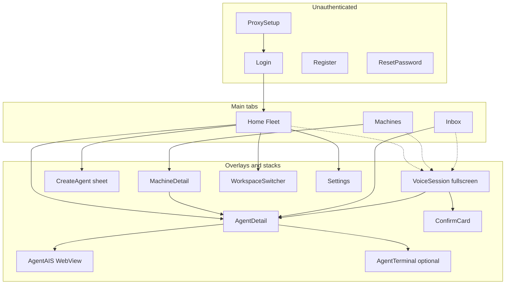
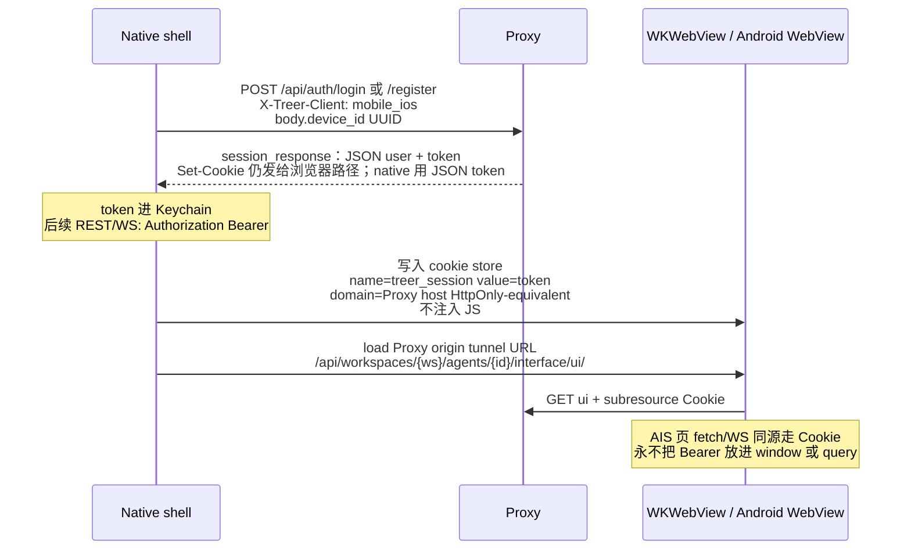
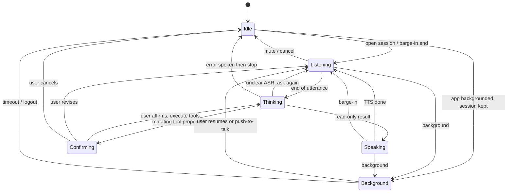
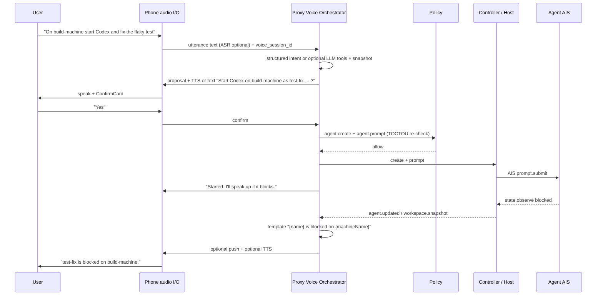

# Treer 手机 App 产品方案：界面、功能与远期纯语音编排

| 字段 | 值 |
| --- | --- |
| 状态 | Draft |
| 作者 | Treer design |
| 日期 | 2026-08-30 |
| 受众 | 熟悉 Treer 控制面的资深工程师 |
| 范围 | 产品 / UX / 客户端形态 / 控制面契约增量；不实现代码 |

---

## Overview

Treer 今天的手机体验是响应式 Web：窄屏隐藏 sidebar，选中 Agent 后全屏打开 PTY 或 AIS iframe（`web/src/App.tsx` 的 `mobileTerminalOpen`）。这足够「看一眼正在跑的 Agent」，但不是一个能在通勤、耳机、锁屏附近 **编排实验室** 的入口。`docs/product.md` 把 browser、CLI、**voice input（未来表面）** 写成同一控制契约的客户端——voice 尚未发货，本方案把那条原则落成屏幕树、导航、确认策略，以及 Proxy 上的 Voice Session 契约，而不是声称当前产品已经有语音面。

对照 `/Users/mac/dev/remoteCodex` 的 Android / iOS 客户端后，结论不是「把 Remote Codex 搬过来」。Remote Codex 是单用户、单 supervisor、以 Codex **thread** 为工作面的远程控制台；Treer 是组织级、多 Machine、多 Agent 的控制面。该学的是工程教训（原生只做壳、Agent UI 走 WebView、语音必须原生、不要 native 重做聊天时间线）；不该抄的是连接三模式、Home=Workspace+Thread 列表、以及把 Agent 伪装成 thread。

推荐形态：**原生壳 + 嵌入 AIS WebView + 原生音频会话 + 可选原生推送**。v1 发货物是 **iOS 文字/触控壳**（Android 落后若干切片）。信息架构从第一天为全屏语音会话留位：持久语音入口、同一 workspace 状态、编排放在 Proxy 而不是手机。编排 **不必是 LLM**：v2 先是可测的文本 utterance 命令协议（结构化意图，或运营方配置的 tool-calling provider）；云 ASR/TTS 与 APNs/FCM 都是自托管 **opt-in**。未配置时隐藏 Voice Live，空态说明原因。v1 从不依赖推送。

---

## Background & Motivation

### 当前 Treer 产品承诺

`docs/product.md` 的核心承诺是：

> Local custody, scoped coordination, open control plane.

具体到客户端：

1. 机器用一次性 enroll link 加入 workspace；成员通过 web 或 CLI 创建、观察、prompt、停止 Agent。
2. 已发货客户端是 browser 与 CLI。`docs/product.md` 把 **voice input 列为该契约的未来客户端**，与 richer collaboration、future applications 并列——不是当前已交付表面。本方案遵守「不得绕过共享身份和协议做成一次性 UI」，把语音设计成未来客户端，而不是现在的产品承诺。
3. 当前移动体验已经存在：全屏 mobile terminal + 全屏 Agent UI iframe。
4. 工作仍是 **terminal- 和 Message-oriented**，不是 Issue → Task → Run → Artifact（`docs/roadmap.md`）。

现有对象模型必须沿用，不能改成 Remote Codex 的 thread 模型：

| 对象 | 含义 |
| --- | --- |
| Organization / Workspace | 成员与机器的作用域 |
| Machine | enrolled Host。协议 `ServerStatus` 只有 `online` / `offline`（`crates/treer-protocol/src/lib.rs`）。手机与 web 一样把 local-only / fenced duplicate / stopped 当作 **恢复文案**，不新增枚举 |
| Agent | 长驻进程：Codex / Claude / Cursor / Grok / OpenCode / Pi / shell / recipe。**每个 Agent 是一条 thread**（`skills/treer/SKILL.md`） |
| Launch profile | workspace 级可复用 argv |
| Managed App + virtual host | 监督 HTTP 服务 |
| Core Message | durable、ack、DAG |
| AIS | `prompt.submit` / `transcript.read` / `state.observe` / `abort`；可选 `ui_path` |
| Policy / audit / network | 控制面治理 |

### 当前移动体验的痛点

`README.md` 与 `web/src/App.tsx`：

- 窄屏（`max-width: 767px`）workspace 打开在 Machines / Agents 列表，不挂载 terminal。
- 点 Agent → `showAgentTerminal` → 全屏 PTY，或 AIS `ui_path` iframe（`/api/workspaces/{id}/agents/{id}/interface/ui/`）。
- 触控键：Esc / Tab / Ctrl / arrows / ^C。
- 认证是 `credentials: "include"` cookie（`treer_session`，TTL 30 天，`crates/treer-proxy/src/auth.rs`）。
- 状态靠 `GET /api/workspaces/{id}/snapshot` + `WS /api/workspaces/{id}/events` 的 `workspace.snapshot`。
- **没有** 独立 App、原生推送、后台语音、系统级麦克风会话、设备 token、可播报的注意力事件。

这套体验把手机当成缩小的桌面控制面。PTY 在手机上难用；fleet 一眼看不全（working / blocked 混在长列表）；离开 App 后不知道 Agent 卡住；无法用语音说「让 MacBook 上的 reviewer 看 diff」。

### 为什么现在写方案而不是立刻写原生客户端

Remote Codex 先用 Compose/SwiftUI 复刻了几乎整套 thread UI（时间线、Markdown、tool block、composer、workspace explorer），生产路径后来改成 bundled `@remote-codex/thread-ui` WebView。这是昂贵的教训。Treer 已经有 AIS 嵌入 UI（Pi UI、Codex UI）和语义 prompt/transcript，不必再走一遍 native 聊天复刻。本文件先锁产品面和契约，再按「契约 → 文字壳 → 推送 → 语音」切片。

---

## Goals & Non-Goals

### Goals

1. 定义 Treer 手机 App 的完整屏幕树、每屏功能、信息架构和导航。
2. 把「纯语音编排」设计进 IA：即使 v1 仍是文字/触控，语音入口、确认、状态同一性和编排归属从 Day-1 约束架构。
3. 对照 Remote Codex 提取可迁移工程教训，并明确反模式。
4. 给出 v1 / v2 / v3 能力切片，以及控制面/协议增量。
5. 给出可独立 review、可独立合并的 PR 计划。

### Non-Goals

- 本方案不实现代码、不发 App Store 包。
- 不把桌面 Network / Admin / Launch profile 编辑器 / Audit 完整搬到手机。
- 不在本阶段落地 Issue / Task / Run / Artifact 对象模型。语音（v2）编排 **现有 Agent 命令**；Core Message 在本 App 出现之前必须先有 **human-session** workspace Message API，且不得走 `/agent/.../messages` 或 `/api/apps/.../messages`。
- 不声称当前 Host 能防机器所有者（`docs/security.md`）。
- 不做 Remote Codex 功能对等清单式移植。
- 不在手机上维护平行任务数据库或私有协作通道。
- 不为手机发明绕过 Policy / Core 的特权 API。

---

## 对照：Remote Codex vs Treer 手机

### 产品差在哪

Remote Codex `PRODUCT.md`：单用户、单 supervisor 主机、面向「自己的 Codex 工作」的远程控制台。核心工作是选 workspace、开 thread、跟 turn、发 follow-up。连接有 Local/Intranet、Server、Relay 三种模式（账号 + 设备 token `rcd_...`，supervisor 出站连 relay）。

Treer：多 Machine 编入组织 workspace；Agent 是 Host 拥有的长驻进程；人类与 Agent 通过 Core Message 协作；AIS 提供语义 prompt/transcript 和可选浏览器 UI。机器已经出站连 Proxy，**不需要** Remote Codex 的 Relay 模式。

### 对照表

| 维度 | Remote Codex | Treer 应采用 |
| --- | --- | --- |
| 连接模型 | Intranet / Server / Relay；native 存 mode、URL、account token、`relayDeviceId` | 用户登录已部署的 Proxy。v1 **仅 email/password**；GitHub/Google 原生 OAuth 是后续 RFC。机器 enroll 仍是 web/CLI 的一次性 `enr_v1_` link，**不是** App 的三种连接模式。Native 存 Proxy URL + 用户 session，不存机器凭证 |
| 核心对象 | Workspace 路径 + Thread | Organization → Workspace → Machine → Agent（+ launch profile / Core Message / AIS） |
| 主工作面 | Thread chat（Home = Workspaces + Threads） | **Fleet 编排**：哪些 machine 在线、哪些 Agent working/blocked/idle；点进 Agent 看进展和 follow-up |
| Thread UI 策略 | 先 native 复刻，后生产改 bundled WebView + `@remote-codex/thread-ui` | **不要 native 重做 Codex/Pi 时间线**。有 `ui_path` 的 Agent 嵌入 AIS WebView（现成 Proxy 隧道）；无 UI 的 Agent 用原生精简 composer + `transcript.read` |
| 终端 | 默认关闭（`ShellEnabled = false`），不在 Android parity 范围 | 默认不当主工作面。无 AIS 时给只读/应急 PTY；触控键可保留但降级。语音不读 PTY 字节 |
| 文件浏览 | Workspace file tree / preview / upload 是一等能力 | **v1 不做**。文件在 Agent 工作目录里，由 Agent/AIS 处理。不要再做一个手机文件管理器 |
| 语音 | 明确列为 native feature、不镜像 web composer；H1/H2 **deferred**（麦、PTT、barge-in、Bluetooth、前后台、voice action protocol） | 同样：语音必须原生。但 Treer 从 Day-1 把 Voice Session 放进 IA 和 Proxy 契约，避免「以后加语音」变成后补通道 |
| 多机 | 一台 supervisor；Relay 设备列表是「哪台家用机」 | 一等能力。Home 按 Machine 分组 Agent；语音解析 machine 名/ID，歧义时确认 |
| 协作 / Message | 基本是单操作者 + 可选 relay 共享 session | v1 Inbox **只**展示 Agent attention（`blocked` / `failed` / 离线机上的非终态 Agent）。人类收件箱 **不是** 现有 Core HTTP 的客户端：今天只有 `/agent/.../messages*`（workload）和 `/api/apps/{service_id}/messages*`（App token）。若本 App 以后要显示投递，必须新增 session 认证的 workspace Message API；那也 **不是** Mail。Orchestrator 禁止冒充那两条现有路由 |
| 推送 | H3 deferred：完成 turn、失败、permission、input required、disconnect | **opt-in 运营基础设施**。未配置 APNs/FCM 时 Settings 空态为「此 Proxy 未配置推送」。v1 从不依赖推送。v1.5 可在 App 仍与 snapshot WS 相连时用本地通知。不推 PTY / Message body |
| 认证存储 | 计划 Keystore/Keychain；当前仍有 SharedPreferences 风险 | Native 必须 Keychain / Android Keystore。禁止把 session 当普通 prefs |
| 路由恢复 | 按 connection 记住 last workspace/thread | 记住 last org/workspace、last tab、可选 last Agent。语音 overlay 不参与「上次路由」以免冷启动直接抢麦 |
| 主工作对象生命周期 | `POST /api/threads/start` 创建 thread | `POST .../agents` 或 `.../launch-profiles/{id}/launch`；每个 Agent 一条 conversation，新对话再 Launch |

### 该学什么（工程教训，已用源码核实）

1. **原生只做壳。** Android 生产路径是 `ThreadDetailWebViewScreen.kt` 加载 bundled thread-ui；iOS `AppRoute` 只保留 `connection | home | workspaceDetail | threadDetail`，thread detail 走 `ThreadDetailWebViewScreen.swift`。文档明确：chat、composer、export、pending request 应留在 shared UI。Treer 对应物已经存在：AIS `ui_path`。
2. **先 native 复刻聊天会付双倍税。** `android-client-architecture.md` 列出几十个 Compose 文件为 legacy fallback。Treer 不要重做 `GraphChat*`。
3. **语音不能走 WebView composer。** Remote Codex 把 voice 放到 `voice` 包和 deferred H1/H2，而不是 web 麦克风。系统音频会话、Bluetooth、锁屏、barge-in 只能原生做。
4. **破坏性操作要显式确认。** Remote Codex 对 delete workspace/thread/device 强制确认。Treer 对 stop/delete Agent、delete machine、跨机创建同样强制。
5. **重启恢复上下文，失败不擦状态。** `android-connection-flow.md`：health 失败显示重试，不自动清 token。
6. **终端默认不是手机产品。** 他们关掉 shell；Treer 的 PTY 更应降级。
7. **独立 Gradle/Xcode 工程，不绑进 JS workspace 默认构建。** Android 在 `apps/android` 独立，避免拖慢 Node 构建。

### 不该抄什么（反模式）

1. **不要把 Treer 做成 Remote Codex 克隆。** Home 不是 thread 列表。Agent 不是「远程 Codex 会话」的别名。
2. **不要 native 重做 Codex/Pi 聊天时间线、Markdown、tool accordion、slash toolbox。** 有 AIS UI 就嵌入；没有就用语义 transcript 的精简原生阅读器。
3. **不要照搬三种连接模式。** Treer 用户账号已经在 Proxy 上；机器出站连接已经解决 NAT。Relay 账号 + `rcd_` 设备 token 与 enroll link 是不同信任模型。
4. **不要在 App 内再做一个平行任务数据库。** 指派任务 = `agent.create` / `profile.launch` / `agent.prompt`。`message.send` 只在 human-session workspace Message API 落地之后才成为 tool。未来 Task 对象到来时，Voice 命令面多一个 tool，不改手机本地 schema。
5. **不要 bundle 一个 `@treer/thread-ui` 去对齐所有 Agent。** Codex UI 有意「一个 Treer Agent 一条 thread、没有 thread list」（`docs/architecture.md`）。Pi UI 同样单 session。共享包会强迫所有 kind 变成一种聊天皮肤。
6. **不要把 Network / Audit / `/admin` / 控制面更新塞进手机。**
7. **不要让 WebView 持有麦克风或推送权限。** 音频会话和 APNs/FCM 属于 native shell。
8. **不要用 cookie 作为 native HTTP 主认证。** 今天 `POST /api/auth/login` 只 Set-Cookie（HttpOnly, SameSite=Strict），JSON 无 token；`authenticate_request` 只读 cookie。Native REST/WS 用 Bearer；AIS WebView 由壳把同一 session **写入该 Proxy host 的 WebView cookie store**（见 AIS 认证桥），永不把 token 放进 `window` 或 query。

---

## 产品原则（手机特化）

从 `docs/product.md` 推下来的手机原则：

1. **Runtime before surfaces.** 手机是客户端。对象解析、Policy 评价、命令执行在 Proxy。语音理解可以是零 LLM 的结构化意图，也可以是运营方配置的 tool-calling provider；二者都不是手机上的拓扑推理。
2. **同一状态宇宙。** 语音提到的 Agent 与 Home 上的卡片是同一个 `agent_id`。禁止语音会话缓存私有「任务」。
3. **Fleet 先于终端。** 用户打开 App 要先看到实验室是否在干活，而不是掉进某个 PTY。
4. **注意力可操作。** `blocked`、`failed`、离线 machine 上仍挂着的非终态 Agent，必须比 idle 列表更靠前。AIS 内部 pending approval 留在 WebView，不另造 Inbox 类型。
5. **低密度语音，高密度文字。** 语音全屏几乎无 chrome；文字 Home 可以密。两者可切换，不可分裂。
6. **歧义时问，不静默猜错机。** 「MacBook」匹配到两台必须语音确认。
7. **确认按杀伤半径。** 只读直出；创建/abort/停止/删除、跨 machine、以及 >500 字符或针对 working Agent 的 prompt 要确认（ConfirmCard）。
8. **Persuasive security, accurate wording.** 不说「安全沙箱手机遥控」；说「你在给自己的已登记机器发控制面命令」。

---

## 分阶段能力

实验室规模假设（设计负载，不是 SLA 承诺）：单个操作者、1 个常用 workspace、约 1–20 台 Machine、5–50 个 Agent。Snapshot 事件已按 revision 推全量；手机不得订阅 PTY 字节作为通知源。

**v1 发货物 = iOS native 壳。** 改善现有 `web/` 窄屏布局 **不是** 交付物（可作设计草图，不进 PR 计划）。Android 在 iOS IA 稳定后按相同切片落后实现。实验室 TestFlight 1 号构建：Proxy URL、密码登录、org→workspace、Home fleet、Settings 子集、可见的 Voice Preview 按钮。

### v1 — iOS 文字/触控编排壳

- 密码登录或注册到已部署 Proxy：请求头 `X-Treer-Client: mobile|mobile_ios|mobile_android` 时，`session_response`（`login` **与** `register` 共用）JSON 才含 `token`；web cookie 路径不变。客户端生成 `device_id` UUID，随 login/register 体发送。
- Org 先选，再 `GET /api/workspaces?organization_id=`；记住 last org/workspace。
- Home：客户端过滤 snapshot 得到注意力 + working + idle。摘要模板 `"{name} is {status} on {machineName}"`。`AgentInfo.updated_at` / `output_revision` 来自 **`treer-protocol`**，不要抄 `web/src/lib/api.ts` 的瘦 `Agent` 类型。
- 打开 Agent：状态、最近 transcript 纯文本、follow-up；有 `ui_path` 则 AIS WebView。
- 用 launch profile / 内置 Terminal 在指定 online machine 上创建并可选立刻 prompt。Create 列表 AIS profile 在前，纯 TUI 仍可选。手机 **不** 暴露 recipe。
- Inbox：仅 Agent attention（见过滤器）。**无 Core Message 段。**
- 设置：Proxy URL（更换需确认）、账号、主题。Notifications / Voice 分区占位，开关在未配置时禁用并解释。
- **Voice 按钮：** 打开 Preview sheet（当前 workspace 名 + 麦克风权限教育 + 「此 Proxy 尚未启用 Voice Live」或「v2 将在此对话」）。**不是** 系统听写。系统听写只作为 composer 的系统输入法附件（iOS 键盘麦克风），与 Voice Session 无关。
- 有 AIS `abort` 能力时 Detail 显示徽章；在 Proxy abort 路由落地前该按钮禁用并注明。

**明确不做：** 推送、APNs、实时双向 TTS、PTY 作为主 UI、Network / profile 编辑器 / Admin、native OAuth、human Message API、改善 mobile web。

### v1.5 — 本地通知与 abort 契约

- App 在后台但仍持有 snapshot WS 时，可用系统本地通知提示 `blocked` / `failed`（不经过 APNs）。进程被杀后没有通知——这是可接受的实验室限制。
- `POST .../agents/{id}/abort`：有 AIS `abort` 时经 Controller 转发；Policy 动作为新建的 **`agent.abort`**，**不**复用 `agent.prompt`（prompt 与 abort 可分授，审计更清晰）。语音「停手 / 取消这一轮」→ abort；「杀掉进程」→ `agents.stop`。

### v2 — 文本命令协议 + 可选音频 + 可选推送

拆成两层，均可独立关闭：

**(a) 文本 utterance 命令协议（Voice Live 的大脑）。** 无 LLM 也可运行：结构化意图（见下文）或运营方配置的 tool-calling HTTP provider（`TREER_VOICE_LLM_URL` 一类）。未配置 LLM 且结构化解析失败 → 请用户换一种说法。隐藏条件：命令协议 flag 关则 Voice 按钮只开 Preview，不进入 Live。

**(b) 可选云 ASR/TTS。** 未配置则 Live 可退化为「打字进同一命令协议」或继续隐藏免提；Settings 空态写明。音频从不作为 v1 依赖。

其余：

- 解析到 machine / Agent / profile，歧义确认。会话 **锁在当前 workspace**（跨 workspace 口头切换是 v3）。
- 「实验室怎么样」= 把 Home 三段列表读出来，不新做 API。
- 进展：模板摘要；运营方打开 LLM summarize 时硬限制 200 字符。AIS/Controller **不**已经会发 speakable summary。
- 确认卡片。粒度 silent / phase / turn；无 noisy。
- 推送：仅当该部署配置了 APNs/FCM。`agent.attention` 短 payload 只为推送/TTS 存在，不是 Inbox 的前置。
- 可选：human-session ` /api/workspaces/{id}/messages*`。Inbox 才增加 Message 段。Orchestrator 只打这条新路由。

### v3 — 更深编排

- 多 Agent 简报的更长口述（仍基于同一 snapshot，不是新对象）。
- Live Activity / 动态岛、车载 / CallKit 级持续会话。
- 跨 workspace 口头切换（确认）。
- Issue / Task / Run 落地后命令面加 tool；手机 IA 不重做。
- 若 human Message API 已存在：语音「给某 Agent 留条」= `message.send` 再可选 `agent.prompt`（符合 skill：Message 不叫醒进程）。

---

## 客户端形态

### 选项评估

| 选项 | 优点 | 缺点 | 对语音/推送 |
| --- | --- | --- | --- |
| 1. 仅响应式 Web / PWA | 零双端；已有 `web/` | 无可靠后台推送；iOS PWA 音频会话弱；锁屏/耳机差；cookie 会话 | **不满足远期语音** |
| 2. 原生完全自绘 | 体验可控 | Remote Codex 已证明 thread UI 复刻成本爆炸；Treer 还有多种 AIS UI | 音频可以，但会把团队锁进无限 parity |
| 3. 原生壳 + AIS WebView | 壳做 fleet/登录/推送/语音；Agent 对话复用 Pi/Codex UI | 要维护双端壳和 WebView 桥（cookie、safe area、返回手势） | **语音和推送走 native，正合适** |
| 4. RN / Flutter | 一套 UI | 系统音频会话、CallKit、APNs 仍要写原生模块；AIS 已是 Web，跨平台层变成第三套 | 中等；不减少 AIS 嵌入工作 |

### 推荐（Key Decision）

**终态：选项 3（原生壳 + AIS WebView）。v1 发货物：选项 G，仅 iOS。** Agent 工作面嵌入 AIS WebView；无 `ui_path` 时用原生精简 transcript + prompt，PTY 为最后手段。

理由：产品差异化在 **语音入口 + fleet 编排**，不在复刻桌面控制面。AIS 已经是「Agent 自己的 UI」。Android 与共享 API client（KMP/Rust）列为后续，不阻塞 TestFlight。

**改善后的 mobile web 不是 v1 交付物。** Alternative F（整页 WebView 包现有 `web/`）作为更快的 AIS/cookie 验证被评估并否决为 v1 主路径，见 Alternatives。

### 代码放哪

**不要**放进 `apps/`。Treer 的 `apps/` 是 workspace 服务（Mail、Telegram、AIS sidecar），不是产品客户端。Remote Codex 的 `apps/android` 在他们的仓库里是合理的，因为他们的 `apps/` 就是各端产品。

推荐：

```text
mobile/
  README.md                 # 壳的范围、WebView 桥、禁止事项
  ios/                      # SwiftUI 壳
  android/                  # Kotlin + Compose 壳
```

协议类型继续放 `crates/treer-protocol`。不要复制 Remote Codex 的 `@remote-codex/thread-ui` 包策略：不要再做一个 bundled 静态聊天前端。AIS 页面由 Proxy 按 Agent 隧道提供（已有 `/interface/ui/`）。WebView 加载的是 **运行中 Agent 的 UI**，不是 App 打包时的静态资产。

Native 最低版本建议：iOS 17（SwiftUI / 现代音频会话）、Android 10 / API 29（与 Remote Codex 相同下限，Android 落后切片才开工）。

`docs/mobile.md` 纳入 `scripts/check-docs.mjs` / `just check` 的文档链接。`mobile/ios` 与 `mobile/android` 工程 **默认不进** `just check`（避免拖垮 Rust/TS 门）；另 PR 加 focused `just mobile-ios-ci` 一类。`mobile/README.md` 说明范围与禁止事项。

---

## 信息架构与屏幕清单

### 导航模型

底部 **3 个 Tab**，外加不占 Tab 的持久语音入口：

| Tab | 角色 |
| --- | --- |
| Home | 实验室此刻：需注意、正在工作、可指派 |
| Machines | 按主机看在线/恢复 |
| Inbox | 需人处理：blocked、failed、离线机上的非终态 Agent |

**You / Settings** 从 Home 右上角头像进入，不占第四 Tab。

**Voice 入口：** 悬浮在 Tab 上方的圆形麦克风按钮（所有主屏可见），或 Tab 中央凸起按钮。不可放入 Settings。点击进入全屏 Voice Session overlay，盖在当前 Tab 上，不卸载 Tab 状态。

桌面 sidebar 的 Profiles / Apps / Network / Audit **不是** Tab。Profiles 只作为 Create 流程的 picker；Apps 可从 Machine 详情只读看到 running 计数；Network/Audit 不做。



冷启动恢复：Proxy URL → session 有效则进入 last workspace 的 Home；session 失效去 Login 并保留 URL；不自动打开 Voice。

### 屏幕树（正文）

每一屏包含：目的、主要信息、主要动作、空/错/离线、与语音的关系。

---

#### 0. 启动与认证

##### 0.1 ProxySetup

- **目的：** 指向用户已部署的 Proxy。Treer 是 self-hostable，没有唯一 SaaS origin。
- **主要信息：** Proxy URL 输入；可选「最近用过的 URL」列表；连通性（`GET /api/health` 或 `GET /api/auth/config`）。
- **主要动作：** 保存并继续；扫描/粘贴（实验室同学口头报 URL）。不在此 enroll 机器。
- **空态：** 首次安装，说明「这是控制面地址，不是某台 Mac 的局域网 IP」。
- **错误态：** TLS 失败、非 Treer 响应、明文 HTTP 在生产要求 HTTPS 时拒绝。
- **离线态：** 保存 URL，允许稍后重试；不进入假登录。
- **语音：** 未认证不开放麦。语音会话需要已选 workspace 的 Policy 主体。

##### 0.2 Login（v1 = 密码）

- **目的：** 以 Treer 用户身份进入组织。
- **主要信息：** email/password。`GET /api/auth/config` 的 `invitation_required` 提示。**v1 不展示 GitHub/Google 按钮**（用户 OAuth 仍是 Proxy 回调 + cookie + 跳 `app_public_url`，且 **没有** PKCE；代码库里的 PKCE 属于 App OAuth `/api/apps/...`，不要混用）。
- **主要动作：** 登录（`POST /api/auth/login`，头 `X-Treer-Client: mobile|mobile_ios|mobile_android`，JSON 体另带客户端生成的 `device_id` UUID 与 `device_name`）；Forgot password；Register（仅当允许，同一头与 `device_id`）。
- **空/错：** 401 保持输入；锁定/邀请错误用服务端文案。
- **离线：** 明确「无法联系 Proxy」，提供更换 URL。
- **语音：** 无。

##### 0.3 Register / ResetPassword

- **目的：** 与现有 web `AuthMode` 对齐：`register`、`forgot`、`reset`。手机不做平台 admin 登录（`/admin`、`treer_admin_session`）。
- **主要信息：** 邮箱、密码、邀请码（若需要）；reset 的 token 来自邮件链接（Universal Link 或手动粘贴）。
- **主要动作：** 提交 `POST /api/auth/register`（同一 `X-Treer-Client` 与 `device_id`）；成功则与 login 一样把 `session_response` 里的 token 写入 Keychain，进入 WorkspaceSwitcher。失败则留在本屏。
- **空态：** Register 在 `invitation_required` 且无码时说明去桌面/管理员要邀请。
- **错误态：** 邀请无效；reset token 过期/已用。Proxy 未配置 Cloudflare Email Sending 时 reset 请求仍返回统一成功文案（防枚举）但邮件不会到达——错误态文案：「若未收到邮件，请联系部署该 Proxy 的人确认发信已配置」，不要声称「已发送」。
- **离线：** 禁用提交，保留已填字段。
- **语音：** 无。

---

#### 1. Workspace 门闸

##### 1.1 WorkspaceSwitcher（首次或切换）

- **目的：** 选 Organization 与 Workspace。所有编排都在一个 workspace 内（CLI 合同同样如此）。
- **主要信息：** org 列表（名、role）；选中 org 后才请求 `GET /api/workspaces?organization_id=`（该 query **必填**，没有无作用域列表）。上次选择标记。
- **主要动作：** 选择并进入 Home；创建 workspace（`POST /api/workspaces`）。**不在手机创建 organization**：这是产品选择——协议有 `POST /api/organizations`，但实验室首次 org 来自邀请/桌面，手机不做。
- **空态：** 无 org → 说明需要邀请或在桌面创建；无 workspace → CTA 创建。
- **错误态：** 401 → Login；成员资格丢失 → 退回 org 列表；500 → 重试。
- **离线：** 展示上次缓存的 org/workspace 名，标注 stale，动作为只读。
- **语音：** 会话绑定当前 workspace。v2 不提供口头切 workspace。跨 workspace 是 v3，且必须确认。

Header 常驻：当前 `org / workspace` 可点开 Switcher。连接点：`live` / `reconnecting` / `offline`（来自 snapshot websocket）。

---

#### 2. Tab: Home（Fleet）

这是 App 的主屏，对应 Remote Codex Home 的位置，但内容是 fleet 而不是 threads。

- **目的：** 5 秒内回答：有没有东西在等我？谁在干活？我能否指派新工作？
- **主要信息（自上而下）：**
  1. **Needs attention**（最多 8 条，溢出「+N in Inbox」进 Inbox Tab，不在 Home 展开）：客户端过滤现有 snapshot / `agent.updated` / `server.offline`，**不**等新 `agent.attention` 事件。
     - `status == blocked` 或 `failed`
     - machine 非 `online` 且 Agent 非终态（`starting` / `working` / `idle` / `blocked` / `unknown`）
     - 不含 Core Message
     - 每条：Agent 名、kind、machine 名、模板摘要 `"{name} is {status} on {machineName}"`、相对时间（`updated_at`）
  2. **Working now：** `starting` / `working`。状态点 + 「updated 12s ago」（协议 `AgentInfo.updated_at` / `output_revision`）。
  3. **Idle & ready：** 按 machine 分组的 `idle`；`unknown` 归本组并带 warning 点（不当作 Inbox，除非同时满足离线机规则）。
  4. **Fleet strip：** Online machines N/M（`ServerStatus` 的 online 计数），Agents working/blocked/idle。
- **主要动作：** 点 Agent → AgentDetail；右上角 **Assign** → CreateAgent；Voice Preview 按钮；下拉刷新 snapshot。
- **空态：** 无 machine → 「在电脑上 Add machine」+ 复制 install/connect 命令（只读，对标 web Install dialog）。无 Agent → Assign。
- **错误态：** snapshot 401 → Login；500 → 重试。
- **离线态：** 用最后一次 snapshot 渲染并打 stale；Assign 禁用；打开 Agent 只读。
- **语音：** v2「实验室怎么样」= 按这三段列表 TTS，无新 API。Home 是语音的默认视觉锚点。

不在 Home 放：PTY 预览、完整 transcript、Network 图、launch profile 表。

---

#### 3. Tab: Machines

- **目的：** 按主机操作。适合「GPU 那台挂了吗」「在 build-machine 上开 Codex」。
- **主要信息：** 每台 Machine 一行：显示名（`machineName`：name || hostname || server_id）、状态点、Controller/Host 版本是否过旧（可选）、该机 Agent 计数（working/blocked/idle）、`available_agents` 小标签（codex/claude/…）。
- **状态文案：** 协议点只有 online/offline。offline 时用 web 同款恢复文案（sleep / stopped / fenced duplicate / local-only 作为 **解释句子**，不是第四种 `ServerStatus`）。复制 `restart-controller`（保 Agent）或 `start`。
- **主要动作：** 点入 MachineDetail；长按复制 server_id / 恢复命令。不在列表上删除 machine。
- **空态：** 同 Home，引导桌面 enroll。
- **错误态：** 401 → Login；500 → 重试（与 Home 相同，本 Tab 共用 snapshot 连接）。
- **离线：** 列表来自缓存，标 stale。
- **语音：** 「在 build-machine 开一个 Codex」打开 CreateAgent 预填该机，或走 Voice 确认。不在语音里执行 `machine delete`。

##### 3.1 MachineDetail

- **目的：** 一台主机的只读健康面 + 在这台上创建 Agent。
- **主要信息：** 状态、hostname、root、supervision（systemd_user / launchd / foreground + fallback_reason）、build、Agent 列表、可选 running Apps 计数。
- **主要动作：** Open Agent；Assign on this machine；Copy recovery；Rename（可选，低频）。**Delete machine 不做**，或仅 owner 且双重确认——默认隐藏。
- **空态：** 在线但无 Agent → Assign。
- **错误态：** 该机命令失败（rename 等）inline error；401 → Login。
- **离线：** 恢复命令；Agent 行按 `agentDisplayStatus` 标 offline。
- **语音：** 「这台在干什么」→ TTS 列 working/blocked。会话可 pin 该 machine（用户明确说「之后都在 build-machine 上」）。

---

#### 4. Tab: Inbox

- **目的：** 所有「需要人」的 **Agent 注意力**，避免 blocked 被 Home 的 8 条上限淹没。
- **主要信息（v1）：** 与 Home 相同的客户端过滤器，完整列表、可搜索。长时间 `working` **不算** attention（无 Task 对象时会误报）。
- **主要信息（v2+ 可选）：** 仅当 human-session workspace Message API 存在且 `TREER_ENABLE_CORE_MESSAGES` 时，增加未 ack 投递段。这是 Core 客户端，**不是 Mail**，不用 App token。
- **主要动作：** 打开 Agent。v1 无 ack/reply Message。
- **空态：** 「没有需要你的事」。
- **错误态：** snapshot 401 / 500 同 Home。Message 段（若有）遇到缺口 API 则隐藏整段，不假装有任务系统。
- **离线：** 缓存的 attention 列表。
- **语音：** 「有什么要我处理的」读该列表。用户说「批准」必须绑定具体 Agent；v1 没有 Message ack。

Inbox **不是** Slack，也不是 Remote Codex 的 pending request 堆。AIS 内部的 plan/approval 仍在 Agent AIS WebView。v1 **只**反映 snapshot 里的 Agent 状态。

---

#### 5. Agent 工作面

##### 5.1 AgentDetail（原生壳，默认落地页）

- **目的：** 不立刻把用户丢进 iframe 或 PTY。先给「这是谁、在哪、什么状态、我能做什么」。
- **主要信息：**
  - 名、kind、`agent_id`（可复制）、machine 名与 online。
  - 状态：starting / working / idle / blocked / exited / failed / unknown / offline（machine 非 online 时显示 offline，与 web `agentDisplayStatus` 相同）。`unknown` = idle 样式 + warning。
  - AIS capabilities 徽章：`prompt.submit`、`transcript.read`、`state.observe`、`abort`、`ui_path`。无 Proxy abort 路由时 `abort` 徽章灰色。
  - **Latest turn 摘要：** 有 `transcript.read` 则最近一页里最后一条 user/assistant 的纯文本截断；否则「output revision N · updated …」。不渲染 GFM/工具树。
  - 简洁 composer（若有 `prompt.submit`，否则可 fallback `agent.prompt` 的 PTY 兼容路径——由 Controller 决定，客户端只打同一 HTTP）。
- **主要动作：** Send follow-up；Open Agent UI（有 `ui_path`）；Abort 当前轮（确认，路由未就绪则禁用）；Stop 进程（确认）；Rename；Delete（确认）；可选 Open terminal。Composer 旁可使用 **系统听写**（键盘），这不是 Voice Session。
- **空态：** 刚创建、尚无 transcript → 「等待 Agent 就绪」，轮询 snapshot。
- **错误态：** machine offline → 恢复命令，composer 禁用。AIS prompt 失败 **不** 静默改走 PTY（架构已规定：一旦 dispatch AIS，错误原样返回）。
- **离线：** 只读摘要。
- **语音：** 「问 GPU 上的训练 Agent 跑到哪了」= 读该页摘要并 TTS。会话中「打开它」一键落到本屏。Composer 与语音 prompt 打同一 `agent.prompt`。

##### 5.2 AgentAIS（全屏 WebView overlay）

- **目的：** 使用 Agent 自己的 Pi UI / Codex UI / 其他 `ui_path`。
- **主要信息：** 隧道页 `GET /api/workspaces/{ws}/agents/{id}/interface/ui/`。Native chrome 仅：关闭、标题（Agent 名）、状态点。
- **主要动作：** 关闭回到 AgentDetail；系统返回手势关闭 overlay 而不是退出 App。
- **空/错：** `ui_path` 消失 → 回 Detail 并 toast。WebView 加载失败显示重试，不 fallback 乱画聊天。
- **离线：** 无法隧道。
- **语音：** 语音会话 **不** 在 WebView 里听麦。用户可把 Voice overlay 盖在 AIS 上；进展仍来自 Proxy 摘要事件。不要把 AIS 页面改成语音 UI。

WebView 桥最小集：safe area、主题（light/dark）、打开外部链接。**不要**转发「发 prompt」——prompt 已有 HTTP API。Remote Codex 的 REST-forwarding 桥是因为 thread UI 是离线 bundle；Treer AIS 是在线隧道，桥更瘦。

**AIS 认证桥（可实现的序列）：**



规则：

- Token 字段加在 `session_response`（`auth.rs` 里 `login` 与 `register` 都 `Ok(session_response(...))`），**只**在请求头精确匹配 `X-Treer-Client: mobile|mobile_ios|mobile_android` 时写入 JSON。浏览器不加该头，JSON 仍是无 token 的 `user_json`，HttpOnly cookie 抗 XSS 不变。
- **不要**把 `X-Treer-Client` 加入 CORS `allow_headers`（今天只有 `content-type` 与 `authorization`，`api.rs`）。否则网页脚本也能要到 JSON token，HttpOnly 形同虚设。Native 不是浏览器 CORS 客户端。
- `authenticate_request` 对 **每一个** `require_user` 路由接受 `Authorization: Bearer`（HTTP、workspace events WS、terminal WS、AIS 隧道）。不要只给 `/events` 开特例，否则应急 Terminal 会断。
- login/register JSON 体带客户端生成的 `device_id`（UUID）与 `device_name`。logout 删除该 token 对应行。
- WebView 加载 **Proxy origin** 上的隧道。壳把 session 写入该 host 的 cookie store。子资源拦截是 fallback。
- **公共契约不提供 `?token=`。** AIS 页内 WS 走 Cookie；native 代建 WS 用 `Authorization` 或首帧 `auth`。

##### 5.3 AgentTerminal（可选、默认隐藏，不删除）

- **目的：** 应急：无 AIS 的 shell、纯 TUI kind（如内置 `--kind codex` / `--kind claude`）、卡在 TUI 的登录、需要 ^C。Create 仍允许选这些 kind；创建成功后落地本 overlay，而不是假装有 AIS 聊天。
- **主要信息：** 现有 terminal websocket；触控键条可复用 web 的 Esc/Tab/Ctrl。
- **主要动作：** 发送键；断开。
- **空/错：** machine offline 同现 web。
- **语音：** 不把 PTY 字节当 TTS 源。语音最多说「这个 Agent 没有语义 transcript，只能在屏幕上看终端」。

默认入口：Settings 里「Show terminal controls」关闭。无 `ui_path` / `prompt.submit` 的 Agent 在 Detail 上显示「Open terminal」。**不**从产品里拿掉 Terminal。

---

#### 6. 创建与指派

##### 6.1 CreateAgent（sheet，从 Home Assign / MachineDetail / 语音确认卡打开）

- **目的：** 在指定 online machine 上用 launch profile 或 kind 创建 Agent，并可带上初始 prompt。
- **主要信息 / 步骤：**
  1. Machine（默认：语音 pin、或当前 MachineDetail、或唯一 online）。
  2. What to run：workspace launch profiles（只读列表）+ 内置 Terminal 以及该机已装的纯 TUI kind。排序：**带 AIS 的 profile 在前**（`prompt.submit` 和/或 `ui_path`），其余 TUI kind / 无 Interface 的 profile 仍可选，不隐藏。缺失 CLI 显示「需在该机安装」，手机 **不** 跑一键 install script（信任边界：`docs/security.md` 写明一键安装以机器账户执行，手机上更危险）。
  3. Name（可自动生成 `defaultProfileAgentName` 风格）。
  4. Optional first prompt（AIS 或 PTY prompt 路径均可；纯 TUI 创建后打开 Terminal overlay）。
- **主要动作：** Create；Create & prompt。**不提供 recipe URL**（installer 会拉起第三方脚本，手机上既难观察也扩大信任面）。需要 recipe 时用桌面。
- **空态：** 无 online machine → 引导 Machines。无 profile → 只给 Terminal，并说明去桌面加 profile。
- **错误：** `agent_ambiguous` 不会在创建时出现；创建失败展示 Proxy 错误。Policy deny 用原错误。
- **语音：** 本 sheet 是确认卡的触控等价物。语音已填字段时，本屏以确认卡形态出现：「在 build-machine 启动 Codex 名为 review-42，并 prompt … [听起来对 / 改 / 取消]」。

不在手机编辑 profile 的 cwd/command/args。

##### 6.2 ConfirmCard（所有突变的唯一确认 UI）

文字 sheet 与 Voice overlay 下半屏共用同一字段，避免两套文案。

| 字段 | 规则 |
| --- | --- |
| `action` | `create` / `prompt` / `abort` / `stop` / `delete` / `launch` / `switch_proxy` / `logout` |
| `title` | 人话动词：「Start Codex」「Stop reviewer」「Delete reviewer」「Abort this turn」 |
| `object_name` | Agent 或 profile 显示名 |
| `object_id_suffix` | 稳定 ID 的 **后 6 个字符**（去掉 `ag_` / `srv_` 前缀后再切或直接取尾部 6） |
| `machine_hostname` | 目标机 hostname 或 name |
| `prompt_excerpt` | 若有首条/follow-up prompt，最多 80 字符 |
| `consequence` | 见下表 |

后果文案（固定，本地化后再改）：

- **Abort：** 「Cancel the current turn. The Agent process stays running.」
- **Stop：** 「Stop the process. You can Launch again. Transcript/PTY history follows Host retention.」
- **Delete：** 「Remove this Agent from the workspace. The process is stopped and the workspace entry is deleted.」
- **Create / Launch：** 「Start `{kind/profile}` on `{machine}` as `{name}`.」
- **Prompt（需确认时）：** 「Send this follow-up to `{name}` on `{machine}`.」
- **switch_proxy：** 「Leave this control plane and clear the Keychain session. You will sign in to the new Proxy URL. Agents on the old Proxy keep running.»
- **logout：** 「Sign out this device. Other devices stay signed in. The Agent fleet is unchanged.»

`switch_proxy` / `logout` 的 `object_name` 为当前 Proxy origin；`machine_hostname` / `prompt_excerpt` / `object_id_suffix` 可空。

按钮：Confirm / Change / Cancel（`switch_proxy` 与 `logout` 无 Change，只有 Confirm / Cancel）。Voice 下 TTS 读 `title` + `machine_hostname` + `object_id_suffix`。删除必须与显示名对得上（语音需说出 Agent 名）。`switch_proxy` 与 `logout` 不走语音命令面（杀伤面在 Settings）。

---

#### 7. Settings

从头像进入，分段列表（对标 `web/src/components/settings.tsx` 但面向手机）。

| 段 | v1 | v2+ |
| --- | --- | --- |
| Proxy | URL、连接状态。**更换 URL 必须 ConfirmCard**（等于离开该控制面、清 Keychain session） | 同 |
| Account | preferred name、email（`PATCH /api/auth/profile`）、logout（只删本设备 session 行） | 设备列表与吊销 |
| Notifications | 未配置 APNs/FCM 时：**空态**「Notifications unavailable until this Proxy has APNs/FCM configured」；开关禁用。v1 从不依赖推送 | 粒度：blocked / failed / completed；静音时段。本部署无密钥则仍为空态 |
| Voice | Preview 说明；入口仍是全局按钮。未配置命令协议/ASR 时：**空态**「Voice Live unavailable until this Proxy has a voice provider」 | 确认偏好、播报粒度、Bluetooth、**`spoken_language`**：默认 `follow_ui`（跟 Treer UI 语言），用户可 DIY 选明确 locale。不按句自动检测。Agent prompt **永不翻译**，始终是用户原话 |
| Appearance | Light / Dark | 同 |
| Advanced | Show terminal；诊断：复制 user_id / workspace_id | Voice Session 调试日志开关 |

Usage & billing 继续当占位，与 web 一致。

- **错误态：** profile PATCH 失败 inline；401 → Login。
- **离线：** 本地 theme 仍可改；账号保存与换 Proxy 禁用。
- **语音：** 「打开语音设置」可跳到 Voice 段。设置本身不用语音改 Proxy URL。

---

#### 8. VoiceSession（全屏 overlay，远期主入口）

对标 ChatGPT Advanced Voice / Gemini Live：全屏、低 UI 密度、实时双向、可 barge-in。会话感觉是「和一个能调度你实验室的人说话」，不是「对着表单念字段」。

- **目的：** 听、说、打断、确认、指派、播报进展。
- **主要信息（尽量少）：**
  - 中央状态球：idle / listening / thinking / speaking / confirming。
  - 一行上下文：`org/workspace` · 可选 pinned machine。
  - 可选最近一句用户文本（小字，辅助确认 ASR）。
  - ConfirmCard 出现时占下半屏（字段见 6.2）。
  - v2 后台：缩小为普通通知，**关麦**。Live Activity / 动态岛是 **v3 only**。
- **主要动作：** 按住或免提说话；点球静音；打断 TTS；确认/改/取消；「在 App 中查看」打开 AgentDetail。
- **空态：** 刚进入 Live：「当前 workspace lab，3 台在线。需要我让哪台机器干什么？」
- **错误态：** 无麦权限 → 系统设置深链；ASR 失败请再说；命令协议超时；Policy deny 原话读出；Proxy 未配置 Voice Live → 不进入本屏。
- **离线：** v2 直接失败并说明；不把草稿当已派发任务（本地听写草稿是 v3）。
- **与文字 UI：** 同一 snapshot。不在本地 invent task_id。

**v1 本屏 = Preview sheet，不是 Live。** 内容：workspace 名、麦克风权限教育、本部署是否已配置 Voice Live。不调用命令协议、不做 ASR、不把听写结果当编排。系统听写只活在 AgentDetail composer。

---

### 桌面功能在手机上的处置

| 桌面表面 | 手机 |
| --- | --- |
| Machines / Agents 列表 | **做**，但是 Home/Machines 注意力优先 |
| Create Agent / Launch profile 使用 | **做**（picker + confirm） |
| Launch profile 编辑器 | **不做**；语音不可静默改 argv |
| Agent terminal | 可选应急 |
| AIS iframe | **做**，全屏 WebView |
| Managed Apps 生命周期 | MachineDetail 只读；不创建 App |
| Network services / vhost / ingress | **不做**；语音只读「有没有叫 docs.internal 的 App」最多 v3 |
| Audit | **不做**；语音不读审计日志（含身份） |
| Members / invites | **不做** |
| `/admin` 更新、用户库存 | **不做** |
| Settings account/theme | **做** |
| Mail / Telegram Apps | **不是本 App。** 人类 Message 若进入 Inbox，走新的 session workspace Message API，不是 Mail |

语音可触发但 UI 不做的：`agent.prompt`、`profile.launch`、snapshot 订阅式等待、`agents.abort`、只读 `status`。`message.send` 仅在 human-session Message API 存在后。语音不可触发的：policy 更改、machine delete、任意网络变更、admin、recipe install。

---

## 纯语音模式（Day-1 架构约束）

### 体验定义

**LLM 已配置时的目标（「像同事一样」）**，也是 PR V0 在 `TREER_VOICE_LLM_URL` 打开时的验收口令：

> 「让 MacBook 上的 reviewer 看当前 diff。」
> 「在 build-machine 开一个 Codex 修这个 bug。」
> 「问一下 GPU 机器上的训练 Agent 跑到哪了。」

此时系统应查 fleet、解析对象、歧义时问「是 studio-macbook 还是 mbp-16？」、确认后调用与 CLI 相同的动作、Agent 阻塞或完成时插话。**这不是零 LLM 档的合格线。** 无 LLM 时这三句应解析失败并请用户改用下面的语法，而不是假装 ChatGPT Live。

**无 LLM 时（默认能跑、仍有用）** 只接受文档化语法，中英空白不敏感、大小写不敏感：

```text
list agents
list machines
status
status {agent}
prompt {agent}: {text}
prompt {agent} on {machine}: {text}
launch {profile} on {machine} as {name}
create {kind} on {machine} as {name}
abort {agent}
stop {agent}
```

中文别名（同一 slot，仍不是自由口语）：

```text
列出 agents
列出机器
状态
状态 {agent}
给 {agent} 发: {text}
在 {machine} 给 {agent} 发: {text}
在 {machine} 启动 {profile} 名叫 {name}
在 {machine} 创建 {kind} 名叫 {name}
取消 {agent}
停止 {agent}
```

`{agent}` / `{machine}` / `{profile}` 按现有唯一名或 ID 解析；歧义则问，不静默猜。解析失败 → 「请用：prompt reviewer on build-machine: …」。不是对着隐藏表单念字段，但也不是自由中文同事句。

### 编排放哪（不是「已经有一个 LLM 运行时」）

**手机 = 音频 I/O + 确认 UI + 推送 + 深链。**  
**Proxy = Voice Session 命令面 + tool 调用 + 摘要策略。**

`treer-proxy` 今天 **没有** LLM、provider config、prompt/tool runtime、或 `summarize.progress` AIS 能力。AIS 清单是 `prompt.submit` / `transcript.read` / `state.observe` / `abort`。因此 v2 必须先规定一个 **可自托管的命令协议**，而不是暗示 Proxy 里已经有编排模型。

符合 `docs/product.md` 的「voice input 是（未来）客户端」。拓扑推理若放在手机，会与 Policy/snapshot 分叉。

#### 命令协议两档（均可独立部署）

1. **无 LLM（默认能跑）。** 文本 utterance → 上一节的 **结构化语法**（规则/槽位，不是聊天模型）。只保证那些模板，不保证三句同事口语。解析失败 → 请用户改用语法。
2. **运营方配置的 tool-calling provider（可选）。** `TREER_VOICE_LLM_URL` + API key。Proxy 把 tool JSON Schema 和当前 snapshot 摘要发给该 URL。**仅此档**验收三句同事口令。未设置则不调用任何模型，Live 仍可用档 1。flag 关 → 隐藏 Live，只留 Preview。

ASR/TTS 是第三层 opt-in（`TREER_VOICE_ASR_*` / `TREER_VOICE_TTS_*`）。未设置：Live 可接受键盘文本 utterance，或隐藏免提。

禁止把手机当编排 LLM。禁止在未配置时假装 ChatGPT Live。

#### Tool 表（映射现有控制面；Policy 主体 = 当前用户）

| Tool | 锚点 | 说明 |
| --- | --- | --- |
| `workspace.snapshot` | `GET /snapshot` / `workspace.snapshot` + `agent.updated` | 读 |
| `machines.list` / `agents.list` / `agents.show` | snapshot | 读 |
| `profiles.list` / `profiles.launch` | launch-profile API | launch 需确认 |
| `agents.create` | `POST .../agents` | 需确认 |
| `agents.prompt` | `POST .../prompt` | 见确认表 |
| `agents.abort` | **新** `POST .../abort`，AIS 有 `abort` 才转发 | 「停手」；无能力则拒绝并建议 stop |
| `agents.stop` | `POST .../stop` | 「杀掉进程」，需确认 |
| `agents.transcript` | `GET .../transcript` | 只取最近 user/assistant 文本 |
| 等待状态 | **不是新 RPC** | 订阅 snapshot/`agent.updated`，直到 `AgentStatus` 匹配。CLI `treer agent wait` 是客户端轮询 `GET` agent，Proxy 不必复制 |
| `messages.*` | **仅**未来的 ` /api/workspaces/{id}/messages*` | **禁止**调用 `/agent/.../messages` 或 `/api/apps/.../messages`。API 未落地则 tool 不存在 |
| 进展摘要 | 模板，或可选 LLM | 默认 `"{name} is {status} on {machineName}"`；可选 LLM 时硬顶 200 字符。Controller/AIS **不**已产生 speakable summary |

禁止的 tool：任意 shell、读机器文件系统、改 Policy、发 ingress、伪造其他用户、`voice-superuser`。

### 解析规则

1. 上下文默认当前 org/workspace。
2. Machine 用 name、hostname、`server_id`、用户别名（v3）；先过滤 online。
3. Agent 用 name、`agent_id`、kind；重名返回 `agent_ambiguous` 等价，**开口问**。
4. 「reviewer」优先匹配 Agent 名，其次 matching launch profile 名。
5. 目标 machine offline → 说恢复建议，不创建。
6. 不把「修这个 bug」在 App 内存成 issue。prompt 文本就是任务；未来 Task 对象可把同一句话变成 `task.create`。

### 确认策略

| 动作 | 确认 |
| --- | --- |
| 只读：list、show、transcript 摘要、status | 直接说 |
| 对 **已存在且 idle** 的 Agent，follow-up **≤ 500 字符** | 默认可自动执行；Voice 设置可改为总是确认 |
| follow-up **> 500 字符**，或目标已是 `working` / `starting` | 必须确认（对 working 插话默认确认；用户要停手应走 abort，而不是把新 prompt 当取消） |
| `agents.abort` | 必须确认（杀伤小于 stop，但仍改变进行中的轮次） |
| `profiles.launch` / `agents.create` | 必须确认：machine、profile/kind、name、首条 prompt |
| `agents.stop` / delete | 必须确认 |
| 跨 machine（相对上次 pin） | 必须确认 |
| `messages.send`（仅 API 存在时） | 确认收件人 + 一句正文 |
| Recipe install | **拒绝**，请用桌面 |

确认 UI：VoiceSession 下半屏卡片 + 可读 TTS。「对，执行」/「取消」/点卡片。Barge-in 可打断 TTS 后改口。

### 进展语音更新

数据源（客户端或 Proxy 命令面都可算，**不要发明 Controller 摘要管道作为 v1 前置**）：

1. Snapshot / `agent.updated` 上的 `AgentStatus`（AIS `state.observe` 已投影进该状态）
2. `output_revision` / `updated_at` 变化
3. `transcript.read` 最近一条 user/assistant **原文截断**，不是 Markdown 树
4. Host 退出 → failed/exited

默认 speakable 字符串（无 LLM）：

```text
{name} is {status} on {machineName}
```

运营方设置 `TREER_VOICE_SUMMARIZE=llm` 且 LLM URL 可用时，才用模型把 last turn 压成 **≤ 200 字符**；失败则回退模板。不要暗示 AIS 已有 summarize capability。

**不要** 用 PTY 字节。

粒度（用户可设，默认 **phase**）：

| 级别 | 播报 |
| --- | --- |
| silent | 只通知（若推送/本地通知存在），不说话 |
| phase | blocked、failed、idle（从 working 结束）、Agent 创建成功 |
| turn | 再加上每个用户可见 turn 完成的一句话（模板或 200 字 LLM） |
| noisy | 不提供；明确拒绝「每个 tool call」 |

前台 Live：插入一句简报，说完回到 listening。  
后台：有 APNs/FCM 才远程推送；否则仅 v1.5 本地通知。锁屏用通知文字。Live Activity = v3。

### 语音会话状态机



后台仍持有 session_id 与事件订阅，但 **默认关麦**（隐私）。需要说时走系统通知；用户点通知回 Listening。

### 时序：语音指派



### 与文字 UI 的同一性

- 命令面不写除现有 Agent（以及未来 human-session Message）命令以外的状态。
- Home 的 working 卡片与语音「正在做」来自同一 snapshot revision。
- 语音确认创建成功后，Home 出现该 Agent；深链 `treer://workspaces/{id}/agents/{id}`。
- 用户在 AIS WebView 里打的字，语音摘要同样能看到（transcript 或 status），因为都是那个 Agent。

### 延迟与负载目标（仅当对应 provider 已配置；不是 v1 门禁）

无 ASR/LLM 时，结构化意图应在 Proxy 进程内毫秒级返回提案。下列数字 **只**在运营方接入云 ASR/LLM 后作为设计愿望，不作为未配置部署的验收标准：

| 指标 | 愿望 |
| --- | --- |
| 语音会话建立（已有 token，无云往返） | p95 < 800ms |
| 只读问题首包（含云 ASR） | 取决于供应商；文档不编造 1.5s SLA |
| 确认卡（结构化意图） | 提案后 p95 < 400ms |
| 后台通知 | 受 snapshot 周期限制，不是独立 attention bus |

**持麦：** v2 允许多设备 **听** 事件；同时只允许 **一处** 持麦（后打开 Live 的设备抢麦，前者变听）。

**音频：** tool 调用不得绕过 Proxy。默认 **设备端 VAD + 只发 transcript 文本**（实验室 Proxy 不落盘音频）。若运营方把 ASR 放在 Proxy，须在部署文档声明音频不进 Core、默认不持久化。未配置 ASR 则 Live 走文本框。

---

## API / 控制面缺口

对照 `web/src/lib/api.ts`、`crates/treer-proxy/src/api.rs`、AIS、Core Message、snapshot websocket。

### 现有、v1 可直接用

- `GET /api/auth/me`、`POST /api/auth/login`（web：Set-Cookie，JSON 无 token）、logout、profile、password reset。
- `GET /api/organizations`；`GET /api/workspaces?organization_id=`（**必须**带 org）；`GET .../snapshot`；`WS .../events`（`workspace.snapshot`、`agent.updated`、`server.offline`/`online`、`agent.deleted`）。
- Agents CRUD、prompt、transcript、stop、launch-profiles list/launch、interface UI 隧道。
- Policy：`agent.prompt`、`agent.create`、`launch_profile.use` 等。**今天尚无** `agent.abort`（PR A 新增，不复用 prompt）。
- **没有** 人类 session 的 `/api/workspaces/{id}/messages*`。

### v1 必须补的（否则 iOS 壳不健康）

| 缺口 | 为什么 | 建议 |
| --- | --- | --- |
| Native Bearer | 现 `session_response` 被 `login` **和** `register` 共用，JSON 是无 token 的 `user_json`；`authenticate_request` 只读 cookie | 在 **`session_response`** 里按头精确匹配 `X-Treer-Client: mobile\|mobile_ios\|mobile_android` 才把 `token` 写入 JSON。两入口都能进 Keychain。**不要**把该头加入 CORS `allow_headers`。`authenticate_request` 对每个 `require_user` 路由（HTTP、events WS、terminal WS、AIS 隧道）接受 `Authorization: Bearer`。TTL 30 天。**不**提供 `?token=` |
| 设备感知 session | 无法只吊销丢失的手机；admin 今天按 user 删全部 session | login/register 体带客户端生成的 `device_id`（UUID）与 `device_name`；`sessions` 存这些列。logout 删 **该 token 行**。v1 不做 refresh/滑动过期 |
| Transcript 纯文本 | 原生 Detail 不渲染 GFM | 现有 transcript JSON 取最近 user/assistant text，截断 |

v1 **不需要** Voice Session、push、attention 事件、OAuth 改动、Message 人类 API。

### v1.5

| 缺口 | 建议 |
| --- | --- |
| AIS abort | `POST /api/workspaces/{id}/agents/{id}/abort`，与 prompt 一样经 Controller 到 AIS `POST /v1/abort`。无 `abort` capability 则 4xx。Policy：**新建** `agent.abort`，**禁止**复用 `agent.prompt`。PR A 必须加该动作与测试 |

### v2 必须先写 RFC、再写代码的

| 缺口 | 建议契约 |
| --- | --- |
| 运营方 Voice 配置 | `TREER_ENABLE_VOICE_SESSIONS`；可选 `TREER_VOICE_LLM_URL`；可选 ASR/TTS。全空则隐藏 Live |
| Voice Session 命令协议 | RFC：utterance JSON、tool JSON Schema、`tool_proposal` / `confirm` / `reject`、TOCTOU Policy、`source=voice` 审计。**先合并 RFC 文档 PR，再实现** |
| 可选推送 | `TREER_ENABLE_PUSH` **加上** APNs/FCM 密钥文件。缺密钥 = 空态，不是半残推送。`POST /api/me/push-devices`。`agent.attention` 短 payload（模板 summary，无 transcript/PTY/Message body）**只**服务推送/TTS，Inbox 继续过滤 snapshot |
| 人类 Message API（可选切片） | session 认证 `GET/POST /api/workspaces/{id}/messages*`，Policy `message.receive` / `ack` / `send` / `read`，principal = 当前用户。**不是** Mail。Orchestrator 禁止打 `/agent/...` 与 `/api/apps/...` |
| Native OAuth RFC | ASWebAuthenticationSession；给 **用户** GitHub/Google 流 **新增** PKCE（不要和 App OAuth 搞混）；成功后发与密码登录相同的 native Bearer。Redirect：优先 `TREER_APP_PUBLIC_URL` Universal Link，自托管无 associated domain 时用 `treer://oauth/callback`。落地前 Login UI 只有密码 |
| Refresh rotation | v1.1：独立 refresh token、reuse detection。不在 v1 做滑动过期 |

### 明确不做的通道

- 手机直连 Controller。
- 把 workload credential 装进 App。
- 为语音单独 relax Policy。
- 用 JetStream 存音频或 PTY。
- App 本地 SQLite 当任务源。
- Orchestrator 冒充 Agent 或 App 去打 Message 路由。
- 公共契约里的 `?token=`。

### 示意：Voice Session（v2 RFC，非现网）

```http
POST /api/workspaces/{workspace_id}/voice/sessions
Authorization: Bearer {session}
```

未启用 Voice 时 404/403，客户端留在 Preview。

```json
{
  "session_id": "vs_...",
  "events_url": "wss://proxy/api/workspaces/{id}/voice/sessions/vs_.../events",
  "idle_timeout_ms": 300000,
  "confirmation": "mutating_and_cross_machine",
  "llm": false,
  "asr": false
}
```

WS 认证：`Authorization: Bearer` 或首帧 `auth`。客户端帧：`utterance`（文本）、可选 `audio`、`end_utterance`、`confirm`、`reject`、`barge_in`、`set_pin`。服务端帧：`assistant_text`、可选 `tts`、`tool_proposal`、`tool_result`、`error`。

内部 tool 复用 `state.send_command` 与现有 HTTP handler。等待靠订阅已有 snapshot 事件。

---

## Data Model Changes

v1 最小：

- `sessions`：现有 `(token, user_id, created_at, expires_at)` 加上可空 `device_id`、`device_name`、`client`。`device_id` 由客户端在 login/register 生成（UUID），不是服务器分配。迁移可逆。logout 删除匹配 token 的那一行。无 `last_seen_at` 滑动、无 refresh。
- 手机本地：Keychain 中的 session；UserDefaults 中的 Proxy URL、last org/workspace、theme。无 Agent 业务库。模型对齐 `treer-protocol` 的 `AgentInfo` / `WorkspaceSnapshot`，不抄 web TS 瘦类型。

v2（均随运营方配置出现）：

- `push_devices(...)` 仅当启用推送
- `voice_sessions(...)` 元数据，不含音频 blob
- **不** 为 Inbox 建 `agent_attention_cache`

**不** 新增 `tasks` 表。

---

## Alternatives Considered

### A. 继续只做响应式 Web，语音用浏览器 Web Speech

- 优点：零原生。
- 缺点：iOS Safari 音频会话、后台、推送均弱；与 product 原则「voice 是一等客户端」冲突。
- **否决** 作为终态，也 **不是** v1 交付物。

### B. 把手机做成「远程 Codex」：Home=Thread 列表，bundle 一个统一聊天 UI

- 优点：对 Codex 用户熟悉；可抄 Remote Codex。
- 缺点：Treer 有多种 Agent kind；Codex UI 明确无 thread list；多机 fleet 被压扁。违反对象模型。
- **否决。**

### C. 在手机跑编排 LLM（本地小模型或设备直连厂商）

- 优点：Proxy 无音频、延迟可能低。
- 缺点：对象解析与 Policy 分叉；审计差；离线胡猜 machine。
- **否决** 拓扑推理。设备端 ASR 可选。

### D. 跨平台 RN/Flutter 一套壳

- 优点：Tab/列表少写一次。
- 缺点：Voice 仍要原生模块；WebView 桥两套；仓库 Rust/TS 为主，再引入第三生态。
- **暂缓。** 若壳的 UI 表面积一直很小，v3 可再评估。v1/v2 用原生壳降低音频风险。

### E. 语音直接驱动 `treer` CLI 自然语言，不设 Voice Session

- 优点：看似复用 skill。
- 缺点：CLI 是 Agent/operator 工具，不是带确认与音频的协议；手机不能安装 workspace CLI 去打 Controller。
- **否决。** 命令面 tools **语义对齐** skill 的 list/create/prompt/transcript/stop；等待是 snapshot 订阅；传输是 Proxy HTTP/WS。

### F. 薄原生壳整页加载现有 `web/` 控制面（Remote Codex「先壳后 UI」的字面移植）

- **做法：** WKWebView/Android WebView 打开 `TREER_APP_PUBLIC_URL`，沿用 `mobileTerminalOpen`、AIS iframe、cookie、CORS、`BrowserAccess` 已允许的 proxy-origin 隧道。原生只挂麦/推送 hook。
- **优点：** 最快验证 AIS 隧道与登录；少写两套列表。
- **缺点：** 主工作面仍是压缩桌面，没有 fleet Home；SameSite=Strict cookie 与原生 WebView 并不自动解决后续 Bearer/Voice；音频仍像 PWA；以后还是要重写 Home。与「语音入口 + fleet 编排」的差异化相反。
- **否决为 v1 主路径。** 允许工程师用它做 **手动** AIS 回归，不进发货范围。

### G. iOS-first，Android 落后切片（采纳为 v1 发货）

- **优点：** 一个 TestFlight 就能验证 Bearer、WebView cookie 桥、IA、ConfirmCard；避免每个功能 PR 双端。
- **缺点：** Android 实验室用户更晚。
- **采纳。** Android 在 iOS Home/AgentDetail/Create 稳定后开始；共享 API client（KMP 或 Rust FFI）可更晚，不阻塞 v1。

---

## Security & Privacy Considerations

信任边界仍是 `docs/security.md`：trusted/mostly trusted lab，不是零信任多租户。手机不改变「机器所有者可检查 Agent」这一事实。

| 威胁 | 严重度 | 缓解 |
| --- | --- | --- |
| 丢失手机持有 session | 高 | Keychain；按设备删 session 行；v1.1 再做 refresh 旋转；锁屏仍需系统认证打开 App |
| 语音误触发删除/stop | 高 | 确认策略；删除需说出 Agent 名；无热词自动执行 |
| 语音歧义打到错误 machine | 高 | 禁止静默猜测；卡片展示 hostname + id 后缀 |
| 推送泄漏 prompt/transcript | 中 | 推送只有状态 + 短摘要；Message body 不进推送 |
| WebView 被恶意 AIS 页面钓鱼 | 中 | 现有隧道已是授权用户可达；sandbox 与 web iframe 对齐；token 只进 cookie store，不进 `window`/query |
| 命令面 prompt injection（仅当启用 LLM 且把 transcript 当上下文） | 高 | 无 LLM 时不存在此通道；有 LLM 时 tool 白名单、mutating 确认、transcript 当数据；系统提示只执行当前话轮 |
| 音频被 Proxy 运营商听到 | 中 | 部署文档声明；可选设备端 ASR；不把音频当 Core 数据 |
| OAuth 在嵌入 WebView 被截 | 高 | 只用系统浏览器 |
| 一键 CLI install 从手机触发 | 高 | 手机不提供该动作 |

Policy：Voice 与 HTTP 同一 `PolicyEngine`。Missing policy 当前 default allow 是产品限制，手机不得宣传「语音有额外防护」。

---

## Observability

- **日志：** Voice Session 记 session_id、user_id、workspace_id、tool 名、proposal_id、latency；**不**记音频、prompt 全文、Message body。
- **指标：** `voice_session_started`、`tool_proposed`、`tool_confirmed`、`tool_denied_policy`、`asr_error`（仅 ASR 启用）、`push_sent`/`push_failed`（仅推送启用）；snapshot ws 重连次数。
- **审计：** 现有 Agent create/stop/delete 继续写。Voice 来源 `source=voice`，correlation_id = session_id。
- **告警：** 仅在对应子系统启用时：推送失败率、LLM provider 5xx、异常高频 `agents.create`。
- **诊断：** Settings 复制 workspace_id、connection state、last snapshot revision。不提供远程看 PTY。

---

## Rollout Plan

这是 **多季度** 实验室程序，不是 15 个周末 PR。v1 = iOS TestFlight；Android 落后。

1. **契约先于 App。** Native login flag + Bearer + 设备列。Web cookie 不变。
2. **iOS TestFlight。** 自托管 Proxy；**不做证书固定**（实验室自定义 CA 不能钉死 Treer CA）。未来 hosted Treer.app 再可选 pinning。
3. **Flags 与密钥分离：** `TREER_ENABLE_VOICE_SESSIONS` / `TREER_ENABLE_PUSH` 必要但不够。无 LLM URL → 结构化意图或隐藏 Live。无 APNs/FCM 密钥 → 通知空态。v1 **从不**依赖推送。
4. **语音灰度：** RFC → 文本 utterance → 可选 ASR。先前台，再后台。
5. **回滚：** 关 flag 停 Live；文字壳继续。Session 迁移保持 web cookie。
6. **商店：** 不在 v1。麦克风用途文案：「向你的 Treer 控制面编排 Agent」。

`docs/architecture.md` 的客户端图应把 Mobile / Voice 画成 **Proxy 的客户端**（与 Browser 并列），不要在 Controller 旁再加一个运行时方框。`docs/quality.md` 增加 `mobile/` 的 review trigger（文档 + 后续 focused CI）。

---

## Open Questions

已决事项（见 Key Decisions）不再列：ASR 默认设备端文本、working 插话必须确认、多设备一处持麦、Live Activity = v3、OAuth 要等 RFC 且 Login v1 只密码、摘要默认模板、Create 优先 AIS 但仍允许 TUI 并保留 Terminal、Policy 动作为新建 `agent.abort`、TTS `spoken_language` 默认 `follow_ui` 且 prompt 不翻译。

仍开放：

1. **长 `working` 是否算 attention。** v1/v2 已决定不做。v3 是否在 Task 对象落地后用可配置超时，留到那时。
2. **共享 API client 形态。** Android 开始时再决定纯 Kotlin 复制 vs KMP vs Rust FFI；不阻塞 iOS v1。

---

## Key Decisions

1. **产品是「多机 Agent fleet 的语音+触控编排器」，不是 Remote Codex thread 控制台。** Home 是注意力与工作中的 Agent，主工作面不是聊天时间线。
2. **终态形态：原生壳 + AIS WebView + 原生音频/可选推送。v1 发货：iOS-first。** 否决纯 PWA 终态；否决 native 复刻 Pi/Codex UI；否决整页 WebView 包现有 `web/` 作为 v1；暂缓 RN/Flutter。Android 落后于 iOS IA。改善 mobile web **不是**交付物。
3. **代码位置 `mobile/ios` 与 `mobile/android`，不进 `apps/`，不 bundle 共享 thread-ui 静态包。** AIS 页面从 Proxy 隧道加载。`docs/mobile.md` 进 `just check` 文档链接；原生工程默认不进 `just check`。
4. **命令面在 Proxy，手机不做拓扑推理。** v2 默认 **无 LLM 的结构化语法**（`prompt {agent} on {machine}: {text}` 等）；「像同事一样」的三句口语是 `TREER_VOICE_LLM_URL` 打开时的验收，不是零 LLM 合格线。未配置命令协议则隐藏 Voice Live。Tools 对齐现有 Agent HTTP，Policy 主体是当前用户。
5. **不 invent Task 表。v1 Inbox = Agent attention only。** 人类 Core Message 需要新的 session 认证 `/api/workspaces/{id}/messages*`，不是 Mail，也禁止 Orchestrator 打 `/agent` 或 `/api/apps` Message 路由。
6. **底部 3 Tab（Home / Machines / Inbox）+ 全局 Voice 按钮。** Voice v1 = Preview sheet（教育 + 麦权限）。系统听写只是 composer 附件。Voice Live 是 overlay。
7. **PTY 降级为可选应急，但保留 Terminal。** 有 `ui_path` 用 WebView；否则原生精简 transcript + prompt。Create **优先列出**带 AIS（`prompt.submit` / `ui_path`）的 profile，**仍允许**纯 TUI kind，创建后落到 Terminal overlay。不隐藏 TUI，不删除 Terminal。Create 隐藏 recipe。
8. **Native REST/WS 用 Bearer；web cookie 路径不变。** Token 加在共用的 `session_response`（login **与** register），仅头为 `mobile|mobile_ios|mobile_android` 时出现。该头 **不**进 CORS `allow_headers`。`authenticate_request` 对所有 `require_user` 路由接受 Bearer。客户端生成 `device_id` UUID。AIS WebView 写 cookie store，永不放进 `window` 或 query。**不**发 `?token=`。v1：30 天 token + logout 删该行。Refresh = v1.1。
9. **确认按杀伤半径；对象歧义必须问。** 数字：idle follow-up ≤ 500 字符默认可发；更长或目标 working/starting 必须确认；create/launch/abort/stop/delete/跨机必须确认。ConfirmCard 是唯一突变 UI；ID 展示后 6 位。
10. **进展默认模板 `"{name} is {status} on {machineName}"`，不用 PTY。** 可选 LLM summarize 硬顶 200 字符。`agent.attention` 仅为推送/TTS payload，Inbox/Home 过滤现有 snapshot。
11. **桌面 Network / Audit / Admin / profile 编辑器 / 一键 CLI install / recipe 不做进手机。**
12. **实施顺序：文档 → Bearer flag → iOS 切片 → abort → Voice RFC → 可选推送/LLM/ASR → Android 落后。** 双端大而全禁止。这是多季度程序。
13. **同一 workspace 状态宇宙。** 语音与文字共享 snapshot 与 `agent_id`。v2 语音不切 workspace（v3 才口头跨 workspace）。
14. **不复制 Remote Codex 连接三模式。** 用户登录 Proxy；机器 enroll 保持出站 + `enr_v1_`。
15. **推送与云 ASR/LLM 是 opt-in 运营基础设施。** 缺 APNs/FCM/LLM 时空态，不半残。v1 从不依赖推送。v1.5 本地通知仅在 snapshot WS 仍活时。
16. **「停手」= `agents.abort`（新 Proxy 路由 + 新建 Policy 动作 `agent.abort`）；「杀掉」= `agents.stop`。** **禁止** abort 复用 `agent.prompt`。等待 = 订阅 snapshot，不是新 RPC。
17. **v2 多设备可听，只一处持麦。**
18. **实验室 rollout 不做证书固定。** 可选 pinning 只属于未来 hosted Treer.app。
19. **Native OAuth 延后。** v1 Login 只有密码。用户 OAuth 需另 RFC：给 GitHub/Google **新增** PKCE（与 App OAuth 分开），ASWebAuthenticationSession，成功后同一 Bearer。
20. **Native 模型对齐 `crates/treer-protocol` 的 `AgentInfo` / `WorkspaceSnapshot`，不抄 `web/src/lib/api.ts`。** `ServerStatus` 保持 online/offline；local-only/fenced/stopped 只是恢复文案。`unknown` Agent 当作 idle + warning。
21. **TTS / 语音语言用户可配。** Voice Settings 字段 `spoken_language`：默认 `follow_ui`（跟 Treer UI 语言），用户可 DIY 选明确 locale。默认 **不**按句自动检测。发给 Agent 的 prompt 始终是用户原话，永不翻译。

---

## PR Plan

原则：每个 PR 可独立 review、可合并。**iOS 先于 Android。** Attention 事件跟推送走，不挡 Inbox。Voice **先 RFC 文档，再代码**。日历：v1 iOS TestFlight 是数周到一个季度的切片串；双端 + 可选 LLM/APNs 是多季度。

顺序：PR1 文档 → PR2 Bearer → iOS 4a/4b/4c → iOS Agent/WebView → iOS Create → iOS Machines/Inbox（snapshot）→ abort → 可选 terminal → Android 落后 → Voice RFC → Voice 文本命令 → 可选 ASR/iOS 音频 → 可选推送+attention payload → 可选 human Message API → Native OAuth RFC → focused mobile CI。

### PR 1 — 文档：手机产品合同与 IA

- **标题：** `docs: define mobile fleet-and-voice product contract`
- **影响：** `docs/product.md`（voice 仍是未来客户端；Mobile 与 Browser 并列连到 Proxy）、新 `docs/mobile.md`、`docs/README.md`、`docs/roadmap.md`、`docs/quality.md`（`mobile/` review trigger）、`docs/architecture.md` 客户端图
- **依赖：** 无
- **说明：** 屏幕树、反模式、v1=iOS、Inbox 不含 Message、Voice 命令面归属。`scripts/check-docs.mjs` 必须覆盖新文档。结构化语法与「同事口令需 LLM」写进 `docs/mobile.md`。

### PR 2 — Native Bearer 与设备列

- **标题：** `proxy: native client bearer sessions`
- **影响：** `crates/treer-proxy/src/auth.rs`、session 迁移、`docs/security.md`、协议如需
- **依赖：** PR 1（可紧随）
- **说明：** 改 `session_response`：头精确为 `mobile|mobile_ios|mobile_android` 时 JSON 含 token（login 与 register 都走这里）。**不**把 `X-Treer-Client` 加入 CORS `allow_headers`。`authenticate_request` 对全部 `require_user` 路由接受 Bearer（含 terminal WS 与 AIS 隧道）。login/register 体接收客户端 `device_id` UUID。logout 删该行。测试：web cookie 回归、无头无 token、register 同样发卡、CORS 预检没有该头、401、过期。

### PR 4a — iOS 工程骨架 + ProxySetup

- **标题：** `mobile(ios): project skeleton and proxy setup`
- **影响：** `mobile/ios/**`、`mobile/README.md`
- **依赖：** 无（health 不需 Bearer）
- **说明：** Xcode、主题、打开 `GET /api/health` / `GET /api/auth/config`。无登录后表面。

### PR 4b — iOS 密码登录与 Keychain

- **标题：** `mobile(ios): password login and keychain session`
- **影响：** `mobile/ios` Features/Connection
- **依赖：** PR 2、PR 4a
- **说明：** Login/Register/Reset 空错离线态。无 OAuth 按钮。login 与 register 都带 `X-Treer-Client` + `device_id`，都从 `session_response` 取 token 进 Keychain。

### PR 4c — iOS Home fleet

- **标题：** `mobile(ios): org workspace switcher and fleet home`
- **影响：** `mobile/ios` Home
- **依赖：** PR 4b
- **说明：** org 先选再拉 workspaces。Home 三段 + 8 条溢出 Inbox 入口。客户端过滤 snapshot。Voice 按钮打开 Preview sheet。Settings 子集。无 WebView。

### PR 6i — iOS AgentDetail + AIS WebView cookie 桥

- **标题：** `mobile(ios): agent detail and AIS WebView cookie injection`
- **影响：** `mobile/ios`、桥文档写入 `mobile/README.md`
- **依赖：** PR 4c
- **说明：** protocol `AgentInfo`。Prompt HTTP。WebView 加载 Proxy 隧道并注入 `treer_session` cookie。无原生 Markdown 时间线。Abort 徽章先禁用。

### PR 7i — iOS Create/Launch 与 ConfirmCard

- **标题：** `mobile(ios): create agent and shared ConfirmCard`
- **影响：** `mobile/ios`
- **依赖：** PR 6i
- **说明：** profile picker，无 recipe、无编辑 argv。`create`/`prompt`/`abort`/`stop`/`delete`/`launch`/`switch_proxy`/`logout` 都走同一 ConfirmCard 字段表（后两项把 Settings 从 4c 的临时对话框迁过来）。

### PR 8i — iOS Machines 与 Inbox（snapshot）

- **标题：** `mobile(ios): machines tab and attention inbox`
- **影响：** `mobile/ios`
- **依赖：** PR 4c（**不**依赖 attention 事件）
- **说明：** 恢复命令；Inbox = 完整 attention 过滤。无 Message 段。401/500 同 Home。

### PR 9i — iOS 可选 Terminal

- **标题：** `mobile(ios): optional terminal overlay`
- **影响：** `mobile/ios`；Settings 默认关
- **依赖：** PR 6i
- **说明：** terminal WS + Bearer。非主工作面。可与 PR 8i 并行。

### PR A — AIS abort 路由

- **标题：** `proxy: agent abort via AIS`
- **影响：** `crates/treer-proxy`、`crates/treer-protocol`、policy、AIS e2e 若可
- **依赖：** 无（可与 iOS 并行）
- **说明：** `POST .../abort`。无 `abort` capability 则错误。Policy 新增 **`agent.abort`**（`policy.rs` / `policy_store.rs` 与测试）；**不要**复用 `agent.prompt`。deny 必须可审计为 abort 规则。之后 iOS 小 PR 启用徽章（可并入本 PR 的 mobile 跟随提交，若 6i 已合）。

### PR V0 — Voice 命令协议 RFC（只文档）

- **标题：** `docs: voice session command protocol RFC`
- **影响：** `docs/mobile.md`（tool JSON Schema、utterance、proposal、确认表、运营方 env、空态）
- **依赖：** PR 1
- **说明：** **无运行时代码。** 写死：零 LLM 只接受结构化语法（含中英模板）；三句同事口语是 `TREER_VOICE_LLM_URL` 打开时的验收，不是默认 parser 的合格线。未配置 LLM/ASR 的空态必须写死。

### PR V1 — Proxy 文本 utterance 命令面

- **标题：** `proxy: voice session text command protocol`
- **影响：** `crates/treer-proxy`、flag、审计 `source=voice`
- **依赖：** PR 2、PR V0、PR A
- **说明：** 实现 RFC 里的结构化语法（规则/槽位，不是聊天模型）+ proposal/confirm + TOCTOU Policy。等待用 snapshot 订阅。同事口语三句在未配置 LLM 时必须失败并提示语法。无 ASR；LLM 适配器可留 no-op。

### PR V2i — iOS Voice Live overlay（文本+可选音频）

- **标题：** `mobile(ios): voice live overlay`
- **影响：** `mobile/ios`
- **依赖：** PR V1、PR 4c
- **说明：** 状态机、ConfirmCard 复用、未配置则保持 Preview。ASR/TTS 仅当 Proxy 声明 `asr: true`。

### PR P — 可选推送 + attention payload

- **标题：** `proxy,mobile(ios): opt-in push with templated attention payload`
- **影响：** `push_devices`、APNs 配置文档、空态、iOS 注册
- **依赖：** PR 2、PR 8i
- **说明：** 无密钥则 Settings 空态。`agent.attention` 只为推送/TTS：`{name} is {status} on {machineName}`。不改 Inbox 数据源。v1 不依赖本 PR。

### PR M — human-session workspace messages（可选）

- **标题：** `proxy: session-authenticated workspace message API`
- **影响：** `crates/treer-proxy`、policy、`docs/product.md` 渠道边界
- **依赖：** Core Message 已启用的部署假设
- **说明：** `/api/workspaces/{id}/messages*`。principal = 用户。不是 Mail。之后才允许 Inbox Message 段与 Voice `messages.*`。

### PR 5a/5b/5c — Android 落后切片

- **标题：** 分别对应 4a/4b/4c 的 Android
- **影响：** `mobile/android/**`
- **依赖：** 对应 iOS 切片 **已合入且 IA 稳定**；PR 2
- **说明：** 不与 iOS 功能 PR 混在同一 diff。不引入 thread-ui assets。

后续 Android Agent/Create/Inbox/Voice 各跟一条独立 PR，不在此再写成双端打包。

### PR O — Native OAuth RFC + 实现

- **标题：** `auth: native user OAuth with PKCE`
- **影响：** `auth.rs` 用户 OAuth（**新增** PKCE，勿与 App OAuth 混淆）、iOS ASWebAuthenticationSession、Login 按钮
- **依赖：** PR 2、PR 4b
- **说明：** 落地前 Login 只有密码。Redirect：Universal Link 优先，否则 `treer://oauth/callback`。

### PR C — focused mobile CI

- **标题：** `ci: optional mobile ios compile job`
- **影响：** CI、`docs/quality.md`、maybe `just mobile-ios-ci`
- **依赖：** PR 4a
- **说明：** **不**并入默认 `just check`。

合入检查：Proxy/文档走 `just check` 或至少 `cargo test -p treer-proxy` + `node scripts/check-docs.mjs`；iOS 用 `xcodebuild` 在 PR C 之后。

---

## References

- Treer：`docs/product.md`、`docs/architecture.md`、`docs/roadmap.md`、`docs/security.md`、`docs/quality.md`、`skills/treer/SKILL.md`、`README.md`
- 控制面：`web/src/App.tsx`、`web/src/components/settings.tsx`、`web/src/lib/api.ts`
- 协议与 API：`crates/treer-protocol/src/lib.rs`、`crates/treer-proxy/src/api.rs`、`crates/treer-proxy/src/auth.rs`
- AIS：`apps/pi-ui/README.md`、`apps/codex-ui/README.md`、各 `apps/*-ais`
- Remote Codex：`PRODUCT.md`、`docs/android-client-architecture.md`、`docs/android-connection-flow.md`、`docs/android-deferred-backlog.md`、`docs/ios-native-app-implementation-plan.zh.md`、`docs/auth-and-connectivity-modes.md`
- Android screens：`SupervisorConnectionSetupScreen.kt`、`SupervisorHomeScreen.kt`、`WorkspaceDetailScreen.kt`、`ThreadDetailWebViewScreen.kt`
- iOS：`AppRoute.swift`、`RootView.swift`、`Features/{Connection,Home,Workspace,ThreadDetail}`

---

## Revision Summary

- 2026-08-30：初稿。对照 Remote Codex 手机端与 Treer 控制面源码，给出 fleet-first 屏幕树、Day-1 语音架构、原生壳+AIS WebView 形态、协议缺口与增量 PR 计划。
- 2026-08-30（评审修订）：v1 Inbox 仅 Agent attention；人类 Message 列为 session API 缺口；Voice 拆成结构化意图 + 可选 LLM/ASR；推送/LLM opt-in；AIS WebView cookie 桥；v1 = iOS-first，mobile web 非交付物；PR 切片与 Voice RFC；abort 路由；ConfirmCard/未知状态/溢出规则；否决 `?token=`；补充 Alternatives F/G。
- 2026-08-30（第二轮）：Bearer 发在共用 `session_response`（login+register），精确头匹配且 **不**进 CORS；`authenticate_request` 全 `require_user` 路由接受 Bearer；客户端 `device_id` UUID。同事三句标为 LLM 验收；零 LLM 只接受文档化语法。ConfirmCard `action` 补 `switch_proxy` / `logout` 及后果文案。
- 2026-08-30（用户决定）：Create 优先 AIS profile，仍允许纯 TUI 并保留 Terminal overlay。Policy 新建 `agent.abort`，不复用 `agent.prompt`。TTS `spoken_language` 默认 `follow_ui`，可 DIY locale；prompt 不翻译、不按句自动检测。
