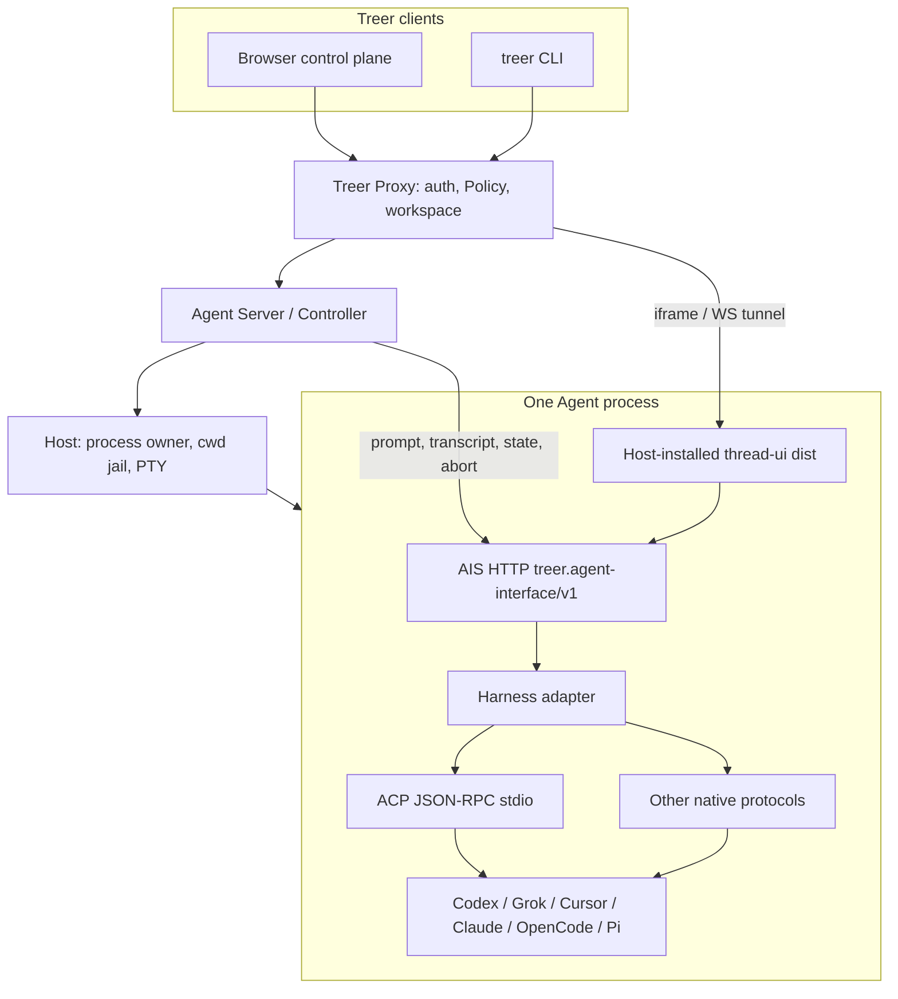

# Remote Codex rust/ACP migration into Treer

| Field | Value |
| --- | --- |
| Status | Phases 0–3 product path on `feat/rc-acp-runtime` (not `main`); UI flags on `feat/treer-presentation-flags`. Phase 4 (compact/fork/goal/MCP/hooks/export, mobile) still later. |
| Date | 2026-09-04 |
| Audience | Treer maintainers who already know Proxy, Host, AIS, and recipes |
| Sources | RC `origin/main` (rust line); UI pin `https://github.com/dufangshi/remote-codex-thread-ui-rust` |
| Scope | Execution plan only. Do not start Treer code until this plan is agreed. |
| Treer working copy | Never commit this work on Treer `main`. Use a git worktree and a new branch. |

Maintained documents stay authoritative until each phase ships. This plan
names every document that must change at completion.

## Hold

RC `main` **is** the Rust ACP rewrite (`39d1b7b0 chore: make Rust
implementation the main line`). Snapshot `treer-acp` from RC `origin/main`,
not from a stale `rust/acp-rewrite` worktree.

First slice is on `feat/rc-acp-runtime` / UI `feat/treer-presentation-flags`.
Do **not** land it on Treer `main` without review. When continuing:

- Do not commit on Treer `main` or fast-forward `origin/main` with this
  feature.
- Create a dedicated worktree and branch, for example:

```sh
git fetch origin
git worktree add -b feat/rc-acp-runtime /Users/mac/dev/treer-rc-acp-runtime origin/main
```

- Keep this plan on `docs/rc-acp-migration` (or merge it into the feature
  branch). Implementation PRs come from the feature worktree.

UI git remotes:

| Repo | Role |
| --- | --- |
| `https://github.com/dufangshi/remote-codex-thread-ui-rust` | **Treer pin.** RC rust UI. Host `treer ui install` this git once. |
| `https://github.com/dufangshi/remote-codex-thread-ui` | Original UI repo. RC CI may still clone a pinned commit from here. |
| `https://github.com/EvoEvolver/treer-agent-ui` | Earlier Treer-owned snapshot at `4b426db`. Not the pin. Leave unused. |

Do not vendor the UI into Treer `apps/`. Treer-specific chrome is **not** a
hard fork of RC: add launch/query parameters in
`remote-codex-thread-ui-rust` so the same package can look like RC or like
an embedded Treer Agent. Default RC supervisor-web stays unchanged if it
omits those params.

## Goal

Take the **session quality** of Remote Codex's Rust ACP rewrite and run it as
ordinary Treer Agents behind Treer's account, workspace, machine, and Policy
model.

The public edge is only Treer Proxy. That is the Treer equivalent of RC **relay
mode**: the machine connects outbound; browsers authenticate as Treer users;
there is no RC user table, no RC device token, and no unauthenticated LAN
supervisor.

Native mobile clients are **out of this plan**. A later plan can merge Treer
mobile and RC's phone apps.

## Locked decisions

1. **Connectivity is Treer relay-equivalent only.** Do not port RC `local`
   (no login) or `server` (single admin password). Do not port
   `crates/relay` or `REMOTE_CODEX_RELAY_AGENT_TOKEN`. Enrolled machines
   already dial the Proxy; that tunnel is the relay.
2. **Identity is Treer only.** Login, session, Bearer, org, restricted
   workspace, and Policy stay in Proxy. AIS loopback remains Agent-private;
   humans never call it except through Proxy.
3. **RC Workspace is not a Treer Workspace.** Treer Workspace stays the
   organization-scoped control-plane object. RC's `WorkspaceDto.abs_path` is
   a directory on one machine. It is replaced by Agent `cwd` and
   launch-profile `cwd`.
4. **Working-directory picker is v1-minimal.** Create Agent / launch profile
   `cwd` only. No Host-local directory bookmarks. Cloning a git URL into a
   directory is an installer or later helper, then Launch with that cwd.
5. **RC Thread is a Treer Agent.** One Agent is one conversation. Extra
   conversations are another Agent via Launch. Do not add `/api/threads`.
6. **Supervisor shells are deleted.** No `shells.rs`, no
   `/api/threads/{id}/shell`, no `@remote-codex/plugin-terminal`. Host PTY
   remains the emergency terminal.
7. **ACP permissions are unattended auto-allow.** Do not port permission
   confirm UI. Document it as a supported trust claim for the trusted-machine
   tier.
8. **Journal stays on the machine**, one SQLite file per Agent under Host
   state (for example `.treer/agents/{agent_id}/journal.sqlite`).
9. **`treer-acp` lives in Treer crates.** Runtime, journal, AIS HTTP. No
   bundled React tree.
10. **Generic thread UI is external.** Pin
    `https://github.com/dufangshi/remote-codex-thread-ui-rust`. **One Host
    installs it once** (`treer ui install`); every Agent on that Host may
    serve that dist. Do not install per Agent. Do not vendor into Treer
    `apps/`. The wire remains AIS `ui_path`. Pi UI and Codex UI keep
    self-registering.
11. **Treer chrome is parameterized, not forked.** `remote-codex-thread-ui-rust`
    should accept launch/query flags (hide rooms rail, explorer, shell,
    permission cards, …) so Treer's iframe can DIY without changing RC's
    default supervisor-web. Code for those flags lands in that UI repo
    later; this round is docs only.
12. **Explorer is Agent-cwd scoped** and is in the first product slice. It
    does not recreate RC Workspace (see below).
13. **Session import is in the first product slice.** Importing a local
    Codex/Claude/ACP session **creates a Treer Agent** bound to that session
    and cwd. It does not attach a thread to an RC workspace id.
14. **Phase-1 ACP extras.** prompt, journal-backed transcript, state, abort,
    auto-allow, `ui_path`, cwd explorer, session import. Resume/load if the
    tests are cheap. Compact, fork, goal, MCP, hooks, PDF export wait.
15. **Mobile UI is deferred.** Do not change the Treer mobile app or bundle
    script in this work. A later plan merges Treer mobile with RC's native
    clients.

## Object mapping

```text
RC relay users / admin password     -> Treer user + org membership
RC relay device                     -> Treer enrolled machine
RC supervisor (outbound to relay)   -> Treer Agent Server (outbound to Proxy)
RC Workspace (label + abs_path)     -> Agent cwd / launch-profile cwd
RC Thread                           -> Treer Agent
RC provider session id              -> ACP session owned by that Agent
RC turn / history item              -> AIS transcript (journal-backed)
RC thread prompt / interrupt        -> agent.prompt / agent.abort
RC thread resume                    -> reconnect ACP session for the same Agent
RC thread delete                    -> agent delete
RC thread fork                      -> Launch another Agent
RC thread import                    -> create Agent bound to an existing local session
RC files API under workspace id     -> AIS file routes under that Agent's cwd
RC supervisor-web shell             -> dropped
RC thread-ui (embedded-single-thread) -> Host `treer ui install` + AIS ui_path
```

### Thread versus Agent

RC `ThreadDto` already carries `agent_id` plus `provider_session_id`. The
rewrite still presents a thread list as the product home. Treer already
decided the opposite: fleet home, and **each Agent is one thread**.

| RC thread field | Treer home |
| --- | --- |
| `id` | `agent_id` |
| `workspace_id` | discarded as a Core id; cwd is on the Agent |
| `provider` / harness `agent_id` | launch profile / harness catalog |
| `provider_session_id` | ACP session owned by that Agent process |
| `title` | Agent `name` |
| `model`, `reasoning_effort`, `fast_mode`, `sandbox_mode` | AIS session settings |
| `approval_mode` | always auto-allow; not a user control |
| `status` / `active_turn_id` | AIS `state.observe` |
| history items | Host-local journal via `transcript.read` |

Creating a "new chat" is `profile.launch` / `agent create`. The thread UI
runs in `embedded-single-thread` mode: no thread list, no workspace
switcher, no relay chrome.

### Why cwd explorer is not RC Workspace

The earlier draft hid explorer because RC's files API was
`/api/workspaces/{id}/files/*` and `id` was a first-class **named directory
catalog**: threads belonged to that id, favorites lived on that id, git
clone created that id.

That catalog is what collides with Treer Workspace.

Agent `cwd` is already a Host-enforced working-directory jail
(`CreateAgentRequest.cwd`, launch-profile `cwd`). An explorer rooted at
that cwd is "the files this Agent may see", which is the same tree the
harness was started in. It does **not**:

- create a Core object
- span machines
- outlive the Agent as a shared project id
- let a workspace member browse the rest of the disk

So explorer stays. Implementation: AIS extra routes on the Agent's
loopback server (same origin as `ui_path`), confined by Host cwd.
Promote to named AIS capabilities later only if CLI/Proxy/Policy must
see file reads and writes. v1 can keep them UI-private under `ui_path`
opacity plus `extraHandler`.

## ACP and AIS

These are **different layers**, not two competing chat APIs. ACP is what
harnesses speak. AIS is what Treer speaks to an Agent.



```text
Human / Agent clients
  -> Treer Proxy  (identity, Policy, routing)
       -> Controller
            -> Host                 process + cwd + PTY
            -> AIS loopback         Treer semantic contract
                 -> adapter
                      -> ACP stdio  harness-standard session protocol
                      -> or Codex app-server / OpenCode HTTP /
                         Claude stream-json / Pi in-process
```

### What each layer owns

| Layer | Whose contract | Completeness today | Job |
| --- | --- | --- | --- |
| **Harness CLI** | vendor | richest vendor-specific behavior | The coding agent itself |
| **ACP** | Agent Client Protocol (JSON-RPC, usually stdio) | **Most complete harness session protocol** | session/new, prompt, cancel, updates, fs, terminal, permissions, load/resume, vendor extensions (steer, compact, goal, …) |
| **Adapter** | Treer-owned translator | per-harness | Map ACP or a native protocol onto AIS. RC rust adapters + catalog live here |
| **AIS** | `treer.agent-interface/v1` | **Most complete Treer Agent contract**; small on purpose | One Agent, loopback HTTP, capability manifest, idempotent prompt, turn-paged transcript, state, abort, optional UI |
| **Controller / Host** | Treer | process lifecycle | Spawn, cwd jail, PTY, register/verify AIS, never let two owners share a session |
| **Proxy** | Treer | org/workspace/Policy | Who may prompt, abort, or load the UI tunnel |

ACP is more complete **downward** (talking to Codex/Grok/Cursor). AIS is
more complete **upward** (talking to Treer: `operation_id`, turn paging,
`instance_id`, Policy, one Agent = one thread). RC's rust rewrite already
aimed at this split: supervisor-owned journal + thin ACP adapters. Treer
keeps the split and throws away RC's extra control plane.

Pi and `apps/codex-ui` never speak ACP; they still register AIS. Grok and
Cursor have no app-server; ACP is their first-party surface. AIS is the
only protocol Proxy/CLI need to know.

### AIS extensibility

v1 core (Controller already routes these):

- `GET /v1/manifest` — `protocol`, `instance_id`, `capabilities`, optional `ui_path`
- `GET /v1/status` — `state.observe` (`idle` / `working` / `blocked`)
- `GET /v1/transcript` — turn-paged `transcript.read`
- `POST /v1/prompts` — `prompt.submit` with idempotent `operation_id`
- `POST /v1/abort` — `abort`

Three extension knobs, in order of invasiveness:

1. **`ui_path` opacity.** HTTP/WebSocket under the UI path is a private
   app. Explorer, model picker, and composer settings can live here
   without a Proxy schema change. This is the v1 home for cwd file tree
   and session settings.
2. **`extraHandler` on the same loopback server.** Used today by adapters
   for non-core JSON. Good for Agent-private routes. Proxy does not
   Policy-check verbs it does not know.
3. **New named capabilities.** Needed when CLI, other Agents, or Policy
   must call the verb (`agent.abort` already went this path). File write,
   compact, or import would graduate here if they become control-plane
   operations.

Do not grow AIS into a copy of ACP. ACP extensions stay in the adapter
until a second harness shares the same Treer-facing semantics.

## Architecture

```text
Browser
  -> Treer Proxy (Treer session / Bearer, Policy)
       -> enrolled Agent Server (outbound)
            -> Host process: one Agent
                 -> treer-acp (Rust ACP runtime + AIS HTTP)
                      -> Host-wide UI dist (`treer ui install`, once)
                      -> harness stdio (grok agent stdio, cursor-agent acp,
                         codex-acp, claude-agent-acp, opencode acp, ...)
                 -> Host PTY (emergency TUI only)
```

RC supervisor HTTP (`/api/threads`, `/api/workspaces`, `/ws`, plugins,
shells) is not published. Humans keep Treer routes. The Agent process
exposes AIS on loopback.

| Piece | Lives in | Owns |
| --- | --- | --- |
| Org, Treer Workspace, Policy | `treer-proxy` | unchanged |
| Machine connection, Host child, PTY, cwd jail | `treer-agent-server` / Host | unchanged |
| ACP catalog, adapters, session, journal, cwd files | `crates/treer-acp` | one Agent's conversation and its tree |
| AIS HTTP | same Agent process (`treer-acp`) | Treer semantic contract |
| Generic thread UI | Host install of `remote-codex-thread-ui-rust` | shared dist; each Agent serves it at `ui_path` |
| Codex app-server UI | `apps/codex-ui` until ACP Codex parity | in-tree fallback; not the generic ACP UI |

One Agent still has one process owner. Do not run `codex-acp` and `codex
app-server` against the same Agent. Do not multiplex every ACP session
inside the Controller.

### Permissions

The runtime answers `session/request_permission` itself (current AIS
auto-allow / RC `yolo`). Hide thread-ui permission cards on the fork.
Trust tier: trusted machines and workspace members.

### Journal

Per-Agent SQLite under Host state. UI history survives process restart.
ACP `session/load` / `session/resume` restores model context when the
harness advertises it.

### Session import

List local harness sessions on that machine (RC's import candidates).
Choosing one **creates a Treer Agent** with that cwd, harness, and
`provider_session_id`. Same as Launch, except the ACP session already
exists. No RC workspace id.

## Thread UI: Host install once, parameters for Treer chrome

Treer does **not** vendor the React package into `apps/` or `web/`. Pin:

```text
https://github.com/dufangshi/remote-codex-thread-ui-rust
```

`apps/pi-ui` and `apps/codex-ui` stay in-tree and keep calling
`treer interface register --ui-path` themselves. They are not the generic
ACP UI.

### `treer ui install` (Host-scoped)

One Host, one install. Every Agent on that machine may serve the same dist.

```text
treer ui install https://github.com/dufangshi/remote-codex-thread-ui-rust.git
treer ui show
```

| Command | Who | Effect |
| --- | --- | --- |
| `install` | Host / operator | Clone/pin/build onto the Host (for example `.treer/ui/`). Not into the Treer git tree. Default git is `remote-codex-thread-ui-rust`. |
| `show` | Host or Agent | What is installed and where the dist lives. |

There is **no per-Agent `use`**. `treer-acp` looks up the Host install and
serves that dist next to AIS, then `interface register --ui-path /`. If
nothing is installed, the Agent is AIS-only (no iframe).

`interface register --ui-path` remains the wire. `treer ui` only manages
the Host checkout. Do not add `--ui` on `agent create`; install is a
machine setup step, like putting `grok` on PATH.

Installer recipes that today clone a UI+ACP TS server should become:
install UI once on the Host, then create `treer-acp` Agents.

### Presentation parameters (later, in `remote-codex-thread-ui-rust`)

Do not hard-fork RC chrome. The UI package already has
`presentation: "workspace" | "embedded-single-thread"` (`embedded` hides
the rooms rail). Extend that with **opt-in query/launch flags** so Treer
can DIY without changing RC supervisor-web defaults (no flags = RC look).

Treer iframe / `treer-acp` would pass flags such as:

| Flag | Treer default | Effect |
| --- | --- | --- |
| `presentation=embedded-single-thread` | on | No thread list / rooms rail (already implemented) |
| `explorer=0` / `explorer=1` | cwd explorer on | Show or hide the file tree |
| `shell=0` | off | Hide RC thread shell plugin (Treer uses Host PTY) |
| `permissions=0` | off | Hide permission cards (AIS auto-allows) |
| `nav=0` | off | Hide RC app/workspace switcher |

Exact names can wait for the UI-repo change. Contract: **absent flags must
preserve today's RC supervisor-web**. Treer sets flags; RC does not.

This round does **not** edit `~/dev/remote-codex-thread-ui-rust`. Document
only.

## Non-goals

- Porting RC relay, local mode, or server-admin auth.
- Making Treer Workspace mean a filesystem path.
- Publishing `/api/threads` on Proxy.
- Supervisor PTY shells or terminal plugins.
- Permission-approval UX.
- Native timeline reimplementation.
- Uploading journals to Core Message or PostgreSQL.
- Replacing Treer `web/` with `supervisor-web`.
- Vendoring `treer-agent-ui` / `remote-codex-thread-ui-rust` into Treer
  `apps/`.
- Merging Treer mobile with RC iOS/Android (later plan).
- Compact, fork, goal, MCP, hooks, PDF export in the first slice.

## Delivery

Maintained documents that must change when this ships:
`docs/architecture.md`, `docs/security.md`, `docs/product.md`,
`docs/quality.md`, `apps/README.md`, `AGENTS.md`,
`skills/treer/SKILL.md` (`treer ui` + `interface`). `docs/mobile.md`
waits for the later mobile merge.

### Phase 0 — Freeze the sources

- RC `main` is the rust line. Snapshot ACP from `origin/main`.
- UI pin: `dufangshi/remote-codex-thread-ui-rust` (Host `treer ui install`).
- Open the Treer **feature** worktree; do not use Treer `main`.

### Phase 1 — `treer-acp`

- Port RC ACP runtime, journal, fake runtime, catalog.
- Drop shells, RC workspace table, relay, permission UI plumbing.
- AIS core routes, auto-allow, Agent cwd, cwd file extra routes.
- Fake harness tests without a live vendor binary.

### Phase 2 — Agent launch, `treer ui`, import

- Host starts one `treer-acp` per Agent (AIS, no bundled React).
- Host `treer ui install` of `remote-codex-thread-ui-rust` once; Agents
  share that dist.
- Session import = create Agent.
- One live harness e2e (grok or cursor).
- Resume/load if tests stay cheap.

### Phase 3 — Fallback hygiene

- Keep `apps/codex-ui` until Codex-over-ACP parity is measured.
- Mark JS `*-ais` compatibility-only.
- README/skill: `treer ui install` is Host-scoped; default git
  `remote-codex-thread-ui-rust`. Presentation flags documented in that
  UI repo.

### Phase 4 — Later

- Compact, fork, goal, MCP, hooks, export.
- Mobile merge with RC native apps.

## Remaining call

Phases 0–3 are implemented on the feature branches: `treer-acp`, Host-wide
`treer ui`, web **New** dialog for `kind=acp` threads, session import,
machine-page thread UI install, iframe embed flags, and JS `*-ais` marked
compatibility-only. Do **not** land on Treer `main` without review.

Phase 4 (compact, fork, goal, MCP, hooks, PDF export, mobile merge) is still
later. Live grok/codex harness e2e is still a quality gap; fake ACP and
mocked web e2e cover the product path.

## PR sketch

All PRs from a Treer worktree branch, never from `main`. Do not start
until this plan is agreed.

1. Add `crates/treer-acp` with fake-runtime tests.
2. AIS registration + cwd jail + auto-allow + cwd file extra routes.
3. Create UI fork; land in-tree `ui_path` bundle; hide permission/shell.
4. Host launch profile; import creates an Agent; one harness e2e.
5. Docs: architecture, security (auto-allow), apps index, skill.

Each PR updates the closest maintained doc in the same change.
