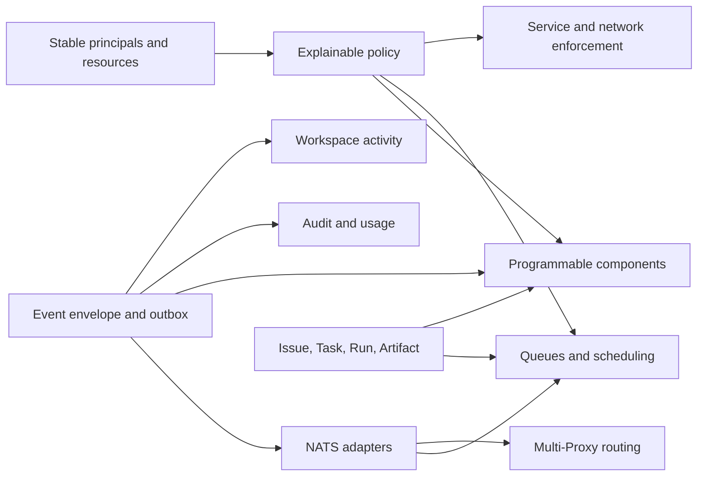

# Capability roadmap

- Status: maintained
- Last source review: 2026-08-18 at `bd3115d`

## Purpose

This document classifies Treer's product needs by user outcome and system
responsibility. It is not a release promise or a flat feature checklist. Use it
to decide which domain owns a proposed capability, which contracts must exist
first, and which shortcuts would create incompatible parallel systems.

The [product direction](product.md) defines the audience and promise. The
[architecture](architecture.md) defines current component boundaries. The
[security model](security.md) defines claims that current and future work may
make. This roadmap owns capability categories and sequencing.

## Current baseline

At `bd3115d`, Treer already provides:

- organizations, members, invitations, and organization-scoped workspaces;
- enrolled machines with a stable Host and replaceable Controller;
- long-running Codex, Claude, and command Agents with PTY replay;
- browser and CLI discovery, control, and terminal attach;
- durable machine-service records and workspace virtual hosts;
- generic TCP relay for virtual hosts and direct source-machine egress for
  ordinary Agent traffic;
- per-Agent workload credentials and short-lived, service-audience-bound
  Ed25519 identity tokens;
- an extensible policy evaluator whose production default currently allows all
  evaluated actions.

Important gaps remain: work is terminal-oriented rather than task-oriented,
Proxy live routing assumes one instance, policy rules and audit events are not
durable, visibility is coarse, telemetry is local, and the web application is
not yet a programmable workspace surface.

## Real operating scenarios

| Scenario | User pressure | Capabilities it exercises |
| --- | --- | --- |
| One developer on several machines | Reliable sessions, updates, private services, and diagnosis | Runtime lifecycle, network, local custody, health |
| Trusted team or research lab | Shared work without losing ownership or context | Visibility, roles, issues, artifacts, activity, audit |
| Agent swarm | Work must survive process restarts and avoid duplicate execution | Messages, tasks, leases, retries, dependencies, events |
| Agent-maintained service | Other Agents and humans need a stable endpoint and trustworthy caller identity | Service catalog, virtual hosts, workload identity, policy, logs |
| CI or ephemeral execution | Work should be scheduled, bounded, collected, and reclaimed automatically | Templates, queues, placement, quotas, artifacts, cleanup |
| Public hosted Treer | Tenants must share infrastructure without sharing control or cost | Isolation, HA routing, policy, metering, quotas, billing |
| Incident response | Operators need to reconstruct what failed across several processes and machines | Logs, metrics, traces, audit, activity timeline, diagnostics |

## Capability planes

### Workspace and resource model

Workspace visibility has three independent dimensions:

1. **Discoverability** determines whether a workspace or resource is listed.
2. **Read visibility** determines who can inspect its metadata and content.
3. **Operability** determines who can mutate or control it.

Initial workspace modes can be `private`, `organization`, and `unlisted`.
Public sharing should first apply to selected artifacts or service entry points,
not implicitly to terminals, machines, credentials, or all workspace state.

Roles should grow beyond owner/admin/member only when a workflow demands them.
Likely operational roles are viewer, contributor, operator, administrator, and
owner. Resource-level grants and cross-workspace service exports should remain
separate from organization membership.

Stable IDs are authorization keys. Names, labels, and aliases are discovery and
presentation metadata.

### Collaboration and work objects

Terminal input is useful for interactive control but is not a durable work
protocol. Treer needs distinct objects with distinct lifecycle semantics:

```text
Issue: why the work matters
  -> Task: the bounded unit to perform
    -> Run: one Agent's execution attempt
      -> Artifact: a durable output or reference
```

- A **Message** communicates information and supports recipients, correlation,
  acknowledgement, and optional expiry.
- An **Issue** is a durable problem, request, or decision with status, labels,
  comments, dependencies, and human or Agent assignees.
- A **Task** is executable work with requirements, claim state, lease, timeout,
  retry policy, dependencies, and an expected result contract.
- A **Run** records one attempt, its executor, timing, status, trace, and output
  references.
- An **Artifact** preserves a file, report, diff, dataset, build, or external
  reference independently of the Agent process that produced it.

This model supports human supervision, Agent handoff, retries, scheduling, and
history without pretending that terminal status proves task completion.

### Event and messaging plane

NATS is a transport and routing substrate, not the source of product semantics.
Treer should define a broker-neutral event contract first:

```text
event_id, schema_version, organization_id, workspace_id,
actor, action, resource, occurred_at,
trace_id, causation_id, correlation_id, payload
```

Database mutations that produce events should use a transactional outbox.
Consumers must be idempotent by `event_id`. SQLite or Postgres remains the
source of durable business state; the broker distributes changes and work.

The intended NATS split is:

| Mechanism | Appropriate traffic |
| --- | --- |
| Core NATS | Presence, invalidation, notifications, request/reply, cross-Proxy ownership and command routing |
| JetStream | Durable tasks, domain events, consumer replay, retries, and work queues |
| Existing point-to-point streams | PTY bytes, live TCP payload, terminal input, and flow control |
| Object storage | Large artifacts, logs, recordings, and build outputs referenced by events |

Large or high-volume byte streams must not be retained in JetStream merely
because NATS is present. A personal single-Proxy deployment should remain able
to run without an external broker through an in-process adapter implementing
the same contracts.

The first event-plane slice now provides the shared envelope, safe
workspace-scoped subjects, an in-process adapter, and an optional JetStream
publisher for existing workspace mutations. It deliberately stops short of a
database outbox: runtime retries are bounded in memory, so the database remains
the recovery source after a Proxy crash.

The first horizontal-routing slice now separates small expiring Controller
leases from change-driven live snapshots, retains current control projections
in file-backed JetStream KV, and uses Core NATS request/reply for commands and
stream delivery. Machine heartbeats revalidate PostgreSQL revocation before
renewing a lease. It supports multiple stateless Proxy replicas against one
PostgreSQL/NATS pair; multi-region broker topology, transactional domain-event
outboxes, traffic accounting, and load testing remain later work.

### Identity, policy, and delegation

Authentication establishes a principal. Policy decides what that principal may
do. The principal model should include human, Agent, machine, and service. The
resource model should include workspace, Agent, machine, service, virtual host,
Issue, Task, Run, Artifact, and UI action.

Policy actions should be stable verbs such as:

```text
discover, read, create, update, delete, control,
network.connect, identity.token.issue, task.claim,
task.complete, artifact.publish, ui.action.invoke
```

Durable rules need version, priority, effect, subject selector, resource
selector, action selector, enabled state, creator, and timestamps. Evaluation
must support `check`, `explain`, and dry-run before enforcement. Every decision
should emit an audit event containing the matching rule or default decision.

Capability delegation is a later but important layer: a user or Agent should be
able to give a child Agent a short-lived token constrained by workspace,
resource, actions, expiry, and possibly usage count. Delegation must narrow
authority rather than copy a parent credential.

Network authorization and application authentication remain separate. A rule
may control whether an Agent can connect to a service, whether it can obtain a
service identity token, or both.

### Observability, evidence, and accounting

Treer must keep different evidence streams distinct:

| Stream | Purpose | Typical backend or surface |
| --- | --- | --- |
| System logs | Debug Proxy, Controller, Host, scheduler, and broker behavior | Structured logs, Loki-compatible sink |
| Telemetry | Measure health and connect latency across components | OpenTelemetry traces and metrics |
| Audit events | Record who attempted which action on which resource and the decision | Append-only durable ledger |
| Activity events | Explain meaningful workspace changes to users | Searchable web and CLI timeline |
| Usage events | Support quotas, capacity planning, and billing | Durable accounting pipeline |
| Agent output | Preserve interactive PTY state and optional recordings | Existing replay plus explicit archival |

These streams can share `trace_id`, `causation_id`, workspace, Agent, machine,
and resource IDs without sharing retention or access rules. Logs are not an
audit ledger, PTY output is not a task result, and provider-reported token usage
is not the same as machine runtime cost.

Useful operator features include a machine diagnostics bundle, Controller/Host
version and health views, stream and queue depth, recent reconnect causes, and
an end-to-end trace from a UI or CLI action to its target process or service.

### Programmable workspace experience

Agents should be able to create useful workspace interfaces without modifying
or redeploying the central React application. The first extension model should
be declarative rather than arbitrary injected JavaScript.

A workspace component document can use Proxy-rendered primitives such as:

- Markdown, table, form, status, diff, log, chart, and artifact preview;
- Issue list, Kanban board, Task queue, Run history, and approval panel;
- typed buttons and forms that invoke registered Proxy actions;
- event subscriptions scoped to the component's workspace and resources.

Component manifests need stable ID, schema version, owner, visibility, required
actions, data bindings, lifecycle, and revision. Component state must be durable
in the Proxy and survive the creating Agent going offline. Typed actions pass
through identity and policy; they must not become a bypass around the normal
API.

The Issue system is the right first built-in application because it exercises
durable objects, Agent and human authors, comments, assignment, activity,
notifications, forms, lists, and actions. Sandboxed iframe or packaged plugin
runtimes can follow after the declarative model establishes permissions,
versioning, and lifecycle expectations.

### Runtime and scheduling

The current long-lived local Host remains appropriate for personal and lab use.
Additional execution modes should implement the same control-plane contract:

- Agent templates and profiles for command, environment, tools, and limits;
- machine capabilities, labels, availability, and placement constraints;
- task queues, concurrency limits, leases, retries, and cancellation;
- ephemeral containers or microVMs with automatic collection and cleanup;
- drain, update rings, rollback, Controller compatibility, and Host health;
- CPU, memory, disk, network, provider, and wall-time limits;
- managed secrets and explicit credential ownership.

Long-lived machine services and ephemeral Agent processes are different
resources. Service registration should not silently make Treer supervise the
service process; supervised services can be introduced as an explicit lifecycle
mode with health, restart, deployment revision, and ownership.

### Services and network

The service catalog can grow from a target address into an operational object:

- owner, maintainers, protocol, health, deployment revision, and dependencies;
- virtual hosts, wildcard TLS ingress with optional workspace authentication,
  custom domains, and cross-workspace export;
- workload-identity audience, accepted issuers, and credential helpers;
- connection counts, byte usage, latency, failures, and circuit state;
- network and egress policy independent from service application policy.

HTTP, SSH, Git, databases, and arbitrary TCP have different authentication
semantics. Treer should provide shared identity primitives and protocol-specific
adapters without claiming one injected header can authenticate every protocol.

### Artifacts, context, and search

An Artifact registry should add content hash, media type, size, producer Run,
workspace, retention, provenance, preview, and storage reference. Large data
belongs in object storage; metadata and relationships belong in the control
plane.

Workspace search should cover Issues, Tasks, Runs, Agents, services, messages,
artifacts, and activity while applying visibility before returning results.
Shared context should point to durable objects rather than copying unbounded
terminal transcripts into every Agent prompt.

### Platform, integrations, and commercial operation

A hosted deployment eventually needs:

- multiple Proxy instances with live connection ownership and routed commands;
- Postgres for concurrent durable metadata and migrations;
- object storage for artifacts and retained output;
- backup, restore, export, retention, and deletion workflows;
- API tokens, service accounts, webhooks, and SDKs;
- GitHub Issue and pull-request sync, CI adapters, and notification sinks;
- provider and machine usage metering, quotas, budgets, and invoices;
- tenant-aware abuse controls and a managed isolation backend.

NATS can connect Proxy instances, but it does not by itself solve durable
connection ownership, idempotency, database consistency, tenant isolation, or
stream backpressure. Those remain explicit platform contracts.

## Dependency map



The event contract is deliberately earlier than NATS. Work objects are earlier
than a distributed scheduler. Stable identity is earlier than restrictive
policy. This ordering allows each later subsystem to reuse product semantics
instead of deriving them from broker subjects, log text, or UI state.

## Sequencing

### Phase 1: Workspace event spine

1. Define the versioned event envelope and actor/resource references.
2. Add an SQLite transactional outbox and idempotent local event dispatcher.
3. Propagate trace, causation, and correlation IDs through current commands.
4. Ship a user-facing Workspace Activity feed and basic operator diagnostics.
5. Define the broker interface without requiring NATS for a single Proxy.

This phase prevents audit, UI updates, NATS, notifications, and accounting from
inventing separate event formats.

### Phase 2: Collaborative workspace

1. Add Issue, Message, Task, Run, and Artifact records incrementally.
2. Use Issue as the first declarative workspace component.
3. Add assignment, comments, mentions, dependencies, and notifications.
4. Add task claim, lease, retry, result, and cancellation semantics.
5. Keep terminal prompt as an interactive fallback, not the durable task bus.

### Phase 3: Governed workspace

1. Separate workspace discoverability, read visibility, and operability.
2. Persist versioned policy rules with explain and dry-run.
3. Enforce service connection, identity token, task, artifact, and UI actions.
4. Emit append-only decision and attribution events.
5. Add scoped delegation, revocation, and approval workflows.

### Phase 4: Distributed platform

1. Extend the current JetStream event adapter with Core NATS routing and durable task adapters.
2. Route commands by live Controller ownership across Proxy instances.
3. Move concurrent durable state to Postgres and large objects to object storage.
4. Add reconnect, failover, queue-depth, and replay tests.
5. Preserve direct stream flow control rather than routing PTY and TCP data
   through durable event storage.

### Phase 5: Managed and commercial operation

1. Add ephemeral isolated execution and resource scheduling.
2. Add usage aggregation, quotas, budgets, and billing records.
3. Add provider credential ownership and tenant-safe secret delivery.
4. Add retention, export, deletion, incident, and support workflows.
5. Validate the managed trust tier independently from the local Host tier.

## Cross-cutting invariants

- Durable workspace state must outlive the Agent that created it.
- Visibility, authorization, placement, and ownership are separate decisions.
- Stable IDs drive policy and relationships; names remain mutable labels.
- Domain events are versioned facts, not arbitrary log lines.
- Database state and published events use an outbox or an equivalent atomic
  consistency mechanism.
- Consumers, commands, tasks, and UI actions are idempotent under retry.
- High-volume terminal and network bytes do not become durable broker traffic.
- Programmable UI actions use typed APIs and normal policy enforcement.
- Policy decisions are explainable and auditable before defaults become
  restrictive.
- Hosted scale must not force personal self-hosted deployments to operate NATS,
  Postgres, and object storage unnecessarily.

## Choosing the next feature

Prefer work that establishes a shared contract used by several later features.
The highest-leverage next epic is the **Workspace Event Spine** because it gives
activity, audit, telemetry correlation, notifications, programmable components,
NATS integration, and accounting one common foundation. An Issue application is
the first product surface that should exercise that foundation end to end.
